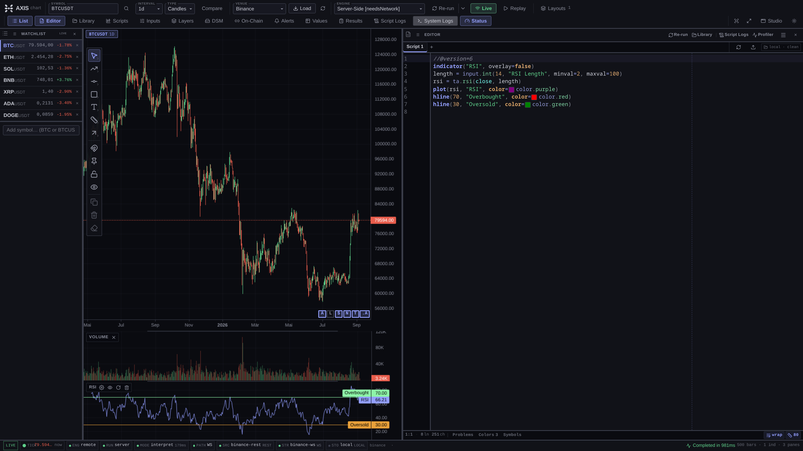
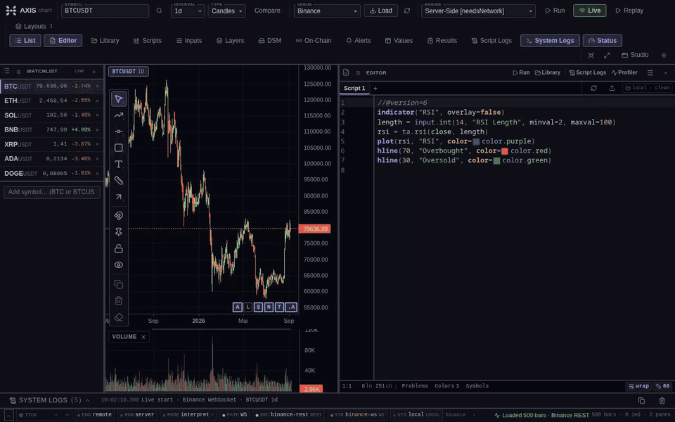
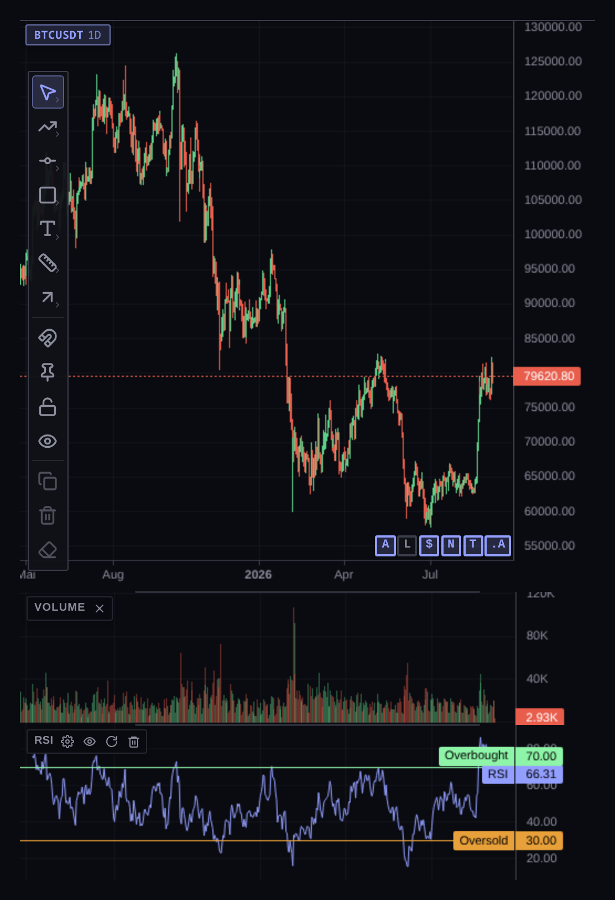
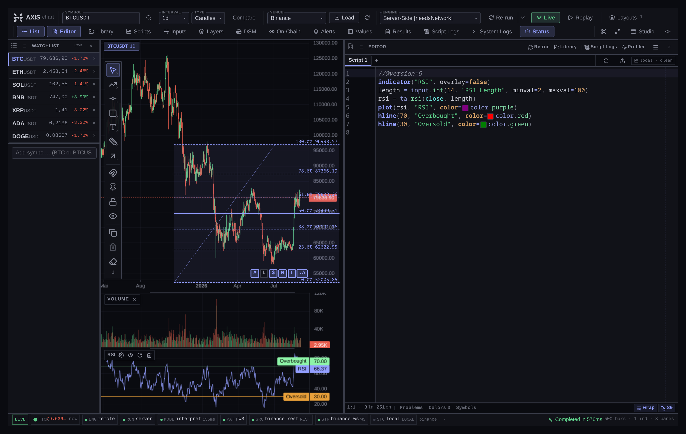
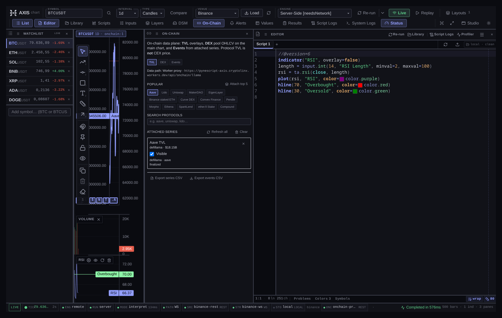
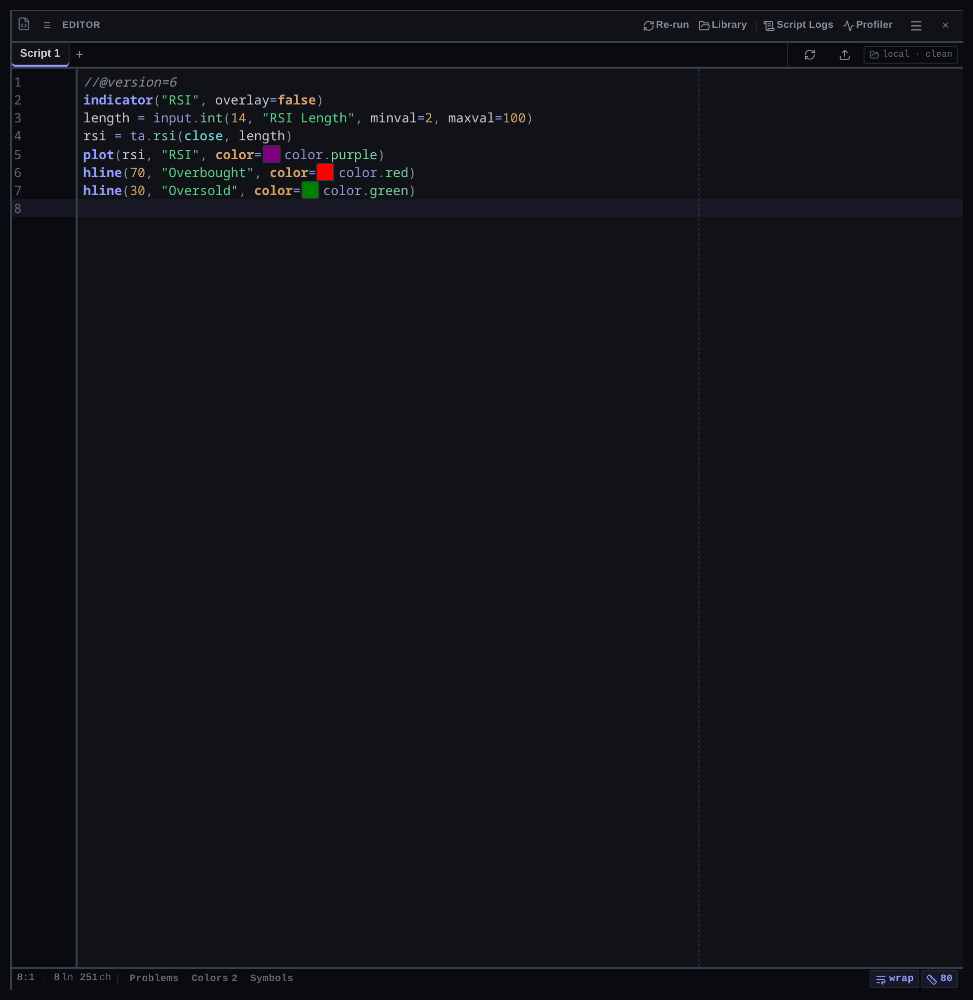
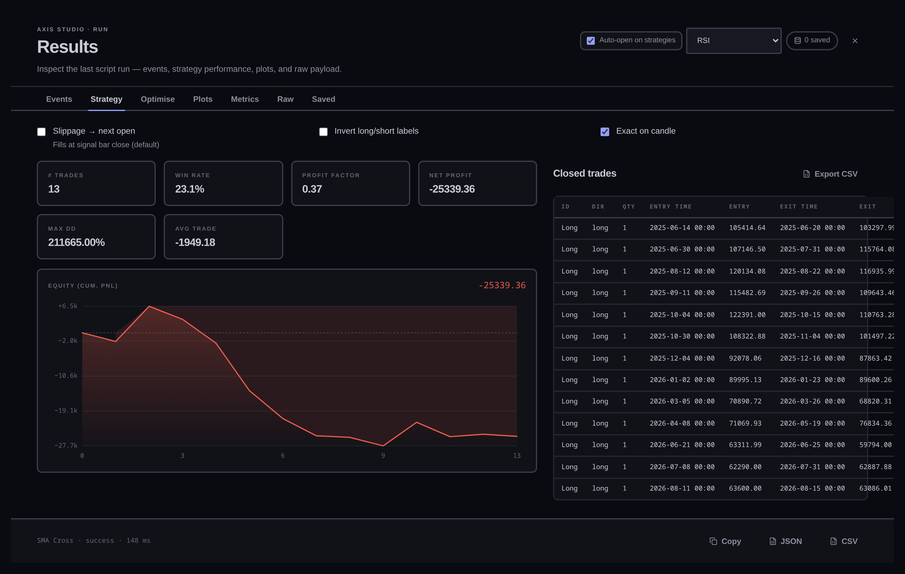
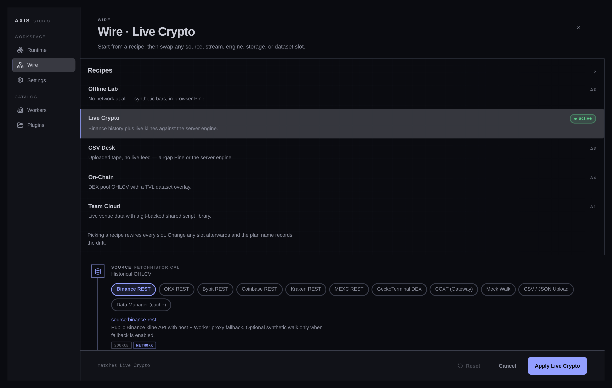

# AXIS

**AXIS** — installable open charting PWA: CEX OHLCV, drawings, on-chain overlays, and Pine Script™ via PYNE.

<div align="center">

[](https://github.com/hoox-sh/axis/actions/workflows/ci.yml)
[](https://codecov.io/gh/hoox-sh/axis)
[](https://www.typescriptlang.org/)
[](https://bun.sh)
[](https://hoox.sh/axis)
[](https://www.npmjs.com/package/@hoox-sh/axis-cli)
[](LICENSE)

**Website:** [hoox.sh/axis](https://hoox.sh/axis) · **Docs:** [hoox.sh/axis/docs](https://hoox.sh/axis/docs) · **Repo:** [hoox-sh/axis](https://github.com/hoox-sh/axis)

**Stack:** ⚡ [HOOX](https://github.com/hoox-sh/hoox) · 🐍 [PYNE](https://github.com/hoox-sh/pyne) · 📊 [**AXIS**](https://github.com/hoox-sh/axis) *(this repo)*

</div>

<p align="center">
  
</p>

<p align="center">
  
</p>

| Chart | Drawings | On-chain |
| --- | --- | --- |
|  |  |  |

| Editor | Results | Studio |
| --- | --- | --- |
|  |  |  |

Full set: [Interface gallery](https://hoox.sh/axis/docs/enduser/guides/screenshots) · files in [`docs/images/`](docs/images/).

**Installable PWA**, **fully pluggable**, runs against the local **[pyne](https://github.com/hoox-sh/pyne)** Pro API,
a Cloudflare Worker, or **fully offline** with the in-browser Pyodide engine.

## Ecosystem

Part of the **[HOOX](https://hoox.sh)** open trading stack:

| Product | Role | Repo | Website |
|---------|------|------|---------|
| **HOOX** | Edge trading framework (Cloudflare Workers) | [hoox-sh/hoox](https://github.com/hoox-sh/hoox) | [hoox.sh](https://hoox.sh) · [docs](https://docs.hoox.sh) |
| **PYNE** | Pine Script™ toolchain + Pro API (engine) | [hoox-sh/pyne](https://github.com/hoox-sh/pyne) | [hoox.sh/pyne](https://hoox.sh/pyne) · [docs](https://hoox.sh/pyne/docs) |
| **pyne-agent-worker** | NL → PYNE scripts (Workers AI™ + optional RAG) | [hoox-sh/pyne-agent-worker](https://github.com/hoox-sh/pyne-agent-worker) | AXIS plugin docs |
| **AXIS** | Charting PWA (this repo) | [hoox-sh/axis](https://github.com/hoox-sh/axis) | [hoox.sh/axis](https://hoox.sh/axis) · [docs](https://hoox.sh/axis/docs) |

**PYNE Agent plugin** (optional): Manager → Plugins → Install → **PYNE Agent**, or URL  
`https://pyne-agent-worker.cryptolinx.workers.dev/plugin/axis-pine-agent.js`  
(standalone Workers AI — no HOOX mesh required). Docs: [PYNE Agent](./docs/enduser/guides/pyne-agent.mdx).

```bash
# Typical local trio
make -C ../pyne run         # pyne Pro API :5002 (clone hoox-sh/pyne; dir sometimes still named pynescript)
bun run dev                 # this repo :3000

# Optional desktop shell (Tauri 2 — needs Rust + system webview libs)
bun run desktop:dev         # native window + Vite HMR
bun run desktop:build       # package installers under src-tauri/target/release/bundle/
```

### AXIS CLI (`packages/cli`)

Operator entry for install, diagnostics, Worker bootstrap (D1 / OAuth), secrets, deploy, and health.

```bash
npm install -g @hoox-sh/axis-cli   # Node ≥ 20; Bun ≥ 1.2 for install/dev/build

cd packages/cli && bun install && bun run build && cd ../..
bun run axis --help

axis install                          # app + worker + CLI deps
axis doctor                           # toolchain; wrangler.toml warns until `axis setup`
axis setup --github-client-id Ov23li…
axis setup d1 --remote                # apply D1 schema on CF
axis secret put ADMIN_TOKEN
axis deploy                           # Worker pynescript-axis
axis health --oauth                   # live /health + device OAuth

# Repo aliases (no global install): bun run axis:install / axis:doctor / axis:deploy / …
# Make wrappers: make axis-doctor  make axis-deploy  make axis ARGS="…"
```

Docs: [AXIS CLI](./docs/devops/cli.mdx) · [packages/cli/README.md](./packages/cli/README.md) · live demo [axis.hoox.sh](https://axis.hoox.sh) · Worker `https://pynescript-axis.cryptolinx.workers.dev`

See [docs/devops/desktop.mdx](./docs/devops/desktop.mdx) for platform prerequisites.

**Icons:** [Lucide](https://lucide.dev) via `lucide-solid` (tree-shakable stroke
icons, ISC). Wrapper: `src/ui/icons.tsx`.

## What's in this repo

| Part | Path | What it does |
|------|------|--------------|
| **App** (PWA) | `src/` | SolidJS + Vite charting UI — lightweight-charts, CodeMirror 6 Pine editor, plugin registry (`src/plugins/`), theme catalog (`src/theme/`), service worker / offline cache (`src/pwa/`, `src/sw/`). |
| **Datafeed** | `src/data/` | Background OHLCV pipeline: backfill, validate, gap-fill (`data-source-manager.ts`), venue adapters (`venues/`, Binance HTTP), bars cache + expansion, watchlist live tickers, signed fetch. |
| **Calc engines** | `src/engines/`, `src/workers/` | Pluggable Pine evaluation backends sharing one contract: local **pyne** Pro API (`:5002`), the Cloudflare **Worker**, or fully offline in-browser **Pyodide**. Workers Manager ships the catalog + health probes for each backend. |
| **Pyodide runtime** | `public/pyodide/`, `public/vendor/`, `vendor/` | Vendored Python wheel stack so scripts run 100% client-side/offline; SW caches it for installs. Synced from pyne releases via `scripts/sync-pyne-wheel.sh`. |
| **On-chain plane** | `src/onchain/` | Dataset plugins: DefiLlama TVL, GeckoTerminal pools/ohlcv, catalog + presets, events, jobs scheduler, alerts bridge, export, keys. |
| **Worker** | `worker/` | Cloudflare Worker API: `/api/run`, `/api/stream` (+ Durable Object WebSocket sessions), KV API keys & usage meter, D1 persistent runs/scripts, R2 indicator bundle cache, Git OAuth for storage-git. |
| **Proxy** | `worker/src/onchain.ts` ↔ `src/onchain/proxy.ts` | Allowlisted `/api/onchain/*` egress proxy in front of DefiLlama / GeckoTerminal — keeps third-party keys server-side and CORS-clean. |
| **Desktop** | `src-tauri/`, `src/desktop/` | Tauri 2 native shell (menu, open-script, About) with per-platform installers built by CI. |
| **CLI** | `packages/cli/` | [`@hoox-sh/axis-cli`](https://www.npmjs.com/package/@hoox-sh/axis-cli) — install, doctor, setup (OAuth/D1), secrets, deploy (Worker/Pages), health. Published to npm on `v*` tags via `.github/workflows/release.yml`. |
| **Tests & ops** | `tests/`, `e2e/`, `scripts/`, `Makefile`, `.github/workflows/` | Bun unit + worker suites, Playwright smoke, changelog/pyne sync scripts, Docker bake, desktop + npm release pipelines. |

## Architecture

```
┌─────────────────────────── Browser (PWA) ─────────────────────────────┐
│  Service Worker · manifest.webmanifest · offline cache               │
│  UI: lightweight-charts + CodeMirror 6 + tabs                         │
│                                                                       │
│  ┌──────────┐  ┌──────────┐  ┌──────────┐  ┌────────────────────┐    │
│  │ Sources  │  │ Streams  │  │ Engines  │  │ Storage (localStorage│   │
│  │ (history)│  │ (live)   │  │ (calc)   │  │  + IDB for offline)  │   │
│  └────┬─────┘  └────┬─────┘  └────┬─────┘  └────────────────────┘    │
│       │             │              │                                    │
│       ▼             ▼              ▼                                    │
│  registry-driven, all plugins share the same contract                 │
└───────────────────────────────────────────────────────────────────────┘
            │                                            │
            ▼ (only if engine=server OR stream=remote)   ▼
┌─────────────────────────── Backend (pluggable) ───────────────────────┐
│  Local Flask `make run`      OR      Cloudflare Pages + Worker        │
│  (dev only)                            • Pages: static PWA             │
│                                        • Worker: /api/run, /api/stream│
│                                        • Durable Object: live session  │
│                                        • KV: API keys, usage meter     │
│                                        • D1: persistent runs/scripts   │
│                                        • R2: indicator bundle cache    │
│                                        • WebSocket Hibernation (DO)    │
└───────────────────────────────────────────────────────────────────────┘
```

## Plugin contract

Solid path uses a **unified TypeScript registry** (`src/plugins/registry.ts`).
Every plugin is an object with `{ id, name, kind, description, configSchema, ... }`.

```ts
// kind: 'source'  — historical OHLCV
// kind: 'stream'  — live tick / bar push
// kind: 'engine'  — calculate Pine
// kind: 'storage' — user script library (local | git | cloud)
// kind: 'dataset' — on-chain / alternate series (TVL, …)
// kind: 'component' — UI slots (phase 2)

// See src/plugins/types.ts for full contracts.
// Active selection: store.activePlugins { source, stream, engine, storage }
// Built-ins register via ensureBuiltins() / registerBuiltins().
// Dynamic plugins: loadPluginFromUrl() in src/plugins/loader.ts
// Script library: Manager → Script Library tab
//   storage-local  → IndexedDB (default, offline)
//   storage-cloud  → Worker /api/scripts + Pro API keys
//   storage-git    → GitHub/GitLab Contents API (commit on Save)
//
// Manager tabs: Catalog (Use + capability badges) · Install (URL) · Script Library
// Settings: engine list from registry, storage picker, endpoint when needed
// Status bar: active engine id + storage backend
```

Legacy vanilla shell still uses `src/registry.js` (see LEGACY.md).

## Built-in plugins

| Kind    | id                   | Source / role                          |
|---------|----------------------|----------------------------------------|
| Source  | `binance-rest`       | `https://api.binance.com/...`          |
| Source  | `okx-rest`           | OKX public candles                     |
| Source  | `bybit-rest`         | Bybit v5 spot klines                   |
| Source  | `coinbase-rest`      | Coinbase Exchange candles              |
| Source  | `kraken-rest`        | Kraken public OHLC                     |
| Source  | `geckoterminal-ohlcv`| DEX pool OHLCV (GeckoTerminal)         |
| Source  | `mock-walk`          | pure-synthetic random walk             |
| Source  | `csv-upload`         | user-uploaded file                     |
| Dataset | `defillama-tvl`      | Protocol TVL history (DefiLlama)       |
| Stream  | `binance-ws`         | `wss://stream.binance.com/...`         |
| Stream  | `mock-poll`          | synthetic poll (offline)               |
| Stream  | `none`               | paused                                 |
| Engine  | `server`             | `POST {endpoint}/run` (+ `/optimize`)  |
| Engine  | `pyodide`            | in-browser Python (Pyodide)            |
| Component | `hyperparameter-optimisation` | Results → Optimise (strategies) |

Add a new plugin via the Plugin Manager **Install** tab (URL module), or
register in TypeScript under `src/sources|streams|engines` and the unified
`src/plugins/registry.ts`. Dynamic load:

```ts
import { loadPluginFromUrl } from './src/plugins/loader';
await loadPluginFromUrl('https://example.com/my-plugin.js');
```

## Product highlights

| Surface | What it does |
|---------|----------------|
| **Topbar Load** | One-shot historical fetch (`historyBars` / venue page cap) into the chart |
| **Data Sources** panel | Background multi-page **backfill** to a past date, **validate** density, **fill gaps**, durable IDB cache, optional Load to chart |
| **On-Chain** panel | DefiLlama **TVL** lines, GeckoTerminal **DEX pool** candles, TVL spike **events**, CSV export, refresh jobs |
| **Results → Optimise** | Strategy `input.*` search (pyne `/optimize` or isolated client fallback) |
| **Scripts** panel | Applied indicators/strategies (list, visibility, colors) — renamed from “Indicators” |
| **Chart themes** | Ten curated high-end presets (void, classic, mono, obsidian, graphite, pacific, dusk, porcelain, parchment, …) — no neon high-contrast default |
| **Price scale** | Auto or 0–8 decimals from symbol + bars; Pine `plot.style_*` parity on overlays |
| **Run** | Accent color only while a run is executing (ghost when idle) |
| **Library / Plugins / Settings** | Script storage (import v6 starter pack), plugin catalog (incl. **component** URL), engine endpoint |
| **Workers Manager** | Health cards + install helpers for Flask / Worker / Pyodide / PWA / PYNE Agent |
| **AXIS CLI** | `packages/cli` — install, doctor, setup, secrets, deploy, health |
| **Desktop** | Optional Tauri 2 shell (`bun run desktop:dev`) |

Docs: [On-Chain data](https://hoox.sh/axis/docs/enduser/guides/on-chain) · [Data Source Manager](https://hoox.sh/axis/docs/enduser/guides/data-source-manager) · [AXIS CLI](https://hoox.sh/axis/docs/devops/cli) · [UI shell](https://hoox.sh/axis/docs/ui/ui-shell)

## Local dev

**Primary path is Vite + Solid** (this is what ships on the VPS demo):

```bash
bun install && bun run dev     # Vite on :3000 (proxies /run → :5002)
# production: bun run build && python3 axis_pwa_server.py   # serves dist/ on :8081
```

```bash
# Terminal 1 — backend (pyne Pro API)
# from the pynescript / pyne checkout:
make run                       # Flask on :5002

# Terminal 2 — AXIS PWA
bun run dev
```

### Legacy static path (not recommended)

`style.css`, `main.js`, `server.ts`, and root-level `index.html` without Vite
are the pre-Solid shell. Prefer `bun run dev` or `dist/` from `bun run build`.
See **`LEGACY.md`**.

For an **offline-first** demo: set `Source = Mock Walk`, `Stream = Mock Poll`,
`Engine = Client-Side (Pyodide)`. Disable network in DevTools — Run still works.

## File map

```
axis/                         (this repo root)
  index.html                  Vite entry
  public/                     PWA icons, manifest, example plugins, vendor wheels
  src/
    app.tsx                   Solid shell: docks, panels, chart workspace
    data/
      load-symbol.ts          Topbar one-shot history → chart
      data-source-manager.ts  Background backfill + validate + gap-fill jobs
      bars-cache.ts           IDB OHLCV cache for manager
      bars-gaps.ts            Series completeness / gap detection
    onchain/                  Dataset plane: DefiLlama TVL, GeckoTerminal, events, jobs
    theme/                    Chart theme catalog + 10 presets
    sources/catalog.ts        binance / okx / bybit / coinbase / gecko / mock / csv
    streams/                  Live multiplex + venue WS
    engines/                  server + pyodide
    indicators/               runAndApply + Scripts panel UI
    editor/                   CM6 Pine editor, diagnostics, profiler, pins
    chart/                    lightweight-charts host, drawings, on-chain overlays
    ui/                       Topbar, panels, On-Chain, command palette, settings
    store/                    Solid app state + persistence
    plugins/                  Unified registry contracts + loader (incl. dataset)
  worker/                     Cloudflare Worker (API / onchain proxy / DO / D1)
  packages/cli/               AXIS CLI (@hoox-sh/axis-cli) — setup / deploy / doctor
  docs/                       Product docs (MDX; mirrored to hoox.sh/axis/docs)
  tests/                      Bun unit + integration tests
  e2e/                        Playwright
```

## Backend targets

- **Local Flask**: existing `make run` on `:5002`. PWA talks to it directly
  (CORS handled by the backend). Default endpoint is `http://localhost:5002`.
- **Production split**: PWA on Cloudflare Pages (`https://axis.hoox.sh`); PYNE Pro API
  on Hetzner (`https://pynescript.online`, nginx → gunicorn `:5002`). Default store
  endpoint is `https://pynescript.online`. SSH: `ssh pynescript`.
- **Cloudflare Worker**: `axis deploy` (or `make worker-deploy`). The Worker
  exposes `/api/run`, `/api/stream`, `/api/keys`, `/api/onchain/*` (DefiLlama +
  GeckoTerminal allowlisted proxy), Git OAuth device flow, etc. See `worker/README.md`,
  [Worker docs](https://hoox.sh/axis/docs/worker), and [AXIS CLI](https://hoox.sh/axis/docs/devops/cli).

## CORS (AXIS browser origin → Pro API)

CORS is enforced by the **API you call** (pyne Pro API or the AXIS Worker), not by the static AXIS PWA.

### Pyne Pro API

`backend/app.py` uses `flask-cors` with `ALLOWED_ORIGINS` (comma-separated). Defaults include
`https://pynescript.online`, `https://app.pynescript.online`, and a **localhost/127.0.0.1 any-port** regex.
Product Origins are **always appended** even when systemd sets a short list:
`*.hoox.sh`, `*.pynescript.online`, and **`*.pynescript-axis.pages.dev`**
(not open `*.pages.dev`). `GET /health` and `POST /run` always reflect the request Origin
so a Cloudflare Pages preview can probe/run against `https://pynescript.online`.

| Origin style | Safe? | Notes |
|--------------|-------|--------|
| `localhost` / `127.0.0.1` (+ port) | Yes | Local AXIS / Vite; only your machine presents these Origins |
| `*.pynescript-axis.pages.dev` | Yes | AXIS Pages project (apex + preview hashes) — always allowlisted |
| Public demo host (`http://VPS:8081`) | Yes if listed | Needed when UI is on VPS and API is elsewhere (or same box) |
| `*` | Demo-only | Reflects any Origin — fine for a public demo, not for production secrets |
| `0.0.0.0` | **Skip** | Not a normal browser Origin; listening on `0.0.0.0` ≠ CORS |

Same-origin proxy: browser on `https://pynescript.online` calls `/run` — no CORS.
Cross-origin (Pages `axis.hoox.sh` → `pynescript.online`) needs the product regex above.
Direct `:5002` is still fine for demos if `ALLOWED_ORIGINS` includes the page origin.

```ini
# /etc/systemd/system/pynescript-api.service
# Short list is fine — pyne always appends localhost + product/Pages regex.
Environment=ALLOWED_ORIGINS=https://pynescript.online,https://axis.hoox.sh,https://hoox.sh
# Demo-only open reflection:
# Environment=ALLOWED_ORIGINS=*
```

### AXIS Worker

`worker/src/index.ts` `pickOrigin` echoes `localhost` / `127.0.0.1`, known product hosts (`*.hoox.sh`, `*.pynescript.online`), and **`*.pynescript-axis.pages.dev`** only (not open `*.pages.dev`); otherwise comma-separated `ALLOWED_ORIGIN` (first entry is fallback). See [CORS docs](https://hoox.sh/axis/docs/devops/cors-and-origins).
Smoke:

```bash
curl -sS -D- -o /dev/null -X OPTIONS https://pynescript.online/run \
  -H "Origin: https://axis.hoox.sh" \
  -H "Access-Control-Request-Method: POST"
# expect Access-Control-Allow-Origin echoing the Origin

curl -sS -X POST https://pynescript.online/run \
  -H "Content-Type: application/json" \
  -H "Origin: https://axis.hoox.sh" \
  -d '{"script":"//@version=6\nindicator(\"t\")\nplot(close)","data":[{"time":1,"open":1,"high":1,"low":1,"close":1,"volume":1}]}'
```

## PWA

- Manifest at `manifest.webmanifest` (void theme `#0a0b10`, icons 192/512).
- Service Worker at `sw.js` registered on first load. Cache-first for the
  app shell, network-first for `/api/*`, fallback to a 503 JSON for offline
  API calls (the `pyodide` engine keeps the app fully usable offline).
- Install prompt: in Chrome/Edge, look for the install icon in the URL bar.

## Persistence (localStorage)

`pynescript.axis.v1` holds:

| Field          | Purpose                              |
|----------------|--------------------------------------|
| `script`       | Last Pine source                     |
| `symbol`/`interval` | Last market selection            |
| `engine`       | `server` or `pyodide`                |
| `source`       | `binance-rest`/`mock-walk`/`csv-upload` |
| `stream`       | `binance-ws`/`mock-poll`/`none`      |
| `endpoint`     | Backend URL                          |
| `mode`         | `local` or `cloud`                   |
| `apiKey`       | stored **only in this browser**      |
| `pluginsConfig`| per-plugin configuration             |

## Verification

- `make run-frontend` then open `http://localhost:8081`.
- App loads, chart shows BTC/USDT, top bar exposes Engine / Source / Stream
  pickers. DevTools → Application → Manifest + Service Workers confirms PWA.
- Engine = `pyodide` + Source = `mock-walk`: go offline (DevTools → Network
  → Offline). Click Run. Pine still executes.

---

## The HOOX Stack — all products & sister projects

Everything under [github.com/hoox-sh](https://github.com/hoox-sh) — one open trading stack on [hoox.sh](https://hoox.sh):

```text
                    https://hoox.sh
           ┌──────────────┼──────────────┐
           ▼              ▼              ▼
         HOOX            PYNE           AXIS
    (edge execution)  (Pine engine)  (charting UI)
           │              │              │
           └──────────────┴──────────────┘
                    trade signals / eval API
```

**Main products**

| Product | Role | Repository | Website |
|---------|------|------------|---------|
| **HOOX** | Edge trading framework — signal validation & execution on Cloudflare® Workers | [hoox-sh/hoox](https://github.com/hoox-sh/hoox) | [hoox.sh](https://hoox.sh) · [docs](https://docs.hoox.sh) |
| **PYNE** | Pine Script™ toolchain — grammar, AST, dual-engine runtime, LSP, Pro API | [hoox-sh/pyne](https://github.com/hoox-sh/pyne) | [hoox.sh/pyne](https://hoox.sh/pyne) · [docs](https://hoox.sh/pyne/docs) |
| **AXIS** *(this repo)* | Installable charting PWA — CEX OHLCV, drawings, on-chain overlays | [hoox-sh/axis](https://github.com/hoox-sh/axis) | [hoox.sh/axis](https://hoox.sh/axis) · [docs](https://hoox.sh/axis/docs) |

**PYNE satellites**

| Project | Role | Repository |
|---------|------|------------|
| **PyneTS** | TypeScript / Bun library (`@hoox-sh/pynets`) — parse, unparse, interpret | [hoox-sh/pynets](https://github.com/hoox-sh/pynets) |
| **pyne-worker** | Python Cloudflare® Worker — edge `POST /run`, cron, R2, alerts | [hoox-sh/pyne-worker](https://github.com/hoox-sh/pyne-worker) |
| **pyne-agent-worker** | Workers AI Pine agent — RAG + validate loop | [hoox-sh/pyne-agent-worker](https://github.com/hoox-sh/pyne-agent-worker) |
| **pyne-lsp** | Language server `pyne-lsp` (in the PYNE tree) | [hoox-sh/pyne](https://github.com/hoox-sh/pyne) · [docs](https://hoox.sh/pyne/docs/lsp) |
| **pyne-vscode** | VS Code / Open VSX extension (in the PYNE tree) | [vscode-extension](https://github.com/hoox-sh/pyne/tree/main/vscode-extension) · [Marketplace](https://marketplace.visualstudio.com/items?itemName=hoox-sh.pyne) |

**AXIS satellites**

| Project | Role | Repository |
|---------|------|------------|
| **axis-plugin-boilerplate** | Starter for source / stream / engine / dataset / component plugins | [hoox-sh/axis-plugin-boilerplate](https://github.com/hoox-sh/axis-plugin-boilerplate) |

**HOOX execution & ops plane**

| Worker | Role | Repository |
|--------|------|------------|
| **hoox-worker** | Public gateway — webhooks, WAF, DO idempotency, dispatch | [hoox-sh/hoox-worker](https://github.com/hoox-sh/hoox-worker) |
| **trade-worker** | Multi-exchange execution — Binance, Bybit, MEXC | [hoox-sh/trade-worker](https://github.com/hoox-sh/trade-worker) |
| **agent-worker** | AI risk manager — cron, trailing stops, kill switch | [hoox-sh/agent-worker](https://github.com/hoox-sh/agent-worker) |
| **d1-worker** | D1 SQL proxy — balances, positions, settings | [hoox-sh/d1-worker](https://github.com/hoox-sh/d1-worker) |
| **telegram-worker** | Telegram alerts + RAG copilot | [hoox-sh/telegram-worker](https://github.com/hoox-sh/telegram-worker) |
| **web3-wallet-worker** | On-chain wallet identity (ethers.js) | [hoox-sh/web3-wallet-worker](https://github.com/hoox-sh/web3-wallet-worker) |
| **email-worker** | Mailgun ingress — natural language → trade signals | [hoox-sh/email-worker](https://github.com/hoox-sh/email-worker) |
| **analytics-worker** | Analytics Engine fan-in — trades, signals, latency | [hoox-sh/analytics-worker](https://github.com/hoox-sh/analytics-worker) |
| **report-worker** | Browser Rendering PDFs → R2, cron delivery | [hoox-sh/report-worker](https://github.com/hoox-sh/report-worker) |
| **dashboard** | Next.js ops console (in the HOOX tree) | [hoox-sh/hoox](https://github.com/hoox-sh/hoox) |
| **pine-worker** | Pine evaluator → trade events (private) | [hoox-sh/pine-worker](https://github.com/hoox-sh/pine-worker) |

**Web**

| Project | Role | Repository |
|---------|------|------------|
| **hoox-landing-page** | Marketing site source for [hoox.sh](https://hoox.sh) | [hoox-sh/hoox-landing-page](https://github.com/hoox-sh/hoox-landing-page) |

## Ethos

- **Independent & open** — no proprietary chart host, no closed data services; evaluation never depends on TradingView®.
- **Edge-first** — compute colocated with exchanges on Cloudflare's global network.
- **Local-first** — AXIS runs fully offline (Pyodide); PYNE runs on your machine; HOOX self-hosts on the free tier.
- **No vendor lock-in** — open core, self-hostable, exportable.
- **Batteries included** — CLIs, LSP, dashboards, docs, and one-click deploy buttons ship in the box.

> **Disclaimer.** *Pine Script™* and *TradingView®* are trademarks of [TradingView, Inc.](https://www.tradingview.com/); *Cloudflare®* is a trademark of Cloudflare, Inc. The HOOX stack is **independent** and is not affiliated with, authorized by, sponsored by, or endorsed by either company. Educational and research use; trading involves substantial risk of loss — this is not financial advice.

⚡ **Powered by Cloudflare** — Workers · D1 · R2 · KV · Queues · Analytics Engine · Workers AI · Browser Rendering

## License

**SPDX:** `AGPL-3.0-only` · **Copyright (C) 2024–2026** jango_blockchained

GNU Affero General Public License v3.0 — see [LICENSE](./LICENSE).

🔋 Batteries included.
