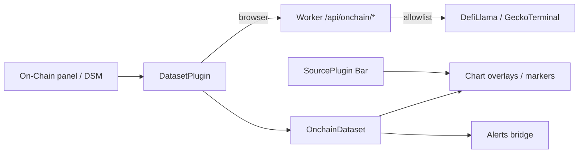

# Copyright (C) 2024-2026 jango_blockchained
#
# This file is part of pynescript.
#
# pynescript is free software: you can redistribute it and/or modify
# it under the terms of the GNU Affero General Public License as published by
# the Free Software Foundation, either version 3 of the License, or
# (at your option) any later version.
#
# pynescript is distributed in the hope that it will be useful,
# but WITHOUT ANY WARRANTY; without even the implied warranty of
# MERCHANTABILITY or FITNESS FOR A PARTICULAR PURPOSE.  See the
# GNU Affero General Public License for more details.
#
# You should have received a copy of the GNU Affero General Public License
# along with pynescript.  If not, see <https://www.gnu.org/licenses/>.
#
# SPDX-License-Identifier: AGPL-3.0-only

---
title: "Architecture Decision Records"
description: "ADR-001 through ADR-015 for AXIS: registry, AXIS≠engine, Solid+Vite, dual engines, configSchema, URL load, storage, CF project id, proxies, DO fan-out, migration, CORS, results export, transport preference + telemetry, on-chain data plane."
---

# Architecture Decision Records

Formal ADRs for AXIS (product + `frontend/`). Status values: **Accepted** unless noted. Dates are conceptual product epochs, not git archaeology.

## Index

| ID | Title |
| --- | --- |
| [ADR-001](#adr-001-pluggable-unified-registry) | Pluggable unified registry |
| [ADR-002](#adr-002-axis--engine) | AXIS ≠ engine |
| [ADR-003](#adr-003-solid--vite-product-ui) | Solid + Vite product UI |
| [ADR-004](#adr-004-dual-engines-server--pyodide) | Dual engines (server + Pyodide) |
| [ADR-005](#adr-005-declarative-configschema) | Declarative configSchema |
| [ADR-006](#adr-006-url-loadable-plugins) | URL-loadable plugins |
| [ADR-007](#adr-007-storage-as-a-plugin) | Storage as a plugin |
| [ADR-008](#adr-008-frozen-cf-project-id) | Frozen CF project id `pynescript-axis` |
| [ADR-009](#adr-009-worker-proxies-first) | Worker proxies first |
| [ADR-010](#adr-010-durable-object-stream-fan-out) | Durable Object stream fan-out |
| [ADR-011](#adr-011-state-namespace-migration) | State namespace migration |
| [ADR-012](#adr-012-cors-as-deploy-concern) | CORS as deploy concern |
| [ADR-013](#adr-013-results-export-in-axis) | Results export in AXIS |
| [ADR-014](#adr-014-transport-preference--connection-telemetry) | Transport preference + connection telemetry |
| [ADR-015](#adr-015-on-chain-data-plane) | On-chain data plane |

---

## ADR-001: Pluggable unified registry

### Context

Early AXIS registered sources/streams/engines in separate ad hoc maps. Operators and authors needed one mental model and one install path.

### Decision

Adopt a **unified `PluginRegistry`** (`frontend/src/plugins/registry.ts`) with kinds:

`source | stream | engine | storage | component(reserved)`

Every plugin shares `PluginBase` (`id`, `name`, `kind`, `description`, `version`, `builtIn`, `configSchema`, `capabilities`, lifecycle hooks). Registration is ordered; listeners observe register/unregister.

### Consequences

- Active selection lives in the Solid store, not the registry.
- Built-ins protected from casual unregister.
- Catalogs (`sources/catalog.ts`, …) become registration facades.
- Contract docs under [Plugins](/axis/docs/plugins).

---

## ADR-002: AXIS ≠ engine

### Context

Closed chart hosts couple rendering and language runtime. That blocks offline mode, alternate evaluators, and headless reuse of PYNE.

### Decision

**AXIS never embeds a closed interpreter.** All evaluation goes through `EnginePlugin.run`. UI modules call `getActiveEngine()` / `runAndApply`, not Python bindings directly (except inside the pyodide engine module).

### Consequences

- Language fidelity owned by [PYNE](/pyne/docs/runtime).
- AXIS docs do not duplicate grammar theory.
- New engines (tiny demo, remote Worker, future WASM) are additive plugins.

---

## ADR-003: Solid + Vite product UI

### Context

Legacy vanilla JS shell (`main.js`, `style.css`) mixed DOM wiring with business logic and aged TV-blue tokens.

### Decision

Product path is **SolidJS + Vite + Tailwind 4**, entry `src/index.tsx` / `app.tsx`. Imperative chart library (lightweight-charts) is isolated in `ChartHost` / `PaneManager` so Solid reconciliation does not thrash canvas DOM.

### Consequences

- Legacy files retained for smoke/static tests only (`LEGACY.md`).
- Icons via `lucide-solid`.
- Deploy artifact is Vite `dist/`, not repo-root static tree.

---

## ADR-004: Dual engines (server + Pyodide)

### Context

Researchers need server fidelity and offline demos. A single transport cannot satisfy both without compromise.

### Decision

Ship two built-in engines:

| Id | Role |
| --- | --- |
| `server` | `POST {endpoint}/run?mode=` with `{ script, data: bars }` |
| `pyodide` | Browser Python + vendored pynescript / antlr wheels |

Both implement the same `EnginePlugin` contract and return `RunResult`.

### Consequences

- Endpoint field only for server-like engines.
- Pyodide requires correct static asset deployment (ZIP integrity checks).
- Timeouts unified at runner layer.

---

## ADR-005: Declarative configSchema

### Context

Per-plugin settings UIs do not scale; custom React/Solid forms per plugin forks the manager.

### Decision

Plugins declare optional **`configSchema`**: map of field name → `{ type, default, label, options, min, max, ... }`. Settings and library panels resolve defaults + `pluginsConfig` overrides via shared resolve helpers.

### Consequences

- New plugins get settings UI without shell changes (within field types).
- Types: `string | number | boolean | select` initially.
- Invalid user values remain a plugin responsibility at runtime.

---

## ADR-006: URL-loadable plugins

### Context

Third-party sources/engines should not require rebuild of the PWA for experiments.

### Decision

Support **`loadPluginFromUrl`**: fetch ES module, validate shape, register, persist install metadata for restore on boot. Example plugins published under `public/plugins/`.

### Consequences

- Browser origin trust model: URL plugins are code execution.
- Security tests constrain schemes and storage-via-URL footguns.
- Offline restore needs prior successful fetch/cache.

---

## ADR-007: Storage as a plugin

### Context

Script library began as localStorage-only; cloud and git were bolted differently.

### Decision

**Storage is a first-class plugin kind** with `list/read/write/remove` (+ optional draft/sync/status). Built-ins: `local` (IDB), `cloud` (Worker `/api/scripts`), `git` (GitHub/GitLab Contents API). Active storage in `activePlugins.storage`.

### Consequences

- Manager Script Library is backend-agnostic.
- Git commits only on explicit save; drafts local.
- Cloud uses Bearer Pro keys and optional optimistic concurrency.

---

## ADR-008: Frozen CF project id `pynescript-axis`

### Context

Renaming Cloudflare Pages/Worker projects severs KV/D1/R2 bindings, custom domains, and CI secrets. Product brand evolved to AXIS.

### Decision

**Keep infrastructure name `pynescript-axis`.** Brand in UI/manifest/docs is AXIS. Health JSON may identify `pynescript-axis-worker`. Optional DNS aliases (`axis.*`) point at the same project without rename.

### Consequences

- `wrangler.toml` `name` and Pages `--project-name` stay frozen.
- Docs call out the freeze explicitly (this ADR).
- npm package name may lag brand.

---

## ADR-009: Worker proxies first

### Context

In-Worker Pyodide is attractive but heavy; production needed a path immediately.

### Decision

Worker **`/api/run` proxies to an external Python backend** first (`EXTERNAL_BACKEND`). In-Worker runtime remains scaffolded/gated. Keys, usage metering, scripts API, and stream DO can ship independently of full edge evaluation.

### Consequences

- AXIS `server` engine talks to Worker URL transparently.
- Operational dependency on Flask (or equivalent) until edge runtime matures.
- Clear layering: Worker is data plane + auth, not necessarily the interpreter.

---

## ADR-010: Durable Object stream fan-out

### Context

N browser clients each opening venue WebSockets waste connections and risk rate limits.

### Decision

**`SessionDO` Durable Object**: one upstream WS per session key; fan-out to N client sockets via `/api/stream`. Hibernation-friendly design on CF.

### Consequences

- Stream plugins may target DO URLs (example plugin provided).
- Session/symbol/interval query params are part of the contract.
- Not a historical source—live only.

---

## ADR-011: State namespace migration

### Context

Hard-renaming storage namespaces would brick user layouts and libraries if keys changed hard.

### Decision

Canonical key **`pynescript.axis.v1`**. On read, fall back to `pynescript.axis.v2` (and parallel library/draft keys), then **write forward**. Do not keep dual-write forever.

### Consequences

- Seamless upgrade for existing browsers.
- Persistence strips bars/lastRun/logs.
- Tests cover migration (`tests/state.test.ts` patterns).

---

## ADR-012: CORS as deploy concern

### Context

Browser AXIS on origin A calling Pro API on origin B fails without CORS. Hardcoding origins in AXIS is wrong.

### Decision

**CORS is a backend/deploy configuration** (`ALLOWED_ORIGINS` on Flask; Worker headers as deployed). AXIS documents required origins; ops sets explicit lists in production (avoid perpetual `*` outside demos).

### Consequences

- Localhost regex for dev.
- Troubleshooting centers on preflight, not engine code.
- Static file server does not replace API CORS.

---

## ADR-013: Results export in AXIS

### Context

Researchers need artifacts (trades CSV, run JSON) without a separate analytics service.

### Decision

**Results panel owns export**: download JSON of `lastRun`, CSV of closed trades, clipboard helpers. Strategy pairing and stats run client-side from engine events (`results/strategy.ts`, `results/events.ts`).

### Consequences

- Export fidelity bounded by engine event quality.
- No server-side report store required for MVP.
- Viewer metrics ≠ broker statements (documented for operators).

---

## ADR-014: Transport preference + connection telemetry

### Context

Operators need to see **how** data and calculation move (WS vs REST vs local vs brokered), whether the live socket is actually open, and engine run latency. Naively “prefer WebSocket everywhere” is wrong: venues expose **history over REST** and **live klines over WSS**. Server engines batch-run over HTTP; Pyodide is local WASM.

### Decision

1. **Transport policy**
   - History → REST (or local mock/CSV).
   - Live → **WebSocket first**, paired per source via `defaultStreamForSource` (`binance-rest` → `binance-ws`, …).
   - Engine → **prefer `WS /ws/run`** on the Pro API when available (`flask-sock`); fall back to HTTP `POST /run`. Pyodide remains local.
   - Brokered → CF Durable Object / `needsProxy` streams surface as transport class **`broker`**.
2. **Honest stream state** — `connecting` until `onStatus({ state: 'open' })`; reconnect uses `reconnecting` / degraded telemetry, not false green.
3. **Venue streams use reconnect with exponential backoff** (`streams/reconnect-ws.ts`).
4. **Connection HUD** — StatusBar second row (`ConnectionHud`) reads ephemeral `store.telemetry` (SRC/STR/ENG/STO chips, tick pulse, engine latency). Persist only `telemetry.hud` prefs + `live.preferAfterLoad` / `live.rerunOn`.
5. **Live re-run modes** — `every-tick` (default) or `bar-close` (venue `Bar.closed` or bar time advance).
6. **Chart stability** — full `setDataToChart` only on history load (`chartDataGen`); live uses `appendBar`; overlay/script drawings update in place to avoid hide/show flash.

### Consequences

- UI never claims WS for historical load.
- Auto-live after Load is **opt-in** (`preferAfterLoad`, default off).
- Plugin capabilities may declare `transport`; otherwise HUD classifies from id/capabilities.
- See [Streams](/axis/docs/plugins/streams), [UI shell](/axis/docs/ui/ui-shell), [Overview](/axis/docs/architecture/overview).

---

## ADR-015: On-chain data plane

### Context

AXIS began as an **OHLCV-first** chart host: `SourcePlugin` / `StreamPlugin` deliver `Bar[]` (open, high, low, close, volume) for CEX and similar venues, then engines run Pine against that series. Operators also need **non-price market structure**:

| Need | Why `Bar` alone fails |
| --- | --- |
| Protocol TVL (USD) | Single scalar liquidity total, not OHLC |
| DEX pool candles | Same shape as bars, but different venue semantics, address/network keys, and page caps |
| Spike / unlock-style events | Discrete time markers with severity, not candles |
| Honest provenance | Provider, snapshot cadence, finality — not implied by “the chart symbol” |

Forcing these into the primary `Bar` pipeline would corrupt scale semantics (TVL vs price), invent fake OHLC for scalar metrics, and couple wallet/signing UX to read-only analytics.

### Decision

Ship a **parallel on-chain data plane** orthogonal to the OHLCV source/stream path:

1. **Plugin kind `dataset`** on the unified registry (`DatasetPlugin` in `src/plugins/types.ts`):
   - `fetchDataset(opts) → OnchainDataset`
   - optional `searchInstruments`
   - payload kinds: `ohlcv | scalar_series | multi_series | events | table`
   - required **provenance** + **finality** (`pending | safe | finalized | unknown`)
2. **Parallel plane modules** under `src/onchain/` (types, cache, keys, adapters, catalog, manager, events, alerts bridge) — not a new `Bar` field and not Pine output.
3. **Worker allowlist proxy** (`worker/src/onchain.ts`, routes under `/api/onchain/…`):
   - rewrite only known DefiLlama / GeckoTerminal paths
   - validate network ids and pool addresses
   - short-TTL isolate cache (`X-Axis-Onchain-Cache`)
   - client default bases from `store.endpoint` (`src/onchain/proxy.ts`)
4. **Chart UX**: attach as host-side overlays (left scale for scalars; separate series keys `onchain_*`); main market OHLCV stays on the right scale. Not wallet, not Pine plots.

### Alternatives considered

| Alternative | Rejected because |
| --- | --- |
| **Force into `Bar` / active source** | TVL is not OHLC; faking open=high=low=close lies to engines and the price scale. Multi-protocol attach becomes multi-symbol load thrash. |
| **Piggyback Pine `request.security` only** | Needs engine + script for every host overlay; no attach UI, no provider search, no finality UI. |
| **Browser → provider direct** | Public DefiLlama / GeckoTerminal hosts often lack CORS for arbitrary AXIS origins (ADR-012). |
| **Open reverse proxy (any URL)** | SSRF risk; Worker must **allowlist** path shape, not pass-through arbitrary upstream. |
| **Wallet-connected RPC as the plane** | Different product (signing, accounts, private RPC). On-chain here means **public analytics APIs**, not MetaMask. |

### Consequences

- **CORS / deploy** — browsers should use `{endpoint}/api/onchain/llama|gecko`; local Worker on `:8787` or deployed edge. Direct `baseUrl` overrides are for Node tests / trusted environments only.
- **Finality honesty** — DefiLlama TVL is typically a **daily snapshot**, not block-final chain state; Gecko OHLCV is **pool** sampling, not CEX marks. UI shows provenance lines; `synthetic` flags fabricated OHLC.
- **Not a wallet** — no signing, no injected providers, no private keys for this plane.
- **Not Pine** — overlays are host datasets; they do not replace `indicator()` / `strategy()` plots from the engine.
- **Engines unchanged** — active OHLCV source still feeds `EnginePlugin.run`; on-chain series do not silently become script `close`.
- **Cache** — client IDB dataset cache (`instrumentCacheKey`) plus Worker short-TTL memory; operators may see stale TVL briefly after large DeFi moves.
- **Security** — Worker rejects path traversal, invalid slugs/addresses, non-GET, and non-allowlisted Gecko paths.

### Phases shipped

| Phase | Capability | Primary surfaces |
| --- | --- | --- |
| **1 — TVL** | DefiLlama protocol TVL scalar history + search | `defillama-tvl` dataset, `src/onchain/defillama.ts`, llama proxy |
| **2 — DEX** | GeckoTerminal pool OHLCV + pool search; optional `geckoterminal-ohlcv` source for DSM multi-page backfill | `geckoterminal` dataset, `src/onchain/geckoterminal.ts`, gecko proxy |
| **3 — Events** | Derived day-over-day TVL spike/drop events (`tvl_spike` / `tvl_drop`) | `src/onchain/events.ts` → chart markers |
| **4 — Alerts** | Bridge events into alerts engine (`onchain_tvl_spike` / `onchain_event`) | `src/onchain/alerts-bridge.ts`, `src/alerts/engine.ts` |

Pro-only DefiLlama surfaces (raises, unlocks via `pro-api.llama.fi`) remain out of the free Worker allowlist.

### Code map

| Path | Role |
| --- | --- |
| `src/onchain/types.ts` | `OnchainDataset`, instruments, finality |
| `src/onchain/catalog.ts` | Built-in dataset registration |
| `src/onchain/manager.ts` | Attach / hide / detach store wiring |
| `src/onchain/proxy.ts` | Resolve Worker llama/gecko bases |
| `worker/src/onchain.ts` | Allowlisted proxy + health |
| `src/plugins/types.ts` | `DatasetPlugin` contract |

### Related docs

- [Datasets](/axis/docs/plugins/datasets) — plugin contract
- [On-Chain data (end user)](/axis/docs/enduser/guides/on-chain) — operator guide
- [Worker](/axis/docs/worker) — `/api/onchain/…` on the edge route table
- [ADR-001](#adr-001-pluggable-unified-registry), [ADR-009](#adr-009-worker-proxies-first), [ADR-012](#adr-012-cors-as-deploy-concern)

---

## ADR lifecycle

New ADRs should:

1. State context, decision, consequences.
2. Cross-link code paths.
3. Avoid re-litigating ADR-002 without supersession note.

## See also

- [Overview](/axis/docs/architecture/overview)
- [Topologies](/axis/docs/architecture/topologies)
- [Plugins contracts](/axis/docs/plugins/contracts)
- [Datasets](/axis/docs/plugins/datasets)
