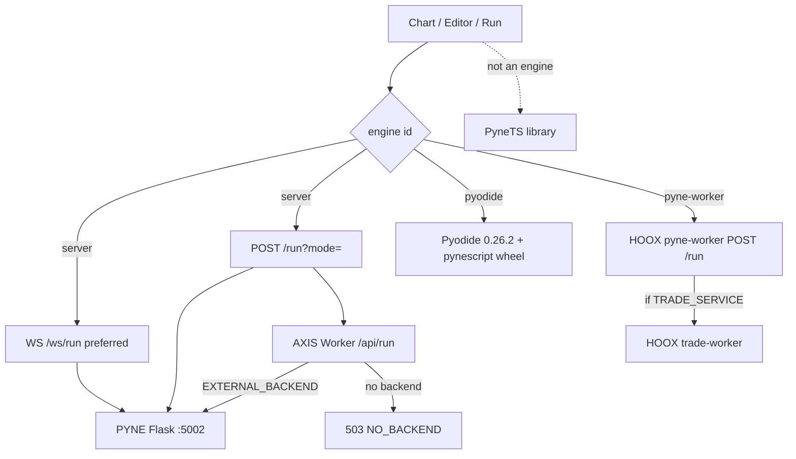

# Copyright (C) 2024-2026 jango_blockchained
#
# This file is part of pynescript.
#
# pynescript is free software: you can redistribute it and/or modify
# it under the terms of the GNU Affero General Public License as published by
# the Free Software Foundation, either version 3 of the License, or
# (at your option) any later version.
#
# pynescript is distributed in the hope that it will be useful,
# but WITHOUT ANY WARRANTY; without even the implied warranty of
# MERCHANTABILITY or FITNESS FOR A PARTICULAR PURPOSE.  See the
# GNU Affero General Public License for more details.
#
# You should have received a copy of the GNU Affero General Public License
# along with pynescript.  If not, see <https://www.gnu.org/licenses/>.
#
# SPDX-License-Identifier: AGPL-3.0-only

---
title: "Evaluation map"
description: "How AXIS runs Pine: Flask Pro API, Worker proxy, in-browser Pyodide. AXIS does not import PyneTS and does not place HOOX orders."
---

# Evaluation map

## Abstract

AXIS is a charting PWA, not a language rewrite. Every Pine evaluation goes through an **engine plugin**. Built-ins are `server` (HTTP/WS to PYNE) and `pyodide` (in-browser Python wheel). Optional HOOX **pyne-worker** is just another Backend URL.

**AXIS does not import `@hoox-sh/pynets`.** **AXIS does not call `trade-worker`.** Drawing a strategy on the chart is research, not execution.

## Conceptual model



## Interface surface

| Path | Implementation | Notes |
| --- | --- | --- |
| Engine `server` | `src/engines/catalog.ts` | Prefer **WS** `ws(s)://{endpoint}/ws/run` (`preferWs` default true), else **POST** `{endpoint}/run?mode=` with `{ script, data, mode, inputs?, profiler?, libraries? }`. Modes `interpret \| compile \| auto`. Timeout scales with bar count (45–180s). Default endpoint `http://localhost:5002`. Strategy HPO uses **`POST {endpoint}/optimize`**. |
| Engine `pyodide` | same file | Self-hosted **Pyodide 0.26.2** (`/pyodide/v0.26.2/`), wheels `/vendor/pynescript-0.5.0-py3-none-any.whl` + `antlr4_python3_runtime-4.13.2`, runtime `/pyodide/pynescript_runtime.py`. **Numba is not in Wasm**; `compile` / `auto` is object-mode. Cold load ~20–30s. |
| AXIS Worker `/api/run` | `worker/src/runtime.ts` | `PYODIDE_IN_WORKER=enabled` scaffold; else **proxy `EXTERNAL_BACKEND/run`**; else 503 `NO_BACKEND`. Caps: 512 KiB script, 50k bars, 30 req/min/IP, 60s upstream. |
| Engine `pyne-worker` | `src/engines/catalog.ts` | Built-in (`builtIn: true`). `POST /run` to the HOOX edge worker. Default origin `https://pyne-worker.cryptolinx.workers.dev`. Distinct from engine `server` and from the AXIS Worker (`worker-axis`). |
| **PyneTS** | — | TypeScript library. [PYNE docs](/pyne/docs/pynets). **Not referenced** in AXIS source. |

Payloads follow the [PYNE evaluate contract](/pyne/docs/api/contract). Defaults: Flask `POST /run` uses `mode` **`auto`**. See [modes](/pyne/docs/enduser/reference/modes).

## Internals

| Path | Role |
| --- | --- |
| `src/engines/catalog.ts` | `server`, `pyne-worker`, `pyodide` |
| `src/workers/catalog.ts` | Workers page catalog entries |
| `worker/src/runtime.ts` | Edge `/api/run` |
| `public/pyodide/` | Wasm runtime + wheel |
| `scripts/sync-pyne-wheel.sh` | Refresh vendored wheel |

## Invariants & edge cases

1. **AXIS ≠ engine** (ADR-002). The shell never embeds a closed interpreter.
2. **AXIS ≠ execution.** Strategy events on the Results panel are not HOOX orders. See [AXIS and HOOX](/docs/enduser/guides/axis-and-hoox).
3. **No `none` stream plugin** in `src/streams/catalog.ts`. Pausing live data is `stopLive()`, not a plugin id.
4. The vendored wheel is `pynescript-0.5.0-py3-none-any.whl`. Live PyPI `hoox-pyne` can be newer (0.6.7 as of this writing). Check `public/vendor/`.
5. CORS: Worker allows localhost, `*.hoox.sh`, `*.pynescript.online`, `*.axis.pages.dev` (plus legacy `*.pynescript-axis.pages.dev`) only.

## Worked examples

### Local desk

```bash
# terminal 1 — PYNE Pro API
cd ../pyne && make run    # :5002 — sister repo hoox-sh/pyne; some checkouts are still named pynescript

# terminal 2 — AXIS
cd axis && bun run dev
```

Manager → engine `server`, Backend URL `http://localhost:5002`.

### Offline

Switch engine to `pyodide`. First run downloads/caches the self-hosted runtime. Do not expect Numba.

### Edge proxy

Deploy AXIS Worker with `EXTERNAL_BACKEND` pointing at Flask or pyne-worker. Engine stays `server`; endpoint is the Worker origin. Still no trade-worker hop unless **that** backend forwards events.

### Pyodide in Worker (scaffold — not production yet)

Goal: a fully-CF deployment (no Flask) with the Worker evaluating Pine itself.

```toml
# worker/wrangler.toml
PYODIDE_IN_WORKER = "enabled"   # default "disabled" — leave it there for now
```

Status: Pyodide boots per isolate, but the wheel install + `run_script`
bridge are stubbed, so every run returns an error envelope (HTTP 200) and
does **not** fall through to `EXTERNAL_BACKEND`. Enabling the flag today
breaks evaluation. Completion checklist (R2 wheel, `BUNDLES` binding,
micropip install, bridge, fail-open semantics) lives in
`worker/RUNTIME.md`. Production recommendation stays `EXTERNAL_BACKEND`.

## Failure modes

| Symptom | Cause | Fix |
| --- | --- | --- |
| 503 `NO_BACKEND` | Worker has no `EXTERNAL_BACKEND` and Pyodide-in-worker off | Set backend or use browser Pyodide |
| 503 body `{ status: 'error', code: 'NO_BACKEND' }` to API consumers | Same as above, machine shape | Do **not** retry — the backend is absent, not busy. Fix config, then resend. (PYNE Agent treats this as skipped-with-note after 1 attempt.) |
| Compile "slow / different" in Pyodide | No Numba | Use Flask for numeric compile |
| Expecting pynets in the PWA | Not wired | Import `@hoox-sh/pynets` in your own app |
| Strategy PnL on chart, no CEX fill | AXIS does not execute | [pyne-worker live trading](/docs/enduser/guides/pyne-live-trading) |

## See also

- [Engines](/axis/docs/plugins/engines)
- [Worker runtime](/axis/docs/worker/runtime)
- [PYNE Pro API](/pyne/docs/api/endpoints/run)
- [PyneTS](/pyne/docs/pynets)
- [HOOX pyne-worker](/docs/devops/workers/pyne-worker)
- [AXIS and HOOX](/docs/enduser/guides/axis-and-hoox)
