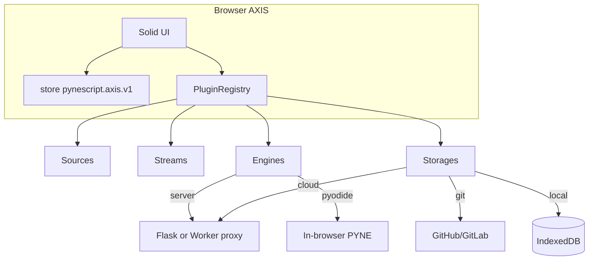

# Copyright (C) 2024-2026 jango_blockchained
#
# This file is part of pynescript.
#
# pynescript is free software: you can redistribute it and/or modify
# it under the terms of the GNU Affero General Public License as published by
# the Free Software Foundation, either version 3 of the License, or
# (at your option) any later version.
#
# pynescript is distributed in the hope that it will be useful,
# but WITHOUT ANY WARRANTY; without even the implied warranty of
# MERCHANTABILITY or FITNESS FOR A PARTICULAR PURPOSE.  See the
# GNU Affero General Public License for more details.
#
# You should have received a copy of the GNU Affero General Public License
# along with pynescript.  If not, see <https://www.gnu.org/licenses/>.
#
# SPDX-License-Identifier: AGPL-3.0-only

---
title: "Architecture"
description: "AXIS system architecture: AXIS vs engine, plugin registry, topologies, ADRs, and state namespaces."
---

# Architecture

AXIS architecture is the discipline of **separable axes**—price history, live time, calculation, and library storage—coordinated by a Solid AXIS UI that never owns a closed interpreter.

## Abstract

| Layer | Responsibility |
| --- | --- |
| AXIS | UI, store, plugin orchestration, chart apply |
| Plugin contracts | `source \| stream \| engine \| storage \| dataset` (+ reserved component) |
| Engines | PYNE evaluation (browser Pyodide or remote `/run`) |
| On-chain plane | Parallel non-OHLCV datasets (TVL, DEX, events) via Worker allowlist proxy — [ADR-015](/axis/docs/architecture/adrs#adr-015-on-chain-data-plane) |
| Optional edge | Cloudflare Pages + Worker + DO/KV/D1/R2 |
| Optional desk API | Flask Pro API |

**Invariant:** AXIS ≠ engine. Evaluation always crosses an engine plugin boundary.

## Track map

| Page | Contents |
| --- | --- |
| [Overview](/axis/docs/architecture/overview) | End-to-end data/control flow |
| [ADRs](/axis/docs/architecture/adrs) | ADR-001 … ADR-015 |
| [Topologies](/axis/docs/architecture/topologies) | Dev, static, edge deploy shapes |
| [State namespaces](/axis/docs/architecture/state-namespaces) | Keys, migration, hash, IDB |
| [Drawings and plot parity](/axis/docs/architecture/drawings-parity) | User tools vs Pine plots/drawings vs PYNE export |

## Conceptual model



## Formal namespaces

```text
Contract namespace:  pynescript.axis.plugins.v1
App state key:      pynescript.axis.v1
App state prefix:   pynescript.axis.*
CF project id:      pynescript-axis   (frozen)
Health service id:  pynescript-axis-worker
```

## Related tracks

- [End User](/axis/docs/enduser) — operator workflows  
- [UI](/axis/docs/ui) — UI subsystem design  
- [Plugins](/axis/docs/plugins) — contracts & catalogs  
- [Worker](/axis/docs/worker) — edge data plane  
- [DevOps](/axis/docs/devops) — build & CORS  
- [PYNE runtime](/pyne/docs/runtime) — language evaluation  

## See also

- Root `README.md` — package-level map  
- `LEGACY.md` — pre-Solid shell boundary  
- [AXIS CLI](/axis/docs/devops/cli) — operator install / deploy 
