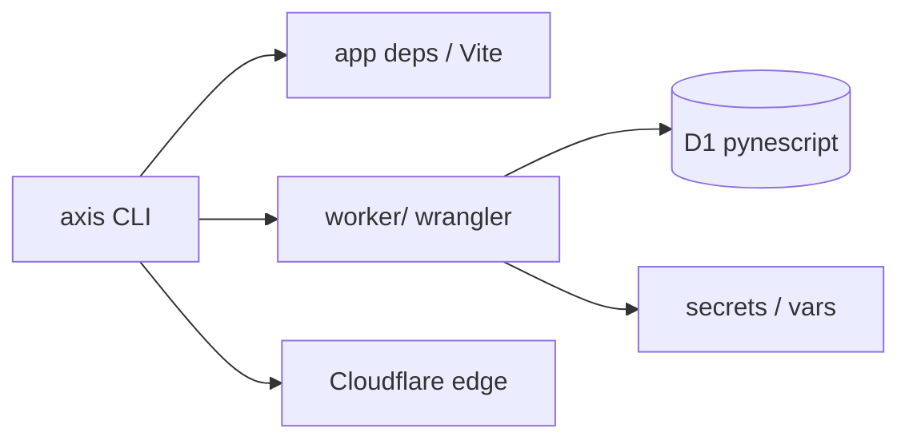

# Copyright (C) 2024-2026 jango_blockchained
#
# This file is part of pynescript.
#
# pynescript is free software: you can redistribute it and/or modify
# it under the terms of the GNU Affero General Public License as published by
# the Free Software Foundation, either version 3 of the License, or
# (at your option) any later version.
#
# pynescript is distributed in the hope that it will be useful,
# but WITHOUT ANY WARRANTY; without even the implied warranty of
# MERCHANTABILITY or FITNESS FOR A PARTICULAR PURPOSE.  See the
# GNU Affero General Public License for more details.
#
# You should have received a copy of the GNU Affero General Public License
# along with pynescript.  If not, see <https://www.gnu.org/licenses/>.
#
# SPDX-License-Identifier: AGPL-3.0-only

---
title: "AXIS CLI"
description: "packages/cli — install, doctor, Worker setup (D1/OAuth), secrets, deploy, and health."
---

# AXIS CLI

## Abstract

The **AXIS CLI** (`@hoox-sh/axis-cli` under `packages/cli`) is the operator entry point for local install, Worker bootstrap, Cloudflare secrets, deploy, and health checks. It wraps Bun + Wrangler with AXIS-specific paths and defaults (Worker name `pynescript-axis`, D1 `pynescript`, OAuth device flow).

Requires **Bun ≥ 1.2**.

## Conceptual model



## Install

```bash
bun install
cd packages/cli && bun install

# from repo root
bun run axis --help
# or
make axis ARGS="--help"
```

## Command surface

| Command | Role |
| --- | --- |
| `axis install` | `bun install` root + `worker/` + CLI |
| `axis doctor` [`--remote`] | Toolchain, `wrangler.toml`, CF auth, optional live `/health` |
| `axis setup` | Bootstrap: install → ensure toml → local D1 |
| `axis setup worker` | Copy `wrangler.toml.example` → `wrangler.toml` if missing |
| `axis setup d1 --local\|--remote` | Apply `worker/schemas/scripts.sql` |
| `axis setup oauth --github-client-id …` | Set public OAuth App id in `[vars]` (or `--secret`) |
| `axis secret put\|list\|delete` | Wrangler secrets (`ADMIN_TOKEN`, `EXTERNAL_BACKEND`, …) |
| `axis deploy worker\|pages\|all` | Deploy Worker and/or Pages |
| `axis health [--oauth]` | Probe `/health` and optional GitHub device start |
| `axis whoami` | Cloudflare account |
| `axis dev` / `dev worker` / `dev desktop` | Local servers |

Global: `--json`, `--quiet`, `-y`.

## Production checklist

```bash
axis install
axis doctor
axis setup --github-client-id Ov23li… --remote-d1
axis secret put ADMIN_TOKEN
axis secret put EXTERNAL_BACKEND
axis deploy worker
axis health --oauth
```

| Item | Guidance |
| --- | --- |
| `GITHUB_OAUTH_CLIENT_ID` | Public OAuth App id; Device Flow enabled on GitHub |
| `ADMIN_TOKEN` / `EXTERNAL_BACKEND` | Prefer `axis secret put` (not committed vars) |
| `ALLOW_OPEN_KEYS` | `"0"` in production |
| Project name | Frozen: `pynescript-axis` |

## Env overrides

| Variable | Role |
| --- | --- |
| `AXIS_ROOT` | Force monorepo root |
| `AXIS_WORKER_URL` | Default health URL |
| `CLOUDFLARE_API_TOKEN` | Non-interactive Wrangler auth |
| `AXIS_CLI_SRC=1` | Load `src/` instead of `dist/` |

## Internals

| Path | Role |
| --- | --- |
| `packages/cli/bin/axis.js` | Bin entry (Bun) |
| `packages/cli/src/commands/*` | Commander handlers |
| `packages/cli/src/services/wrangler-toml.ts` | Minimal toml var helpers |
| `packages/cli/src/services/health.ts` | `/health` + OAuth probes |
| Root `bun run axis` / `make axis` | Convenience wrappers |

See also: [Cloudflare deployment](/axis/docs/devops/cloudflare), [Worker bindings](/axis/docs/worker/bindings).
