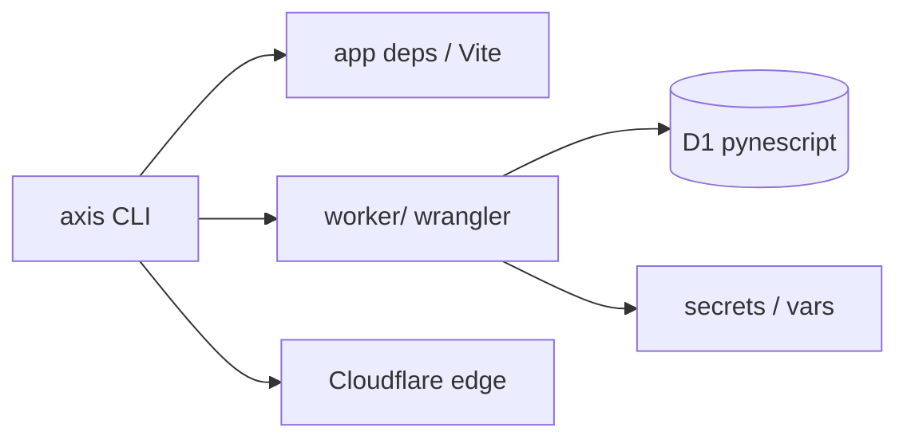

# Copyright (C) 2024-2026 jango_blockchained
#
# This file is part of pynescript.
#
# pynescript is free software: you can redistribute it and/or modify
# it under the terms of the GNU Affero General Public License as published by
# the Free Software Foundation, either version 3 of the License, or
# (at your option) any later version.
#
# pynescript is distributed in the hope that it will be useful,
# but WITHOUT ANY WARRANTY; without even the implied warranty of
# MERCHANTABILITY or FITNESS FOR A PARTICULAR PURPOSE.  See the
# GNU Affero General Public License for more details.
#
# You should have received a copy of the GNU Affero General Public License
# along with pynescript.  If not, see <https://www.gnu.org/licenses/>.
#
# SPDX-License-Identifier: AGPL-3.0-only

---
title: "AXIS CLI"
description: "packages/cli — install, doctor, Worker setup (D1/OAuth), secrets, deploy, health — CLI-first operator path."
---

# AXIS CLI

## Abstract

The **AXIS CLI** (`@hoox-sh/axis-cli` under `packages/cli`) is the **CLI-first** operator entry for local install, Worker bootstrap, Cloudflare® secrets, deploy, and health checks. It wraps Bun + Wrangler with AXIS-specific paths and defaults (Worker name `pynescript-axis`, D1 `pynescript`, OAuth device flow).


Requires **Node ≥ 20** to run the published binary (`npm i -g @hoox-sh/axis-cli`) and **Bun ≥ 1.2** for install/dev/build commands that shell out to Bun. Product version follows root `package.json`; the CLI package (`@hoox-sh/axis-cli`) is versioned independently and publishes on `v*` tags via `.github/workflows/release.yml`.

## Conceptual model



## Install

```bash
# npm
npm install -g @hoox-sh/axis-cli
axis --help

# from monorepo root
bun install
cd packages/cli && bun install && bun run build && cd ../..

bun run axis --help
# Make pass-through
make axis ARGS="--help"
# Optional global link
cd packages/cli && bun link && axis --help
```

### Root package scripts & Make targets

| Invoke | Runs |
| --- | --- |
| `bun run axis -- <args>` | `packages/cli/bin/axis.js` |
| `bun run axis:install` | `axis install` |
| `bun run axis:doctor` | `axis doctor` |
| `bun run axis:setup` | `axis setup` |
| `bun run axis:deploy` | `axis deploy` (default worker) |
| `bun run axis:health` | `axis health` |
| `make axis ARGS="doctor --remote"` | same bin with args |
| `make axis-install` · `axis-doctor` · `axis-setup` · `axis-deploy` · `axis-health` | fixed wrappers |

When using `bun run axis setup -- --flag`, keep the `--` so Bun forwards flags to the CLI.

## Command surface

| Command | Role |
| --- | --- |
| `axis install` | `bun install` root + `worker/` + CLI |
| `axis doctor` [`--remote`] | Toolchain, `wrangler.toml`, CF auth, optional live `/health` |
| `axis setup` | Bootstrap: install → ensure toml → local D1 |
| `axis setup worker` | Copy `wrangler.toml.example` → `wrangler.toml` if missing |
| `axis setup d1 --local\|--remote` [`--create`] | Apply `worker/schemas/scripts.sql` |
| `axis setup oauth --github-client-id …` | Set public OAuth App id in `[vars]` (or `--secret`) |
| `axis secret put\|list\|delete` | Wrangler secrets (`ADMIN_TOKEN`, `EXTERNAL_BACKEND`, …) |
| `axis deploy` / `deploy worker` | Deploy Worker `pynescript-axis` |
| `axis deploy pages` | Vite build + Pages project |
| `axis deploy all` | Worker then Pages |
| `axis health [--oauth] [--url …]` | Probe `/health` and optional GitHub device start |
| `axis whoami` | Cloudflare® account |
| `axis dev` | Vite product UI |
| `axis dev worker` | Local wrangler Worker |
| `axis dev desktop` | Tauri desktop shell |

Global flags: `--json`, `--quiet`, `-y` / `--yes`.

## Production checklist

```bash
axis install
axis doctor
axis setup --github-client-id Ov23li… --remote-d1
axis secret put ADMIN_TOKEN
axis secret put EXTERNAL_BACKEND
# Optional but recommended for gated /api/run:
# axis secret put (or wrangler vars) REQUIRE_RUN_AUTH / bind API_KEYS
axis deploy worker
axis health --oauth
```

| Item | Guidance |
| --- | --- |
| `GITHUB_OAUTH_CLIENT_ID` | Public OAuth App id; Device Flow enabled on GitHub; **env wins over body `clientId`** |
| `GITLAB_OAUTH_CLIENT_ID` | Same for GitLab when using git storage |
| `ADMIN_TOKEN` / `EXTERNAL_BACKEND` | Prefer `axis secret put` (not committed vars) |
| `API_KEYS` KV | Bind in prod; D1 without KV fails closed (`API_KEYS_REQUIRED`) |
| `ALLOW_OPEN_KEYS` | `"0"` in production |
| `REQUIRE_RUN_AUTH` | `"1"` to force Bearer on `/api/run` even without KV |
| Project name | Frozen: `pynescript-axis` |

## Env overrides

| Variable | Role |
| --- | --- |
| `AXIS_ROOT` | Force monorepo root |
| `AXIS_WORKER_URL` | Default health / deploy probe URL |
| `CLOUDFLARE_API_TOKEN` | Non-interactive Wrangler auth |
| `AXIS_CLI_SRC=1` | Load `src/` instead of `dist/` |

## Internals

| Path | Role |
| --- | --- |
| `packages/cli/bin/axis.js` | Bin entry (Bun) |
| `packages/cli/src/commands/*` | Commander handlers (`install`, `doctor`, `setup`, `deploy`, `secrets`, `health`, `dev`, `whoami`) |
| `packages/cli/src/services/wrangler-toml.ts` | Minimal toml var helpers |
| `packages/cli/src/services/health.ts` | `/health` + OAuth probes |
| Root `package.json` `axis` / `axis:*` scripts | Convenience wrappers |
| Root `Makefile` `axis` / `axis-*` | Make wrappers |

See also: [Installation](/axis/docs/enduser/getting-started/installation), [Cloudflare® deployment](/axis/docs/devops/cloudflare), [Worker bindings](/axis/docs/worker/bindings), [Worker auth](/axis/docs/worker/auth), [packages/cli/README.md](https://github.com/hoox-sh/axis/blob/main/packages/cli/README.md).
