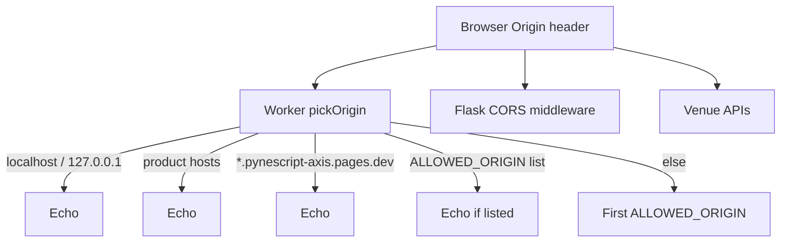

# Copyright (C) 2024-2026 jango_blockchained
#
# This file is part of pynescript.
#
# pynescript is free software: you can redistribute it and/or modify
# it under the terms of the GNU Affero General Public License as published by
# the Free Software Foundation, either version 3 of the License, or
# (at your option) any later version.
#
# pynescript is distributed in the hope that it will be useful,
# but WITHOUT ANY WARRANTY; without even the implied warranty of
# MERCHANTABILITY or FITNESS FOR A PARTICULAR PURPOSE.  See the
# GNU Affero General Public License for more details.
#
# You should have received a copy of the GNU Affero General Public License
# along with pynescript.  If not, see <https://www.gnu.org/licenses/>.
#
# SPDX-License-Identifier: AGPL-3.0-only

---
title: "CORS and origins"
description: "Worker pickOrigin: local-dev, product hosts, project-scoped Pages previews, ALLOWED_ORIGIN list, Flask constraints."
---

# CORS and origins

## Abstract

AXIS is a browser product that talks to **cross-origin** backends (Flask, Worker, venues). CORS misconfiguration is the #1 local-deploy footgun after missing wheels.

The Worker implements an explicit origin picker (`pickOrigin` in `worker/src/index.ts`); Flask and venue APIs have their own rules.

## Conceptual model



## Worker behavior

Resolution order for `Access-Control-Allow-Origin`:

### 1. Local-dev (always echoed)

Any `http://` or `https://` origin on **`localhost`** or **`127.0.0.1`**, optional port  
(e.g. Vite `:3000`, `axis_pwa_server` `:8081`, Playwright ephemeral ports).

**Not allowed (and not needed):** `http://0.0.0.0:…` — browsers do not use `0.0.0.0` as a page origin; binding with `HOST=0.0.0.0` only means “listen on all interfaces.”

Localhost/127 allowlisting is **safe for CORS**: only pages actually served from those hosts present that `Origin`. A public site cannot forge `Origin: http://localhost:3000` in a real browser.

### 2. Product hosts (2.0.1+)

Exact product / HOOX / legacy PYNE hosts under:

- `*.hoox.sh` / `hoox.sh`
- `*.pynescript.ai` / `pynescript.ai`
- `*.pynescript.online` / `pynescript.online`

Examples: `https://axis.hoox.sh`, `https://hoox.sh`, `https://pynescript.ai`.

### 3. Project-scoped Cloudflare® Pages (not open `*.pages.dev`)

Only origins matching **`*.pynescript-axis.pages.dev`** (and the apex `pynescript-axis.pages.dev`) are echoed. Arbitrary third-party Pages projects (`evil.pages.dev`, other apps) fall through to the allowlist fallback — they are **not** reflected.

### 4. `ALLOWED_ORIGIN` allowlist

Comma-separated exact origins in `env.ALLOWED_ORIGIN` (e.g. `https://a.example,https://b.example`). If the request Origin is listed, echo it; otherwise return the **first** entry (default `https://pynescript.ai`).

**CORS headers applied:**

```
Access-Control-Allow-Origin: <picked>
Access-Control-Allow-Methods: GET, POST, PUT, DELETE, OPTIONS
Access-Control-Allow-Headers: Content-Type, Authorization, X-Admin-Token, If-Match
Access-Control-Max-Age: 86400
Vary: Origin
```

`OPTIONS` → `204` preflight.

### Production implication

For a custom domain already under product regex, no extra var is required. For one-off preview hosts outside the project, list them:

```
ALLOWED_ORIGIN = "https://my-preview.example.com,https://axis.example.com"
```

## Flask / server engine

The **server** engine posts from the browser to the configured endpoint. Flask Pro API must:

1. Answer `OPTIONS` preflight if cross-origin.
2. Reflect or allow the PWA origin.
3. Accept `Content-Type: application/json`.

Same-origin reverse proxy ([VPS demo](/axis/docs/devops/vps-demo)) eliminates CORS for `/run`.

## Venue sources/streams

Public Binance/OKX/etc. REST must send CORS headers usable by browsers. If blocked:

1. Use offline `mock-walk` / `mock-poll`.
2. Add a **same-origin proxy** on Worker/Flask (not a general open proxy — scope carefully).
3. Prefer DO relay only for WS fan-out (WS is not CORS in the XHR sense, but still network-reachable).

## Dynamic plugins

- **Module import** of plugin JS: needs CORS on the **script origin** (same-origin `/plugins/` is safe).
- **fetch inside plugin**: subject to third-party CORS independently.

## Invariants & edge cases

1. **Credentials** — Worker CORS does not set `Allow-Credentials: true`; use Bearer headers, not cookies.
2. **Multiple prod domains** — product regex + comma-separated `ALLOWED_ORIGIN` cover multi-host; unknown sites never get open reflection.
3. **Vite vs 8081** — both covered for Worker; Flask config must match whichever you use.
4. **Health checks** from curl omit Origin — still work; browser calls need correct ACAO.
5. **No open `*.pages.dev`** — only the frozen project `pynescript-axis` previews are product-scoped.

## Failure modes

| Browser console | Meaning |
| --- | --- |
| blocked by CORS policy | Origin not allowlisted |
| preflight 404 | Server lacks OPTIONS |
| No ACAO on error body | Some error paths forgot headers (Worker try/catch mostly covered) |

## See also

- [Worker bindings](/axis/docs/worker/bindings)
- [Local dev](/axis/docs/devops/local-dev)
- [Dynamic loader](/axis/docs/plugins/dynamic-loader)
