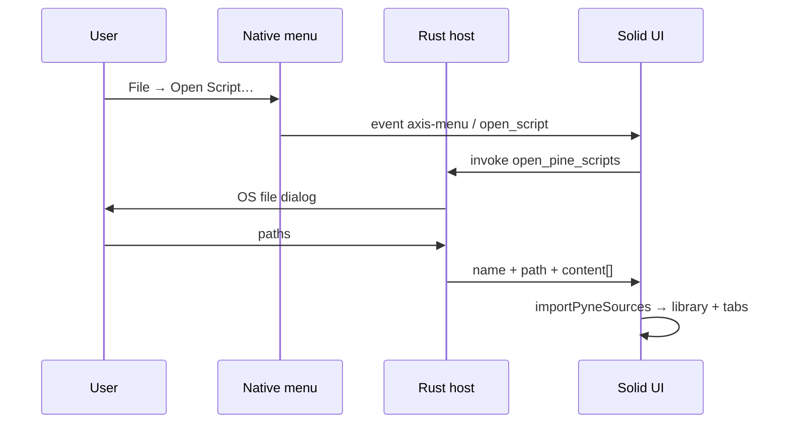
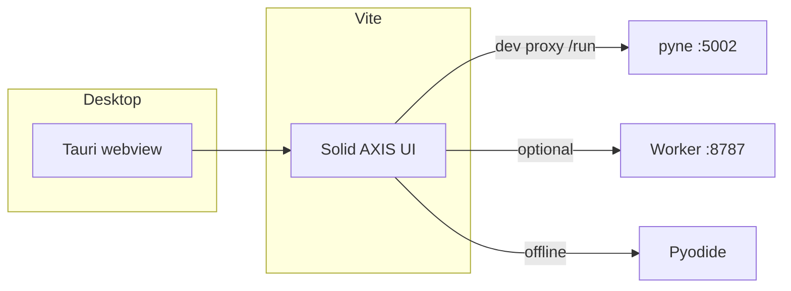

# Copyright (C) 2024-2026 jango_blockchained
#
# This file is part of AXIS.
#
# SPDX-License-Identifier: AGPL-3.0-only

---
title: "Desktop (Tauri)"
description: "Run and package AXIS as a native desktop app with Tauri 2."
---

# Desktop (Tauri)

## Abstract

AXIS ships as a browser PWA and as an optional **desktop shell** built with
[Tauri 2](https://v2.tauri.app/). The Solid/Vite UI is unchanged; Tauri embeds
it in a system webview (WebKitGTK on Linux, WKWebView on macOS, WebView2 on
Windows).

## Commands

From the repo root (after `bun install`):

```bash
bun run desktop:dev     # Vite :3000 + Tauri window (hot reload)
bun run desktop:build   # Vite production build + native installers
bun run desktop:info    # toolchain / webview diagnostics
```

| Script | What it does |
|--------|----------------|
| `desktop:dev` | Runs `tauri dev` → `beforeDevCommand` starts Vite, opens a native window on `http://127.0.0.1:3000` |
| `desktop:build` | Runs `tauri build` → `bun run build` then packages `dist/` |
| `desktop:info` | Prints Rust, system libraries, and webview status |

Installers land under `src-tauri/target/release/bundle/` (AppImage, deb, rpm,
msi, dmg — depending on host OS and `bundle.targets`).

## Prerequisites

### Always

- [Bun](https://bun.sh) (or another JS package manager that can run the scripts)
- [Rust](https://www.rust-lang.org/tools/install) (`rustc` / `cargo`) — see `src-tauri/Cargo.toml` `rust-version`
- System webview libraries for your platform ([Tauri prerequisites](https://v2.tauri.app/start/prerequisites/))

### Linux (Arch / CachyOS example)

```bash
sudo pacman -S --needed webkit2gtk-4.1 base-devel curl wget file \
  openssl appmenu-gtk-module libappindicator-gtk3 librsvg patchelf
```

Debian/Ubuntu equivalents use `libwebkit2gtk-4.1-dev` and related `-dev` packages
(see the Tauri docs for the current list).

### Engine backends

Desktop AXIS is the same product as the PWA. For Pine evaluation you still need
one of:

| Engine | Notes |
|--------|--------|
| Local **pyne** Pro API | `http://127.0.0.1:5002` — Vite proxies `/run` in dev |
| Cloudflare Worker | Configure worker URL in Manager |
| **Pyodide** (in-webview) | Fully offline path; largest first load |

## Layout

| Path | Role |
|------|------|
| `src-tauri/` | Rust host, `tauri.conf.json`, icons, capabilities |
| `src-tauri/tauri.conf.json` | App id `sh.hoox.axis`, window size, build hooks |
| `src/` | Unchanged Solid product UI |
| `dist/` | Vite output consumed by `frontendDist` |

## Behaviour notes

- **Service worker** is skipped in the Tauri shell (`src/pwa/register-sw.ts`).
  Offline install is a PWA concern; the desktop app is already installed as a
  native binary.
- **Window** defaults: 1440×900, min 960×640, centered.
- **CSP** is left open (`null`) so external venues, Pyodide assets, and worker
  APIs work the same as in the browser. Tighten later if you ship a locked-down
  build.
- Icons are generated from `public/assets/icon-512.png` via `bunx tauri icon`.

## Native menu & open from disk

The Tauri host builds a native app menu:

| Menu | Item | Action |
|------|------|--------|
| **File** | **Open Script…** (`⌘/Ctrl+O`) | System multi-file dialog → library + editor tabs |
| **File** | **Quit AXIS** | Quit (platform predefined) |
| **Help** | **About AXIS** | Info dialog (version / license / site) |

### Flow



| Path | Role |
|------|------|
| `src-tauri/src/lib.rs` | Menu, `open_pine_scripts` command, dialog + disk read |
| `src/desktop/` | `isTauriShell`, menu listen, open + About wiring |
| `src/storage/import-pyne-open.ts` | Shared status/logs/editor open after import |
| `src/storage/import-pyne-files.ts` | `importPyneSources` (text) + `importPyneFiles` (browser `File`) |

Accepted extensions match the PWA drop path: `.pyne`, `.pine`, `.pinescript`,
`.pinev5`, `.pinev6`. Per-file size cap on the host: **8 MiB**.

Drag-and-drop of the same extensions still works in the desktop webview.

## Conceptual model


