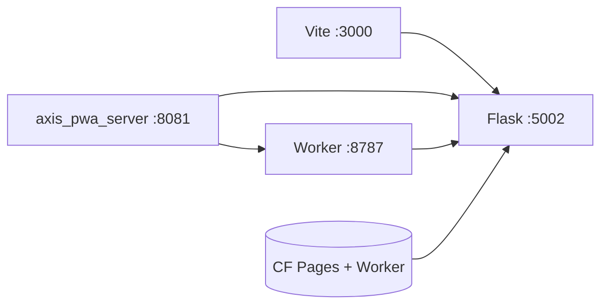

# Copyright (C) 2024-2026 jango_blockchained
#
# This file is part of pynescript.
#
# pynescript is free software: you can redistribute it and/or modify
# it under the terms of the GNU Affero General Public License as published by
# the Free Software Foundation, either version 3 of the License, or
# (at your option) any later version.
#
# pynescript is distributed in the hope that it will be useful,
# but WITHOUT ANY WARRANTY; without even the implied warranty of
# MERCHANTABILITY or FITNESS FOR A PARTICULAR PURPOSE.  See the
# GNU Affero General Public License for more details.
#
# You should have received a copy of the GNU Affero General Public License
# along with pynescript.  If not, see <https://www.gnu.org/licenses/>.
#
# SPDX-License-Identifier: AGPL-3.0-only

---
title: "DevOps"
description: "Build, serve, Cloudflare, VPS demo, CORS, and CI for the AXIS PWA and Worker."
---

# DevOps

## Abstract

AXIS DevOps spans five runnable surfaces:

1. **Vite + Solid PWA** — product UI (`bun run dev`)
2. **Static server** (`axis_pwa_server.py` or Vite preview) — production-like assets
3. **Cloudflare Worker** (`worker/`) — edge API / WS / OAuth / on-chain proxy
4. **Desktop (Tauri 2)** — native shell around the same UI (`bun run desktop:dev`)
5. **AXIS CLI** (`packages/cli`) — install, doctor, setup, secrets, deploy, health

See [Desktop (Tauri)](./desktop) and [AXIS CLI](./cli) for operator entry points.

Python evaluation for desk workflows still often uses the **Flask Pro API** (`make run` on `:5002`). The Worker proxies there when `EXTERNAL_BACKEND` is set.

## Conceptual model

## Topology cheat sheet

| Mode | Command sketch | Ports |
| --- | --- | --- |
| Dev AXIS | `bun run dev` / `bun run axis dev` | Vite (often `:3000`) |
| Dev + Flask | + `make -C ../pynescript run` | `:5002` |
| Static dist | `bun run build` + `python axis_pwa_server.py` | `:8081` |
| Worker local | `bun run axis dev worker` / `cd worker && bun run dev` | `:8787` |
| CF Worker prod | `bun run axis:deploy` | HTTPS workers.dev / custom |
| Operator | `bun run axis:doctor` · `axis setup` · `axis health` | — |

## Page map

| Page | Topic |
| --- | --- |
| [Local dev](/axis/docs/devops/local-dev) | Day-to-day loop |
| [AXIS CLI](/axis/docs/devops/cli) | Install, doctor, setup, secrets, deploy, health |
| [Build and serve](/axis/docs/devops/build-and-serve) | Vite build, SPA server, assets |
| [Cloudflare®](/axis/docs/devops/cloudflare) | Pages + Worker deploy |
| [Desktop (Tauri)](/axis/docs/devops/desktop) | Native shell |
| [VPS demo](/axis/docs/devops/vps-demo) | Single-box static + Flask |
| [CORS and origins](/axis/docs/devops/cors-and-origins) | Allowed origins matrix |
| [CI and testing](/axis/docs/devops/ci-and-testing) | GitHub Actions, coverage, e2e |

## Frozen names

| Surface | Value |
| --- | --- |
| CF project | `pynescript-axis` |
| Health service | `pynescript-axis-worker` |

## See also

- [Worker](/axis/docs/worker)
- [Testing reference](/axis/docs/reference/testing)
- [AXIS hub](/axis/docs)
