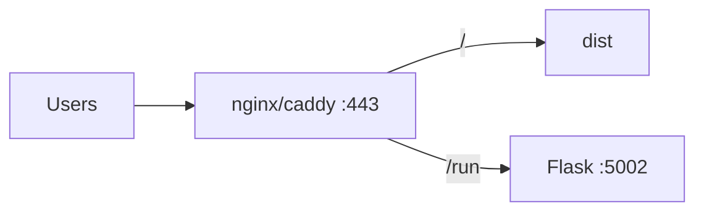

# Copyright (C) 2024-2026 jango_blockchained
#
# This file is part of pynescript.
#
# pynescript is free software: you can redistribute it and/or modify
# it under the terms of the GNU Affero General Public License as published by
# the Free Software Foundation, either version 3 of the License, or
# (at your option) any later version.
#
# pynescript is distributed in the hope that it will be useful,
# but WITHOUT ANY WARRANTY; without even the implied warranty of
# MERCHANTABILITY or FITNESS FOR A PARTICULAR PURPOSE.  See the
# GNU Affero General Public License for more details.
#
# You should have received a copy of the GNU Affero General Public License
# along with pynescript.  If not, see <https://www.gnu.org/licenses/>.
#
# SPDX-License-Identifier: AGPL-3.0-only

---
title: "VPS demo topology"
description: "Single-box demo: static AXIS dist + Flask Pro API (+ optional reverse proxy) without Cloudflare."
---

# VPS demo topology

## Abstract

A **VPS demo** is the lowest-surprise production-like setup for Pine evaluation: one machine runs Flask (PYNE) and serves the static AXIS build. Optional nginx/caddy terminates TLS and reverse-proxies `/run` same-origin to avoid CORS.

No Worker required. Cloud storage and DO streams will not work without the Worker.

## Conceptual model



## Interface surface

### Processes

| Process | Command | Port |
| --- | --- | --- |
| Build (CI or once) | `cd frontend && bun run build` | — |
| Static | `PORT=8081 python axis_pwa_server.py` | 8081 |
| API | `make run` / `python -m backend.app` | 5002 |

### Same-origin proxy sketch (Caddy)

```caddy
axis.example.com {
  handle /run* {
    reverse_proxy 127.0.0.1:5002
  }
  handle /optimize* {
    reverse_proxy 127.0.0.1:5002
  }
  handle {
    reverse_proxy 127.0.0.1:8081
  }
}
```

Then PWA endpoint = `https://axis.example.com` and the **server** engine posts to `/run` on the same host.

### Production-like (axis.hoox.sh)

- Cloudflare → VPS nginx `:443` (TLS)
- nginx proxies SPA to static server and Pro API paths (`/run`, `/optimize`, `/ws/`, `/health`,
  `/lsp/`, …) to gunicorn `:5002`
- PWA **Backend URL** = `https://axis.hoox.sh` (same origin — no mixed content)
- Cloudflare Pages previews (`*.pynescript-axis.pages.dev`) also use that Backend URL
  cross-origin — pyne must allow those Origins on `/health` and `/run` (always-on
  product regex; see [CORS](/axis/docs/devops/cors-and-origins))

**Update deploy** (from a machine that can SSH to the VPS):

```bash
# 1. Ship latest main
git push origin main

# 2. On VPS (paths may vary — often /root/axis + rsync dist → PWA WorkingDirectory)
ssh axis 'cd /root/axis && git pull --ff-only'
# Build on a machine with enough RAM, then rsync dist (VPS bun may OOM):
# rsync -az --delete dist/ axis:/root/pynescript/frontend/dist/
ssh axis 'systemctl restart axis-pwa'
# Pro API if needed:
# ssh axis 'systemctl restart pynescript-api'
```

Local operator CLI for the **Worker** edge (separate from VPS static): `bun run axis:deploy` — see [AXIS CLI](/axis/docs/devops/cli).

### Hardened network (UFW) + health checks

Production VPS pattern (verified on `axis.hoox.sh`):

| Surface | Bind / allow | Health URL |
| --- | --- | --- |
| **UFW** | `deny incoming` default; **allow 22/tcp, 443/tcp only** | — |
| **nginx** | `0.0.0.0:443` TLS | `https://axis.hoox.sh/health` → proxy `127.0.0.1:5002/health` |
| **Pro API (gunicorn)** | **`127.0.0.1:5002` only** | loopback; **not** public |
| **PWA static** | **`127.0.0.1:80` only** (nginx fronts it) | SPA at `/` |
| **fail2ban** | `sshd` jail | — |

**Do not** open UFW for `5002`, `80`, or `8787` on a public VPS. Direct probes to `http://<vps-ip>:5002/health` **must time out** if hardening is correct.

**Workers Manager** browser probes:

- On **product hosts** (`axis.hoox.sh`, …), pyne Pro is probed via **same-origin** `/health` (nginx), not `http://127.0.0.1:5002` (that would hit the *client* PC and always look “down”).
- Catalog `publicEndpoint` (`https://axis.hoox.sh`) is used when the default is loopback and the page is not local dev.
- CF Worker health stays on `https://pynescript-axis.*.workers.dev/health` (edge; independent of VPS UFW).

### Minimal without TLS

- Static `:8081`, Flask `:5002`
- Prefer a hostname over raw IP when the page is HTTPS
- Open firewall; accept CORS from static origin (configure Flask accordingly)

## Internals

| Concern | Notes |
| --- | --- |
| Pyodide offline | Ship full `dist` including `vendor` + `pyodide` |
| Process supervisor | systemd units for flask + axis_pwa_server |
| Updates | Rebuild dist artifact; restart static only |
| Secrets | Flask admin / pro keys separate from Worker |

## Worked example — systemd sketch

```ini
# /etc/systemd/system/axis-pwa.service
[Service]
WorkingDirectory=/opt/axis/frontend
Environment=PORT=8081
ExecStart=/usr/bin/python3 axis_pwa_server.py
Restart=on-failure
```

Pair with an existing `backend` unit for Flask.

## Invariants & edge cases

1. **CPU/RAM** — Pyodide is browser-side; VPS load is Flask evaluate concurrency.
2. **Do not expose open admin tokens**.
3. **Disk** — dist + wheels are tens of MB.
4. Hybrid: VPS Flask as `EXTERNAL_BACKEND` for a CF Worker still works if VPS has a public URL.

## Failure modes

| Issue | Fix |
| --- | --- |
| Mixed content | HTTPS page calling HTTP Flask blocked |
| CORS | Prefer same-origin proxy |
| 502 on /run | Flask crashed; check journalctl |

## See also

- [Build and serve](/axis/docs/devops/build-and-serve)
- [Cloudflare](/axis/docs/devops/cloudflare)
- [CORS](/axis/docs/devops/cors-and-origins)
