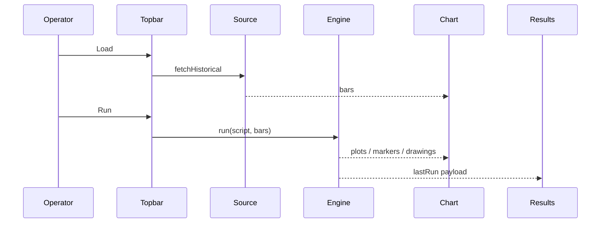

# Copyright (C) 2024-2026 jango_blockchained
#
# This file is part of pynescript.
#
# pynescript is free software: you can redistribute it and/or modify
# it under the terms of the GNU Affero General Public License as published by
# the Free Software Foundation, either version 3 of the License, or
# (at your option) any later version.
#
# pynescript is distributed in the hope that it will be useful,
# but WITHOUT ANY WARRANTY; without even the implied warranty of
# MERCHANTABILITY or FITNESS FOR A PARTICULAR PURPOSE.  See the
# GNU Affero General Public License for more details.
#
# You should have received a copy of the GNU Affero General Public License
# along with pynescript.  If not, see <https://www.gnu.org/licenses/>.
#
# SPDX-License-Identifier: AGPL-3.0-only

---
title: "Quick start"
description: "First historical load, first Pine Run, live stream, and reading the Results drawer in AXIS."
---

# Quick start

Fifteen-minute path from empty AXIS to plots, strategy stats, and optional live updates.

## Abstract

1. Ensure AXIS is running ([Installation](/axis/docs/enduser/getting-started/installation)).
2. Load bars for a symbol.
3. Paste or write a minimal indicator / strategy.
4. **Run** → inspect chart overlays + Results.
5. Optionally enable **Live**.

## Conceptual model



## Interface surface

### 1. Load history

Topbar fields that matter:

| Control | Default-ish | Notes |
| --- | --- | --- |
| Symbol | `BTCUSDT` | Venue-specific for `binance-rest` |
| Interval | `1d` | Watchlist + chart share interval vocabulary |
| Source | `binance-rest` | Or mock / CSV |
| Stream | `binance-ws` | Paused until Live |
| Engine | `server` or `pyodide` | Settings for endpoint |

Click **Load** (or pick a watchlist row). Status bar should move through loading → ready with bar count context.

**CSV path:** Source = **CSV upload** → pick file when prompted → bars inject via upload store.

**Deep history:** for multi-page backfill to a past date (background, with gap validation), open the **Data** panel — see [Data Source Manager](/axis/docs/enduser/guides/data-source-manager).

### 2. Minimal script

Open the editor (docked right by default). Example indicator:

```pine
//@version=6
indicator("AXIS smoke", overlay=true)
plot(close, "close")
plot(ta.sma(close, 20), "sma20")
```

Strategy smoke (events for Results → Strategy):

```pine
//@version=6
strategy("AXIS strat smoke", overlay=true)
longCond = ta.crossover(ta.sma(close, 10), ta.sma(close, 30))
if longCond
    strategy.entry("L", strategy.long)
if ta.crossunder(ta.sma(close, 10), ta.sma(close, 30))
    strategy.close("L")
```

Language semantics: [PYNE runtime](/pyne/docs/runtime).

### 3. Run

**Run** (topbar or editor). Pipeline:

1. Active engine `run({ script, bars, config })`
2. `lastRun` stored in memory (not fully persisted)
3. Results drawer opens
4. Chart applies overlay lines, trade markers, Pine drawings

Success: status “Completed in Nms”; plots on price pane (or dedicated indicator pane if non-overlay).

### 4. Read Results

Tabs:

| Tab | Content |
| --- | --- |
| Events | Normalized entry/exit/order stream |
| Strategy | Closed trades + win rate, PF, max DD |
| Plots | Series names, point counts, last value |
| Metrics | Runtime, engine, bar count, errors |
| Raw | Full JSON payload |

Export: JSON run dump; trades CSV. Click a trade to scroll the chart to entry/exit time.

### 5. Live (optional)

Toggle **Live**. Stream plugin pushes bars; AXIS may re-run silently when `needsRerun` is set. Stream = **None** freezes time. Mock poll works offline after engine warm-up.

### 6. Save a script (optional)

Manager → **Script Library** → name → Save. Backend is active storage (`local` default = IndexedDB). See [Script library](/axis/docs/enduser/guides/script-library). Editor **Pull / Push** uses the same storage when configured for git/cloud.

### 7. Power tools (optional)

| Tool | Where | Purpose |
| --- | --- | --- |
| **⌘/Ctrl+K** | Global | Command palette — panels, Run, layout, editor toggles |
| **Workers Manager** | Topbar activity · ⌘K | Backend health, presets, PYNE Agent install |
| **Layouts** | Topbar | Multi-chart 1 / 2H / 2V / 4 + recipes |
| **Replay** | Topbar | Scrub history (full bars, cursor on last) |
| **Compare** | Topbar | Second symbol overlay |
| **Price decimals** | Price-pane scale | Auto or 0–8 — [Charting](/axis/docs/ui/charting) |
| **Debug / Pins** | Editor header | Line chips vs chart markers — [Debugging](/axis/docs/ui/debugging) |
| **Layers / Alerts** | Panel toggles | Drawings list; local price alerts |
| **v6 starter pack** | Script Library → Import | `examples/script-library-starter.json` |

## Worked example: offline lab

| Setting | Value |
| --- | --- |
| Source | mock-walk |
| Stream | mock-poll |
| Engine | pyodide |
| Storage | local |

Load → Run smoke indicator → toggle Live. No Flask required.

## Worked example: desk + Flask

| Setting | Value |
| --- | --- |
| Source | binance-rest |
| Stream | binance-ws |
| Engine | server |
| Endpoint | `http://localhost:5002` |
| Storage | local |

`make run` in repo root; Vite or static AXIS as installed.

## Invariants

- Empty editor **Run** is a no-op.
- Errors set status `error` and still populate Results Metrics/Raw when payload exists.
- Switching source auto-aligns default stream (e.g. mock-walk → mock-poll).

## Failure modes

| Symptom | Action |
| --- | --- |
| CORS on `/run` | Fix `ALLOWED_ORIGINS` / use Pyodide |
| No trades in Strategy | Need entry+exit pair events; open strategy script |
| Live no updates | Stream not `none`; network; check logs drawer |
| Pyodide first run slow | Expected warm-up; assets self-hosted under origin |

## See also

- [Compose recipes](/axis/docs/enduser/getting-started/compose-recipes)
- [Strategy and results](/axis/docs/enduser/guides/strategy-and-results)
- [Troubleshooting](/axis/docs/enduser/guides/troubleshooting)
