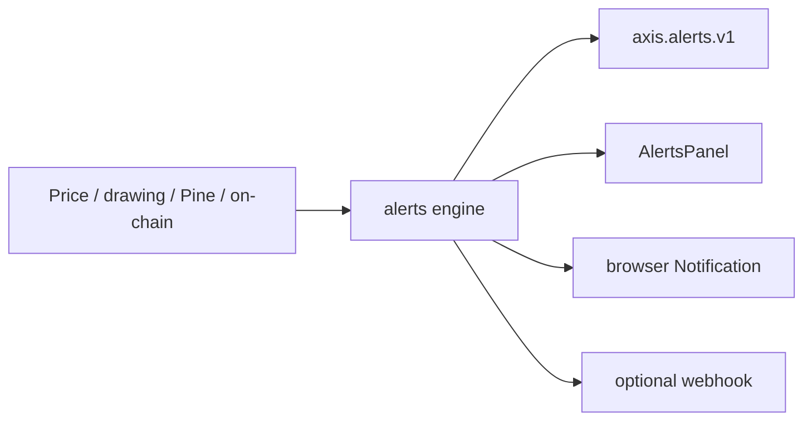

# Copyright (C) 2024-2026 jango_blockchained
#
# This file is part of pynescript.
#
# pynescript is free software: you can redistribute it and/or modify
# it under the terms of the GNU Affero General Public License as published by
# the Free Software Foundation, either version 3 of the License, or
# (at your option) any later version.
#
# pynescript is distributed in the hope that it will be useful,
# but WITHOUT ANY WARRANTY; without even the implied warranty of
# MERCHANTABILITY or FITNESS FOR A PARTICULAR PURPOSE.  See the
# GNU Affero General Public License for more details.
#
# You should have received a copy of the GNU Affero General Public License
# along with pynescript.  If not, see <https://www.gnu.org/licenses/>.
#
# SPDX-License-Identifier: AGPL-3.0-only

---
title: "Alerts"
description: "AXIS local alerts: price crosses, drawings, Pine conditions, on-chain spikes. Persist axis.alerts.v1. Not HOOX orders."
---

# Alerts

## Abstract

AXIS ships a **client-side alert book** (`src/alerts/`) with an Alerts panel. Kinds cover price, percent change, drawing touch, Pine conditions, and on-chain TVL spikes. State persists in `axis.alerts.v1`. Optional browser notifications and a webhook URL are local to the PWA.

These alerts are **not** HOOX `trade-worker` orders and are **not** the PYNE Pro API `alert()` L2 webhook export — though a Pine `alert()` / `alertcondition()` can surface as `pine_condition` if the engine returns it.

## Conceptual model

## Interface surface

Kinds implemented in `src/alerts/`:

| Kind | Fires when |
| --- | --- |
| `price_cross` | Price crosses a level |
| `price_above` / `price_below` | Price vs level |
| `pct_change` | Bar-to-bar (or window) percent move |
| `drawing_touch` | User drawing intersects price |
| `pine_condition` | Engine-exported Pine condition / `alert()` |
| `onchain_tvl_spike` | DefiLlama TVL jump (see On-Chain) |
| `onchain_event` | Catalogued on-chain event |

UI: `src/ui/AlertsPanel.tsx`. Persistence key: **`axis.alerts.v1`**.

PYNE language `alert()` / `alertcondition()` on Flask / pyne-worker is documented at [PYNE alerts](/pyne/docs/runtime/alerts). Pointing AXIS's local webhook at the HOOX gateway is possible and **dangerous** — you are then inventing an execution path the PWA does not certify.

## Internals

| Path | Role |
| --- | --- |
| `src/alerts/` | Engine + format + storage |
| `src/ui/AlertsPanel.tsx` | Panel |
| `src/onchain/` | TVL spike helpers (`buildTvlSpikeEvents`) |

## Invariants & edge cases

1. Alerts survive reload via local storage, not the Worker D1 script registry.
2. Closing the tab stops evaluation unless a stream + engine is still running.
3. On-chain kinds require the on-chain proxy (`/api/onchain`) to be reachable.
4. `lastRun` strategy results are **not** persisted; do not assume alert history equals a backtest.

## Worked examples

1. Open Alerts panel.
2. Add `price_cross` on the active symbol / TF.
3. Enable browser notifications in the browser, then in the panel.
4. For Pine: run a script that calls `alertcondition`; confirm `pine_condition` rows after a successful engine run.

On-chain: attach a TVL series, then add `onchain_tvl_spike` (default ~10% day-over-day in `buildTvlSpikeEvents`).

## Failure modes

| Symptom | Cause | Fix |
| --- | --- | --- |
| No rows | Engine not running / no stream | Start live or replay bars |
| Pine kind never fires | Engine dropped alerts | Use Flask interpret; see [PYNE alerts](/pyne/docs/runtime/alerts) |
| On-chain silent | Proxy HTML / CORS | Use Worker `/api/onchain`, not the SPA origin |
| Webhook posted a trade | You pointed it at HOOX | Use [pyne-worker](/docs/enduser/guides/pyne-live-trading) instead |

## See also

- [On-Chain](/axis/docs/enduser/guides/on-chain)
- [Drawings](/axis/docs/enduser/guides/drawings)
- [Evaluation map](/axis/docs/architecture/evaluation)
- [PYNE alerts](/pyne/docs/runtime/alerts)
- [AXIS and HOOX](/docs/enduser/guides/axis-and-hoox)
