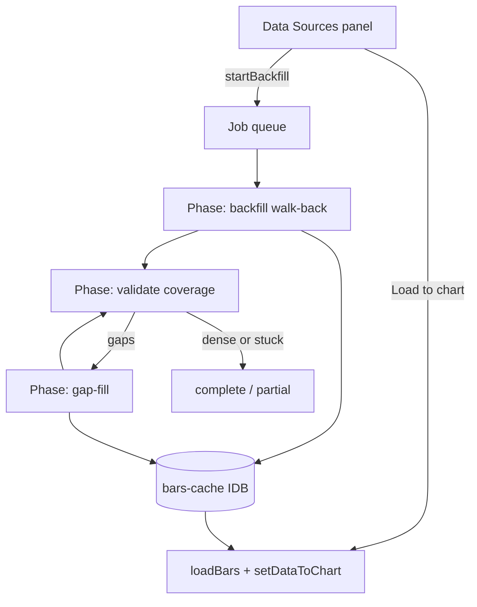

# Copyright (C) 2024-2026 jango_blockchained
#
# This file is part of pynescript.
#
# pynescript is free software: you can redistribute it and/or modify
# it under the terms of the GNU Affero General Public License as published by
# the Free Software Foundation, either version 3 of the License, or
# (at your option) any later version.
#
# pynescript is distributed in the hope that it will be useful,
# but WITHOUT ANY WARRANTY; without even the implied warranty of
# MERCHANTABILITY or FITNESS FOR A PARTICULAR PURPOSE.  See the
# GNU Affero General Public License for more details.
#
# You should have received a copy of the GNU Affero General Public License
# along with pynescript.  If not, see <https://www.gnu.org/licenses/>.
#
# SPDX-License-Identifier: AGPL-3.0-only

---
title: "Data Source Manager"
description: "Background multi-page OHLCV backfill to a past date, dataset validation, and gap fills — without blocking the chart."
---

# Data Source Manager

Deep history accumulation for a **symbol + source + timeframe**, down to a **past date**. Work runs fully in the **background**: chart, live streams, and the editor stay free.

## Abstract

| Piece | Role |
| --- | --- |
| Topbar **Load** | One venue page (or `historyBars`) straight onto the chart |
| **Data Sources** panel | Queue backfill jobs, watch progress, load cache onto chart |
| Walk-back pages | Multi-page REST with `endTime` only (avoids start+end one-page traps) |
| Validate + gap-fill | After backfill, check density and re-download holes |
| IDB bars cache | Durable OHLCV per `source\|symbol\|interval` |

Open from the topbar **Data** button, or command palette → **Toggle Data Source Manager**.

## Conceptual model

## How to use

1. Open **Data** (Data Sources panel).
2. Set **symbol**, **source / exchange**, **timeframe**, and **accumulate to** (UTC date).
3. Optionally check **Apply to chart when complete**.
4. Click **Start background backfill** — the job id appears immediately; work continues detached.
5. Watch phases: **Backfilling** → **Validating** → **Filling gaps** → **Complete** (or **Partial**).
6. Click **Load to chart** when ready (or rely on apply-when-complete).

Pause / resume / cancel apply between pages. Multiple jobs queue with low concurrency (rate-limit friendly).

## Phases

| Phase | Behavior |
| --- | --- |
| **Backfill** | Walk newest → older using `endTime` + page limit only. Never send `startTime`+`endTime` together to venue APIs that return the *first* N bars from start (would falsely complete in one page). |
| **Validate** | Measure coverage from target past date → job end time: leading, internal, and trailing holes via interval step + tolerance. |
| **Gap-fill** | For each gap window, walk-back download again; re-validate (several rounds). |
| **Done** | `datasetComplete` when dense; otherwise **Partial** with remaining gap count (venue may lack older history). |

## Job fields (UI)

| Field | Meaning |
| --- | --- |
| Bars / Pages | Cached bar count and network pages this job |
| Oldest / Target | Current oldest open time vs past-date target |
| Gaps | Detected holes · how many fill attempts landed bars |
| Coverage | full / partial / in progress |

## Relation to Topbar Load

| | Topbar **Load** | Data Source Manager |
| --- | --- | --- |
| Blocks UI | Yes (status loading) | No (background jobs) |
| Depth | Single page / `historyBars` | Multi-page to past date |
| Chart | Always paints | Only on **Load to chart** or apply-when-complete |
| Cache | Ephemeral `store.bars` | Durable IDB `bars-cache` |

Use Load for desk-speed symbol switches; use the manager when you need years of 1m/1h/1d history for research.

## Internals

| Path | Role |
| --- | --- |
| `src/data/data-source-manager.ts` | Job queue, walk-back, validate, gap-fill |
| `src/data/bars-cache.ts` | Memory-first + IDB durable OHLCV cache |
| `src/data/bars-gaps.ts` | Gap detection / coverage report |
| `src/ui/DataSourceManagerPanel.tsx` | Panel UI |
| `src/plugins/types.ts` | `SourceOpts`: `startTime?`, `endTime?`, `signal?` |
| `src/sources/catalog.ts` | Venue date params + `sourcePageLimit` |

### bars-cache performance (2.0.1+)

`bars-cache.ts` is **memory-first**:

| API | Behavior |
| --- | --- |
| `getCachedBars` | Serve warm in-memory series immediately; cold miss hydrates from IndexedDB then fills memory |
| `getCachedBarCount` | Count without cloning the full series when warm |
| Range / window | `sliceBarsForLoad` + count helpers avoid full clones for progress UI |
| Soft caps | `BARS_CACHE_MAX` (100k bars/series), `BARS_CACHE_MAX_SERIES` (48 keys) |

DSM gap-fill progress uses `getCachedBarCount` instead of loading full series each tick.

## Limits & safety

- Max concurrent network jobs: **1** (queue the rest).
- Caps: pages per walk, bars per series (soft IDB cap), gap-fill rounds.
- Backfill forces `fallback: false` so synthetic walks do not fake venue history.
- Cancel uses `AbortController` on in-flight fetches (symbol / job switches abort mid-page).

## See also

- [Sources](/axis/docs/plugins/sources) — built-in historical plugins  
- [Quick start](/axis/docs/enduser/getting-started/quick-start) — one-shot Load  
- [UI shell](/axis/docs/ui/ui-shell) — topbar panels  
