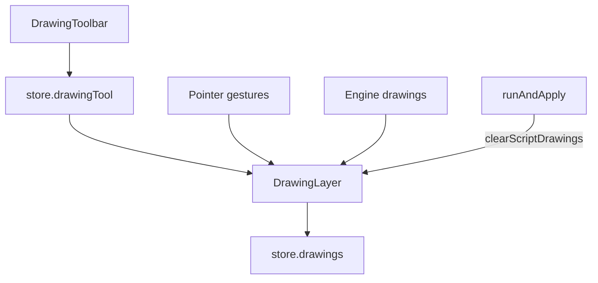

# Copyright (C) 2024-2026 jango_blockchained
#
# This file is part of pynescript.
#
# pynescript is free software: you can redistribute it and/or modify
# it under the terms of the GNU Affero General Public License as published by
# the Free Software Foundation, either version 3 of the License, or
# (at your option) any later version.
#
# pynescript is distributed in the hope that it will be useful,
# but WITHOUT ANY WARRANTY; without even the implied warranty of
# MERCHANTABILITY or FITNESS FOR A PARTICULAR PURPOSE.  See the
# GNU Affero General Public License for more details.
#
# You should have received a copy of the GNU Affero General Public License
# along with pynescript.  If not, see <https://www.gnu.org/licenses/>.
#
# SPDX-License-Identifier: AGPL-3.0-only

---
title: "Drawings"
description: "Interactive chart annotations in AXIS—tools, persistence, and how they differ from Pine script drawings."
---

# Drawings

AXIS supports **user drawings** (interactive tools on the chart) and **script drawings** (objects returned by the engine). They share a canvas layer but different lifecycles.

## Abstract

| Class | Origin | Cleared when | Persisted |
| --- | --- | --- | --- |
| User drawings | Drawing toolbar | Explicit delete / clear | Yes (`store.drawings` in `pynescript.axis.v1`) |
| Script drawings | Engine `drawings[]` | Next Run (re-applied) | No (recomputed) |

## Conceptual model

## Tools

| Tool id | Kind | Geometry |
| --- | --- | --- |
| `cursor` | — | Select / pan mode (not a drawable) |
| `hline` | hline | Horizontal price |
| `vline` | vline | Vertical time |
| `trend` | trend | Two points |
| `ray` | ray | Two points (extends) |
| `extend` | extend | Extended line |
| `rect` | rect | Two corners |
| `ellipse` | ellipse | Ellipse / oval |
| `arrow` | arrow | Directional segment |
| `fib` | fib | Two points; levels 0, 0.236, 0.382, 0.5, 0.618, 0.786, 1 |
| `measure` | measure | Two points (delta readout) |
| `text` | text | Anchor + label |

Colors: default accent `#939fff`, up/down/measure variants in `DRAWING_COLORS`.

### Style bar and per-tool settings

The floating style bar (next to the rail) edits **the selected drawing**, or the **defaults for the active tool** when nothing is selected. Last-used extras are stored per tool (`drawingPrefs.byKind`).

| Control | Where | Tools |
| --- | --- | --- |
| Color / width / dash | Style bar | All place tools |
| Custom color | Style bar native picker | All place tools |
| Fill | Style bar slider | Shapes, ranges, fib, highlighter, positions |
| Extend L / R | Style bar arrows | Trend, ray, extend, info line, channel, fib |
| Show price | Style bar `$` | Horizontal/vertical lines, fib labels |
| Lock | Style bar (selection) | Selected drawing |
| Text / font size | Settings popover (gear); double-click on chart | Text, note, callout, flag, price label |
| Fib levels / reverse / % | Settings popover | Fibonacci family |
| Risk/reward | Settings popover | Long / short |
| Arrow caps | Settings popover | Trend, ray, arrow, forecast |

Gear button: `axis-drawing-settings`. Popover: `axis-drawing-settings-popover`.

### Layers & templates

- **Layers** panel lists user drawings (select, hide, delete)  
- **Templates**: save/load drawing packs (`axis.drawingTemplates.v1`)  
- **Duplicate / tag symbol** helpers for multi-chart workflows  

## Interface surface

- Toolbar on chart host (`DrawingToolbar`)
- Active tool in store; layer sync via `createEffect` on `store.drawingTool`
- Pane manager hosts price chart; drawings bind to time/price coordinates (not pixel-only)

## Workflows

**Annotate a level**

1. Select Horizontal line.  
2. Click price.  
3. Reload page—line remains (persisted drawings array).

**Fibonacci between swing points**

1. Select Fib.  
2. Click swing low → swing high (or reverse).  
3. Levels render from `FIB_LEVELS`.

**After Run with Pine lines/labels**

1. Run script that emits drawings.  
2. Layer clears previous script drawings, then applies new set.  
3. User drawings remain.

### Script drawings (engine → chart)

Engine `drawings[]` map through `pyne-drawings.ts` before paint:

| Engine surface | Chart behavior |
| --- | --- |
| `line` / `box` / `label` / `polyline` | SVG geometry on the script’s pane scale |
| `linefill` / `line_fill` | Filled quad between two line endpoints |
| `force_overlay` (line/box/label) | Paint on the **price** pane even when the script is `overlay=false` |
| `barcolor` series | Not SVG — per-bar candle body/wick tint via `plot-visuals` |

Non-overlay scripts place ordinary geometry on the indicator pane Y-scale; user toolbar drawings always stay on price.

## Internals

| Path | Role |
| --- | --- |
| `frontend/src/chart/drawing-types.ts` | Tool ids, types, fib levels |
| `frontend/src/chart/drawing-layer.ts` | Interaction + render |
| `frontend/src/chart/DrawingToolbar.tsx` | UI |
| `frontend/src/chart/pyne-drawings.ts` | Map engine drawings → layer |
| `frontend/src/chart/ChartHost.tsx` | Mount / dispose |

## Invariants

1. User drawings ≠ strategy results; deleting drawings does not alter `lastRun`.  
2. Time base is bar time (unix-compatible chart times).  
3. `cursor` never creates geometry.  
4. Persistence omits bars/logs but **includes** drawings—large freehand-less sets only.

## Failure modes

| Symptom | Fix |
| --- | --- |
| Clicks do nothing | Tool is cursor; chart empty (no bars/time scale) |
| Drawings vanish on Run | Those were script drawings—re-run or convert notes to user tools |
| Lost after wipe | Cleared site data / different browser profile |

## See also

- [AXIS — charting](/axis/docs/ui/charting)
- [Strategy and results](/axis/docs/enduser/guides/strategy-and-results)
