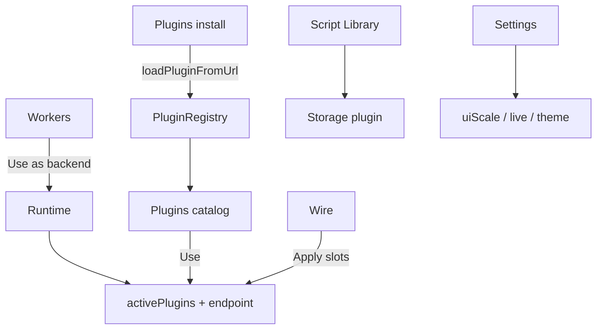

# Copyright (C) 2024-2026 jango_blockchained
#
# This file is part of pynescript.
#
# pynescript is free software: you can redistribute it and/or modify
# it under the terms of the GNU Affero General Public License as published by
# the Free Software Foundation, either version 3 of the License, or
# (at your option) any later version.
#
# pynescript is distributed in the hope that it will be useful,
# but WITHOUT ANY WARRANTY; without even the implied warranty of
# MERCHANTABILITY or FITNESS FOR A PARTICULAR PURPOSE.  See the
# GNU Affero General Public License for more details.
#
# You should have received a copy of the GNU Affero General Public License
# along with pynescript.  If not, see <https://www.gnu.org/licenses/>.
#
# SPDX-License-Identifier: AGPL-3.0-only

---
title: "Manager and settings"
description: "Runtime, Workers, Plugins, Wire, and Settings — how AXIS chrome is split."
---

# Manager and settings

Five studio pages share one full-viewport overlay. Runtime is the active calculation context; Workers and Plugins are catalogs, not tabs inside it.


## Abstract

| Surface | Opens from | Mutates |
| --- | --- | --- |
| **Runtime** | Topbar **Studio** · studio rail · ⌘K “Open Runtime” | Active engine, endpoint, exec mode, probe of *that* backend |
| **Workers** | Studio rail · ⌘K “Open Workers” · Runtime card | Probe catalog; activate a backend (`endpoint` / engine) |
| **Plugins** | Studio rail · ⌘K “Open Plugins” · hidden topbar testid | Registry membership, Use, URL install, script library |
| **Wire** | Topbar **Studio** → Wire rail · ⌘K “Open Architecture” | Compose slots; Apply writes `activePlugins` |
| **Settings** | Topbar **Studio** → Settings rail · ⌘K “Open Settings” | Appearance, chart, live, session keys, editor intel, theme |

Active plugins live in `store.activePlugins`; per-plugin fields in `store.pluginsConfig` keyed by `` `${kind}:${id}` ``.

## Conceptual model



## Plugin Manager

### Catalog


Lists sources, streams, engines, storages from the unified registry.

| Action | Effect |
| --- | --- |
| **Use** | `setActivePlugin(kind, id)` for that row’s kind |
| Capability badges | `offline`, `needsAuth`, `needsNetwork`, `needsProxy` from `plugin.capabilities` |
| Built-in flag | Built-ins resist casual unregister |

Status bar shows active engine id and storage backend after changes.

### Install (URL)


Paste a module URL exporting a default plugin object (`kind`, `id`, `name`, contract methods). AXIS:

1. Fetches and validates export
2. Registers into the TypeScript registry
3. Persists install record so `restoreInstalledPlugins()` reloads next visit

Security notes (operator-level): only https/http schemes suitable for module load; treat third-party URLs as code execution in your browser origin. See security tests under `tests/security/`.

Supported URL kinds: **source**, **stream**, **engine**, **dataset**, **component**. Example plugins ship in `public/plugins/`:

- `example-coingecko-source.js`
- `example-tiny-pyne-engine.js`
- `example-cf-do-stream.js`

**PYNE Agent** (sister project — natural language → PYNE scripts) installs as a **component** from your deployed worker URL (or via Workers Manager → Install):

```text
https://<pyne-agent-worker>/plugin/axis-pine-agent.js
```

See [PYNE Agent](/axis/docs/enduser/guides/pyne-agent) and [plugin reference](/axis/docs/plugins/pyne-agent). Works without the HOOX mesh.

### Script Library tab

See [Script library](/axis/docs/enduser/guides/script-library). The Plugins page hosts the panel so library and plugins share one studio surface.

## Runtime vs Workers vs Plugins

One overlay (`AppPage` in `src/ui/studio/`) with a left rail. Switching rail pages does not close the overlay.

- **Runtime** — `src/ui/runtime/RuntimePage.tsx` — active engine, endpoint, exec mode.
- **Workers** — `src/ui/workers/WorkersPage.tsx` — backend inventory and probes.
- **Plugins** — `src/ui/plugins/PluginsPage.tsx` — catalog / install / library.

## Workers


Opens from the studio rail, ⌘K **Open Workers**, or a Runtime related card.

| Sub-tab | Role |
| --- | --- |
| **Overview** | Health cards (distinct icon per worker) for pyne Pro API, AXIS Worker (prod + local wrangler), Pyodide, PWA service worker, optional PYNE Agent / pyne-worker |
| **Detail** | **Usage** (when to pick this worker), probe latency, feature flags, Use-as-backend / preload / install actions |
| **Install** | **When to use** + step-by-step setup with copyable commands (`make run`, `wrangler`, plugin URL, …) |
| **Configure** | Paste Backend URL, presets (`:5002`, `:8787`, workers.dev, axis.hoox.sh), activate Pyodide, install agent plugin |

### Catalog items (usage)

| Worker | Icon intent | When to use |
| --- | --- | --- |
| **pyne Pro API** | server | Primary **Server** calculation backend (Flask `:5002`). Best for compile/Numba and long history. |
| **AXIS Worker** | zap | Production edge data plane (on-chain proxy, scripts D1, optional `/api/run`). Default for On-Chain. |
| **AXIS Worker (local)** | activity | Local wrangler `:8787` while developing the Worker. |
| **Pyodide** | cpu | In-browser offline calc — no Backend URL; first load ~20–30s. |
| **Service Worker** | wifi | PWA shell cache (auto in production; skipped in Vite dev). Not a calc engine. |
| **PYNE Agent** | download | Optional NL → Pine plugin; scripts still run via your engine. |
| **pyne-worker** | settings | Optional HOOX mesh edge evaluator; paste origin as Backend URL. |

### Probes

- Run once when the modal opens; **Refresh** re-runs.
- Each worker has a **hard wall-clock timeout** (~5s) so a hung host cannot leave “Probing…” forever.
- Pyodide probe uses **HEAD** (not a full `pyodide.js` download).
- HTTP probes hit `GET /health` (JSON markers). Implementation: `src/workers/*`, `src/ui/workers/WorkersPage.tsx`. Operator CLI twin: [AXIS CLI](/axis/docs/devops/cli).

**Hardened VPS note:** production UFW typically allows only **22 + 443**. Pro API binds **`127.0.0.1:5002`** — public `:5002` probes correctly **time out**. On `https://axis.hoox.sh`, Workers Manager probes pyne Pro via **same-origin** `https://axis.hoox.sh/health` (nginx reverse-proxy), not loopback. See [VPS demo](/axis/docs/devops/vps-demo).

## Runtime (engine)

Engine, execution mode, Backend URL, Test, and Prefer WebSocket live on **Runtime**, not Settings. Storage is a **Wire** slot.

| Field | Behavior |
| --- | --- |
| Engine | Registry engine list; labels via `engineOptionLabel` |
| **Execution mode** | When the active engine exposes `configSchema.mode` (server): `interpret` \| `compile` \| `auto`. Stored in `pluginsConfig.engine:<id>.mode` and sent on each run (WS and REST). |
| Prefer WebSocket run | Server engine: prefer `/ws/run` over REST when available |
| Backend URL | Shown when engine is `server` or has `configSchema.endpoint` |
| Test / Probe | `GET` health against endpoint; status message |

## Settings


Product chrome only. Engine/endpoint/mode are on Runtime.

| Field | Behavior |
| --- | --- |
| Default interval | Updates store; may reload bars for current symbol |
| Watchlist refresh | Clamp 5–120 seconds |
| Chart theme | Preset picker (void / classic / mono / boutique dark & light) — see `src/theme/presets.ts` |
| History bars | One-shot Load depth (venue may clamp further) |

Deep multi-page history and gap repair live in the [Data Source Manager](/axis/docs/enduser/guides/data-source-manager), not Settings.

**Execution mode** maps to PYNE `Runtime.run(..., mode=…)`:

| Mode | Behavior |
| --- | --- |
| `interpret` | Full AST interpreter (default) |
| `compile` | Numba/numpy compiled path |
| `auto` | Try compile; fall back to interpret on failure |

The Connection HUD engine chip shows the selected mode. Save persists via Solid store `persist()` into `pynescript.axis.v1`. Escape closes; Ctrl/Cmd+Enter saves.

**Pyodide engines** hide endpoint—calculation is same-origin assets, not Flask.

## Interface surface (UI map)

| Control | Store field |
| --- | --- |
| Engine select | `activePlugins.engine`, flat `engine` |
| Storage select | `activePlugins.storage` |
| Endpoint | `endpoint` |
| Source/stream topbar | `activePlugins.*`, `source`, `live.streamId` |
| Theme toggle | `theme` + `data-theme` on `<html>` |

## Internals

| Path | Role |
| --- | --- |
| `src/ui/studio/` | Full-page overlay kit (`ax-*`) |
| `src/ui/runtime/RuntimePage.tsx` | Active engine / endpoint / mode |
| `src/ui/plugins/PluginsPage.tsx` | Catalog / install / library |
| `src/ui/workers/WorkersPage.tsx` | Backend inventory / probes |
| `src/ui/settings/SettingsPage.tsx` | Product chrome |
| `src/ui/wire/WirePage.tsx` | Compose recipes |
| `src/ui/plugin-badges.tsx` | Capability badges |
| `src/plugins/registry.ts` | Unified registry |
| `src/plugins/loader.ts` | URL load + restore (incl. component) |
| `src/plugins/bootstrap.ts` | Built-ins |

## Invariants

1. Settings never write script bodies—only layout/config.
2. Catalog **Use** does not auto-Run; Load/Run remain explicit.
3. Source change may re-default stream (`defaultStreamForSource`).
4. API keys for cloud/git belong in `pluginsConfig`, not in git-committed defaults.

## Worked examples

**Point AXIS at local Worker**

1. Settings → Engine Server-Side → Endpoint `http://127.0.0.1:8787`
2. Probe → OK
3. Save → Run

**Install example source**

1. Manager → Install → URL to `.../plugins/example-coingecko-source.js` (served origin)
2. Catalog → Source appears → Use → Load

## Failure modes

| Symptom | Fix |
| --- | --- |
| Empty catalog | Built-ins not registered—hard reload; check console |
| URL install fails | CORS on plugin host; bad export; mixed content |
| Probe fails | Backend down; wrong path; HTTPS mixed content |
| Settings not sticky | localStorage blocked / quota |

## See also

- [Script library](/axis/docs/enduser/guides/script-library)
- [Compose recipes](/axis/docs/enduser/getting-started/compose-recipes)
- [Plugins](/axis/docs/plugins)
