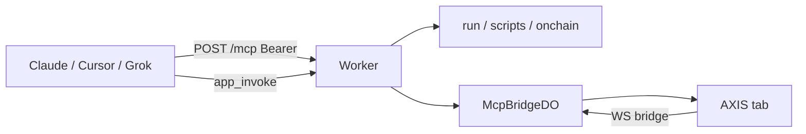

# Copyright (C) 2024-2026 jango_blockchained
#
# This file is part of pynescript.
#
# pynescript is free software: you can redistribute it and/or modify
# it under the terms of the GNU Affero General Public License as published by
# the Free Software Foundation, either version 3 of the License, or
# (at your option) any later version.
#
# pynescript is distributed in the hope that it will be useful,
# but WITHOUT ANY WARRANTY; without even the implied warranty of
# MERCHANTABILITY or FITNESS FOR A PARTICULAR PURPOSE.  See the
# GNU Affero General Public License for more details.
#
# You should have received a copy of the GNU Affero General Public License
# along with pynescript.  If not, see <https://www.gnu.org/licenses/>.
#
# SPDX-License-Identifier: AGPL-3.0-only

---
title: "MCP (agents)"
description: "Connect Claude, Cursor, Grok, or Inspector to AXIS so an agent can load symbols, edit Pine, run scripts, and read results."
sidebarTitle: "MCP"
---

# MCP (agents)

## Abstract

AXIS speaks **Model Context Protocol** so a coding agent can **read and write** the product: load a symbol, edit the Pine buffer, run a script, inspect strategy results, toggle panels, manage alerts and the library.

Two planes:

| Plane | Live AXIS tab? | Typical use |
| --- | --- | --- |
| **Worker** | No | Health, `POST /api/run`, cloud scripts, on-chain / market proxy |
| **App** | Yes — this browser session | Chart, editor, indicators, alerts, watchlist, library, results, chrome |

Auth is a Worker API key (`pn_…`), the same Bearer used for cloud script storage. Secrets (exchange credentials, API keys) are redacted from snapshots.

Operator contract and tool schemas: [MCP server](/axis/docs/worker/mcp).

## Conceptual model



## Connect this tab

1. Mint a key: `axis keys create` (needs `ADMIN_TOKEN`).
2. **Studio → Settings → General → Worker (cloud + MCP)** — paste Worker URL (`https://worker.axis.hoox.sh` or `http://127.0.0.1:8787`) and the `pn_…` key. Data tab is exchange credentials only.
3. **Studio → Settings → General → MCP** — leave **Connect this tab to MCP** on (default).
4. Confirm the hint shows `Bridge: open` (or `connecting`). `idle` with “No Worker API key” means step 2 is missing.

The PWA mints a short-lived one-time ticket over HTTP (`Authorization: Bearer`) then opens `wss://…/api/mcp/bridge?ticket=…` so the long-lived `pn_…` key never appears in the WebSocket URL. The Worker partitions the session by a hash of the key — another user’s key cannot attach to your tab.

Turn the toggle **off** if you do not want agents driving this browser.

## Status-bar indicator

The status bar shows an **MCP capsule** with two dots:

- **Session dot** — bridge socket state (green open, amber connecting,
  red error/off, dim idle) plus how many PWA tabs the Worker sees on your
  key's session (`MCP · 2 tabs`). The count polls every 20 seconds while
  connected.
- **Activity dot** — lights up while an agent is actively driving this tab
  (any `app_invoke` received in the last few seconds). Hover for the last
  capability and when it ran.

Click the capsule to open Settings → MCP.

Note: MCP clients (Claude, Cursor, …) call `POST /mcp` statelessly, so there
is no per-client presence — the capsule tracks bridge + tab attachment and
live invoke activity, which is what `app_*` tools need.

## MCP in System Logs

Every bridge event lands in **System Logs** (topbar **Logs**) with source
`mcp`: connects, disconnects, session tab-count changes, and one line per
agent invoke (`drawings.add → ok · 84ms`, errors with their code). Filter the
strip by source (`mcp`) or level, or query programmatically with
`logs.get` (`{ source?, level?, limit? }`).

New app versions prompt via an update banner (version check every 2 minutes,
on window focus, and when the bridge reconnects) — no manual reload hunting.

## Connect a client

Print a snippet:

```bash
axis mcp config --key pn_…
```

Endpoint: `https://worker.axis.hoox.sh/mcp` (or your wrangler origin + `/mcp`).

### Remote HTTP (Inspector, Cursor, clients with URL + headers)

```json
{
  "mcpServers": {
    "axis": {
      "url": "https://worker.axis.hoox.sh/mcp",
      "headers": { "Authorization": "Bearer pn_…" }
    }
  }
}
```

`GET /mcp` is public discovery (tool names only). Tool calls require Bearer.

### Stdio (`axis mcp`)

For clients that only spawn a local process:

```bash
axis mcp --key pn_…
# or AXIS_API_KEY=pn_… axis mcp
axis mcp config --stdio --key pn_…
```

The CLI forwards newline-delimited JSON-RPC from stdin to `POST /mcp`.

## What to ask an agent

Worker-only (no tab):

- “Call `axis_health` and tell me if D1 and MCP are on.”
- “List my cloud scripts.” (`axis_scripts_list`)
- “Run this Pine against these OHLCV rows.” (`axis_run`)

Live tab (`app_session_status` → connected):

- “Load BTCUSDT 1h and tell me bar count and last close.” (`chart.load` then `app_get` `bars`)
- “Put this indicator in the editor and run it.” (`editor.set` + `editor.run`)
- “Open the alerts panel and list alerts.” (`panels.set` + `alerts.list`)
- “Screenshot the panes.” (`chart.screenshot` — PNG base64)

Start with `app_capabilities` if the client has not cached the catalog.

## Capabilities at a glance

Pass these ids to **`app_invoke`** as `capability`, with a JSON `payload`.

| Domain | Ids |
| --- | --- |
| App | `app.snapshot`, `app.get`, `app.set`, `app.command`, `app.shortcut`, `app.event` |
| Chart | `chart.get` / `set` / `load` / `reload` / `live` / `layout` / `theme` / `type` / `screenshot` / `zoom` |
| Editor | `editor.get` / `set` / `run` / `diagnostics` |
| Scripts | `indicators.list` / `add` / `remove` / `update` / `run` (remove detaches chart panes like the Layers panel; code edits need `run` after) |
| Alerts | `alerts.list` / `create` / `update` / `remove` |
| Watchlist | `watchlist.get` / `add` / `remove` / `lists` |
| Library | `library.list` / `read` / `write` / `remove` |
| Results / logs | `results.get`, `logs.get` / `append` / `clear` |
| Chrome | `panels.get` / `set`, `theme.get` / `set`, `plugins.list` / `activate` |
| Workspace | `workspace.export` / `import` |
| Drawings | `drawings.list` / `add` / `update` / `remove` / `clear` / `tool` |
| Settings | `settings.get` / `set` |
| Status | `status.get` |

`app_set` paths (anything else is `PATH_DENIED`): `symbol`, `interval`, `source`, `engine`, `exchange`, `theme`, `chartType`, `uiScale`, `live.active`, `live.preferAfterLoad`, `editor.doc`, `editor.open`, `watchlist.open`.

Example payloads:

```json
{ "capability": "chart.load", "payload": { "symbol": "ETHUSDT", "interval": "15m" } }
```

```json
{ "capability": "editor.set", "payload": { "doc": "//@version=6\nindicator(\"RSI\")\nplot(ta.rsi(close, 14))" } }
```

```json
{ "capability": "alerts.create", "payload": { "name": "BTC 100k", "kind": "price_cross", "symbol": "BTCUSDT", "params": { "price": 100000 } } }
```

```json
{ "capability": "drawings.add", "payload": { "kind": "trend", "points": [{ "time": 1700000000, "price": 67000 }, { "time": 1700003600, "price": 67600 }] } }
```

```json
{ "capability": "settings.set", "payload": { "settings": { "interval": "1h", "historyBars": 5000 } } }
```

Full argument tables: [MCP server](/axis/docs/worker/mcp).

## Limits

- **No tab** → Worker tools still work; `app_*` returns `SESSION_OFFLINE`.
- **`MCP_BRIDGE` unbound** → `NO_MCP_BRIDGE` (add the Durable Object in `wrangler.toml` and deploy).
- **`axis_request` is not an open proxy** — only AXIS JSON APIs. Stream, OAuth device-flow, and `/mcp` recursion are blocked.
- Agents must not invent Pine APIs (`TV.set`, `pine.chart.setTheme`, …). See [AGENTS.md](https://github.com/hoox-sh/axis/blob/main/AGENTS.md) in the repo.
- MCP is **not** HOOX order routing. Alerts remain local (browser / webhook).

## Troubleshooting

| Symptom | Check |
| --- | --- |
| 401 `NO_KEY` / `INVALID_KEY` | Bearer on `/mcp`; mint with `axis keys create` |
| 503 `API_KEYS_REQUIRED` | D1 bound without `API_KEYS` KV — `axis setup kv` |
| `SESSION_OFFLINE` | Tab open, MCP toggle on, same `pn_…` as the client |
| `Bridge: idle` / no API key | Settings → General → Worker (cloud + MCP) |
| `Bridge: error` | Worker URL reachable; CORS; `MCP_BRIDGE` deployed |
| App command unknown | Palette has not mounted yet — use `chart.*` / `editor.*` ids instead |

In-page test (browser console on the AXIS origin):

```js
await window.__AXIS_MCP__.invoke('chart.get')
```

## See also

- [MCP server](/axis/docs/worker/mcp) — tools, resources, prompts, allowlist
- [AXIS CLI](/axis/docs/devops/cli)
- [Auth](/axis/docs/worker/auth)
- [Manager and settings](/axis/docs/enduser/guides/manager-and-settings)
