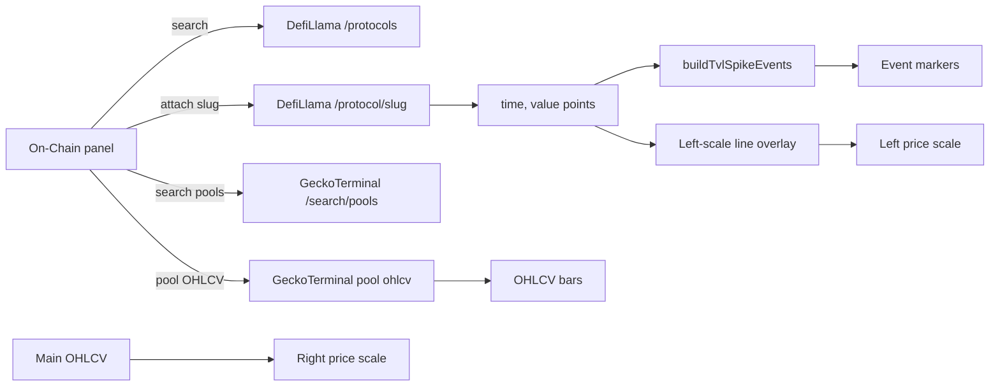

# Copyright (C) 2024-2026 jango_blockchained
#
# This file is part of pynescript.
#
# pynescript is free software: you can redistribute it and/or modify
# it under the terms of the GNU Affero General Public License as published by
# the Free Software Foundation, either version 3 of the License, or
# (at your option) any later version.
#
# pynescript is distributed in the hope that it will be useful,
# but WITHOUT ANY WARRANTY; without even the implied warranty of
# MERCHANTABILITY or FITNESS FOR A PARTICULAR PURPOSE.  See the
# GNU Affero General Public License for more details.
#
# You should have received a copy of the GNU Affero General Public License
# along with pynescript.  If not, see <https://www.gnu.org/licenses/>.
#
# SPDX-License-Identifier: AGPL-3.0-only

---
title: "On-Chain data"
description: "DefiLlama protocol TVL, GeckoTerminal DEX pool OHLCV, and derived TVL spike events — not a wallet, not CEX-only price."
sidebarTitle: "On-Chain data"
---

# On-Chain data

AXIS **on-chain data plane**: search public protocol and DEX metrics and plot them next to your chart. Built-in providers include **DefiLlama protocol TVL** (total value locked, USD), **GeckoTerminal DEX pool OHLCV**, and **derived TVL spike/drop events**.

## Abstract

| Piece | Role |
| --- | --- |
| **On-Chain** panel | Search protocols / pools, attach / hide / detach series |
| DefiLlama TVL | Daily USD liquidity history for a protocol slug |
| GeckoTerminal OHLCV | DEX pool candlesticks (minute / hour / day aggregates) |
| TVL spike events | Day-over-day \|%\| threshold events from attached TVL (`tvl_spike` / `tvl_drop`) |
| Left price scale | Independent metric axis so main OHLCV keeps the right scale |
| Provenance | Each series records provider + finality / snapshot notes |

Open from the topbar **Panels** group (**On-Chain**), or command palette → toggle the On-Chain panel (panel id `onchain`).

## What this is not

- **Not a wallet.** AXIS does not connect to MetaMask, Ledger, or any signing wallet for this plane.
- **Not CEX price by default.** Protocol TVL is liquidity in USD, not the exchange candle series for the chart symbol. DEX pool OHLCV is **on-chain pool** price, which can diverge from centralized venues.
- **Not Pine.** These overlays are host-side dataset series; they are not produced by `indicator()` / `strategy()` plots.

## Conceptual model

## How to use (DefiLlama TVL)

1. Load a market as usual (symbol + source + timeframe).
2. Open **On-Chain**.
3. Search a protocol (e.g. `aave`, `uniswap`, `lido`).
4. Click a result to **attach** its TVL history.
5. The curve appears on the **left scale** of the price pane (when overlay wiring is active).
6. Hide or remove series from the **Attached series** list; **Clear** removes all.

Multiple protocols can be attached (chart safety caps the number of on-chain lines).

## DEX pools (GeckoTerminal)

Phase 2 adds **DEX pool OHLCV** via [GeckoTerminal](https://www.geckoterminal.com/) public API (no API key). Use this when you want on-chain pool candles rather than protocol TVL:

| Concept | Detail |
| --- | --- |
| Network | Gecko network id (`eth`, `solana`, `base`, `arbitrum`, `polygon_pos`, …) |
| Pool address | EVM `0x` + 40 hex, or Solana-style base58 |
| Timeframe | `minute` / `hour` / `day` with aggregate (e.g. 1h → hour + aggregate 1) |
| Currency | Default USD when proxied with query pass-through |

Client helpers live in `src/onchain/geckoterminal.ts` (`fetchGeckoPoolOhlcv`, `searchGeckoPools`, interval/network maps). Browsers should use the **Worker gecko proxy** (below) because public GeckoTerminal hosts often lack CORS for arbitrary origins.

## Events (TVL spikes)

From an attached TVL scalar series, AXIS can derive **day-over-day** percent-change events:

| Field | Behavior |
| --- | --- |
| Type | `tvl_spike` (gain) or `tvl_drop` (loss) |
| Default threshold | 10% absolute day-over-day change |
| Severity | `warn` below critical band; `critical` for large moves (default ~25% or 2.5× threshold) |
| Payload | `pctChange`, `prevValue`, `value`, thresholds |

Pure helper: `buildTvlSpikeEvents` in `src/onchain/events.ts`. These are **derived** from daily snapshots — not mempool or block-final chain events.

DefiLlama **raises** and **token unlocks** require Pro API (`pro-api.llama.fi`) and are **not** fetched by the free Worker proxy; inject external events only if you already have that data.

## Scale and chart behavior

| Behavior | Detail |
| --- | --- |
| Scale | On-chain TVL lines use the built-in **left** price scale (`left`) |
| Main market | Primary OHLCV stays on the **right** scale |
| Compare | Compare overlays may share the left scale; on-chain keys are `onchain_*`, not `overlay_*` |
| Units | TVL values are **USD** liquidity totals from DefiLlama; DEX OHLCV is pool quote (often USD) |

## Network path (CORS / Worker proxy)

Browsers often **cannot** call `https://api.llama.fi` or `https://api.geckoterminal.com` directly (CORS). AXIS therefore defaults to the **Worker on-chain proxy** derived from **Settings → engine endpoint** (`store.endpoint`):

| Client request | Worker route | Upstream |
| --- | --- | --- |
| `{endpoint}/api/onchain/llama/protocols` | allowlisted GET | `https://api.llama.fi/protocols` |
| `{endpoint}/api/onchain/llama/protocol/{slug}` | allowlisted GET | `https://api.llama.fi/protocol/{slug}` |
| `{endpoint}/api/onchain/gecko/networks/{net}/pools/{addr}/ohlcv/{tf}` | allowlisted GET (+ query) | `https://api.geckoterminal.com/api/v2/networks/.../ohlcv/...` |
| `{endpoint}/api/onchain/gecko/search/pools` | allowlisted GET (+ query) | `https://api.geckoterminal.com/api/v2/search/pools` |
| `{endpoint}/api/onchain/health` | local | feature flags (providers + cache) |

Gecko OHLCV query pass-through (allowlisted only): `aggregate`, `limit`, `currency`, `before_timestamp`.  
Search pass-through: `query`, `network`, `page`, `include`.

- Local Worker: set endpoint to `http://127.0.0.1:8787` and run `cd worker && bun run dev`.
- Production default endpoint already points at the AXIS Worker when deployed.
- Override with plugin config `baseUrl` only if you need a different host (e.g. direct upstream for Node tests).

Isolate memory caches short-TTL responses (`X-Axis-Onchain-Cache: HIT|MISS`):

| Route class | TTL (approx.) |
| --- | --- |
| Llama protocols list | 10 min |
| Llama protocol detail | 2 min |
| Gecko OHLCV | 60 s |
| Gecko search | 120 s |

## Provenance and finality

Each attached series carries a short provenance line, for example:

- Provider: **DefiLlama · protocol TVL (USD)**
- Provider: **GeckoTerminal · pool OHLCV**
- Finality: **Daily snapshot · not CEX price** (TVL) or pool candle finality notes (DEX)

Treat DefiLlama points as **daily** aggregates from the public API — not block-final on-chain events and not exchange marks. DEX candles reflect the **pool** at GeckoTerminal’s sampling, not a CEX order book.

## Network, CORS, and proxies

| Situation | What to do |
| --- | --- |
| Local dev blocked by CORS | Use Worker proxy via `store.endpoint` (`/api/onchain/llama` or `/api/onchain/gecko`) |
| Self-hosted demo | Configure edge to reach the Worker, or proxy only allowlisted paths |
| Offline | Needs network; there is no offline synthetic TVL/DEX walk by default |

See also [CORS and origins](/devops/cors-and-origins) for Worker origin allowlisting.

## Dataset plugins (advanced)

On-chain providers implement the structural **dataset** plugin contract (`fetchDataset`). Built-ins register via the on-chain catalog; dynamic URL plugins may install additional datasets. End users normally only use the On-Chain panel — see [Datasets](/plugins/datasets) for the contract sketch.

## Related docs

- [Data Source Manager](/enduser/guides/data-source-manager) — OHLCV backfill (separate from on-chain scalars)
- [Sources](/plugins/sources) — historical bar sources
- [Worker overview](/worker) — `/api/onchain/…` route table
- [CORS and origins](/devops/cors-and-origins) — browser cross-origin constraints
