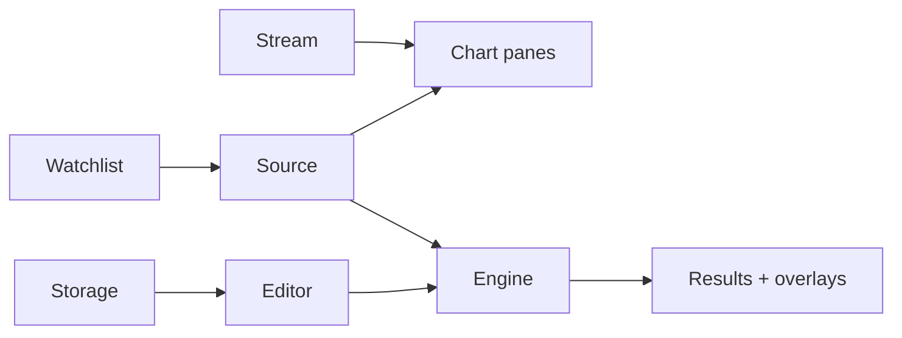

# Copyright (C) 2024-2026 jango_blockchained
#
# This file is part of pynescript.
#
# pynescript is free software: you can redistribute it and/or modify
# it under the terms of the GNU Affero General Public License as published by
# the Free Software Foundation, either version 3 of the License, or
# (at your option) any later version.
#
# pynescript is distributed in the hope that it will be useful,
# but WITHOUT ANY WARRANTY; without even the implied warranty of
# MERCHANTABILITY or FITNESS FOR A PARTICULAR PURPOSE.  See the
# GNU Affero General Public License for more details.
#
# You should have received a copy of the GNU Affero General Public License
# along with pynescript.  If not, see <https://www.gnu.org/licenses/>.
#
# SPDX-License-Identifier: AGPL-3.0-only

---
title: "End User"
description: "Install AXIS, compose source/stream/engine/storage recipes, and run research workflows without a proprietary chart host."
---

# End User

AXIS is an installable charting PWA: load history, stream the present, evaluate Pine Script™ through a pluggable engine, and keep a script library on disk, IndexedDB, cloud, or git. This track is for operators and researchers who use the AXIS—not for plugin authors or Worker deployers.

Language fidelity (grammar, builtins, runtime semantics) lives in [PYNE](/pyne/docs). AXIS never reimplements the language; it **hosts** evaluation via engine plugins.

## Abstract

You compose four axes:

| Axis | Question it answers |
| --- | --- |
| **Source** | Where do historical OHLCV bars come from? (CEX venues or DEX pools) |
| **Stream** | How does the live bar advance? |
| **Engine** | Who evaluates the script? |
| **Storage** | Where do saved scripts live? |
| **On-chain** | Protocol TVL, DEX OHLCV, events — parallel plane (not a wallet) |

Any lawful combination is valid. Offline lab, desk research against Binance + Flask, AXIS at the edge through a Cloudflare Worker, and a git-backed library are all first-class recipes—see [Compose recipes](/axis/docs/enduser/getting-started/compose-recipes).

## Conceptual model

The shell (topbar, chart, editor, results, manager) is **AXIS**. Calculation is always `engine.run({ script, bars, config })`. Persistence of scripts is always a storage plugin.

## Interface surface

| Surface | Role |
| --- | --- |
| Topbar | Symbol, interval, source/stream/engine pickers, Load, Run, Live, On-Chain |
| Watchlist | Quick symbol switch + quote poll |
| Chart | lightweight-charts panes, drawings, trade markers, on-chain overlays, price-scale decimals |
| Editor | CodeMirror 6 Pine Script™ document (docked / popout) |
| Results | Events, Strategy, Optimise, Plots, Metrics, Raw + export |
| On-Chain | DefiLlama TVL, GeckoTerminal DEX, spike events, export / refresh |
| Manager | Plugin catalog, URL install (incl. **component** / PYNE Agent), Script Library |
| Workers Manager | Backend health probes, presets, install helpers |
| Settings | Endpoint, engine, storage, on-chain proxy notes |
| Desktop | Optional Tauri 2 shell (`bun run desktop:dev`) |

## Getting started

1. [Installation](/axis/docs/enduser/getting-started/installation) — AXIS CLI, Vite dev, desktop, static `dist/`, or hosted PWA
2. [Quick start](/axis/docs/enduser/getting-started/quick-start) — first load + first Run (`//@version=6`)
3. [Compose recipes](/axis/docs/enduser/getting-started/compose-recipes) — offline, desk, multi-venue, CSV, edge, git

## Guides

- [Manager and settings](/axis/docs/enduser/guides/manager-and-settings) — Plugins + **Workers Manager**
- [PYNE Agent](/axis/docs/enduser/guides/pyne-agent) — natural language → scripts
- [On-Chain data](/axis/docs/enduser/guides/on-chain) — TVL, DEX pools, events, Worker proxy
- [Data Source Manager](/axis/docs/enduser/guides/data-source-manager)
- [Script library](/axis/docs/enduser/guides/script-library) — incl. v6 starter pack import
- [Strategy and results](/axis/docs/enduser/guides/strategy-and-results)
- [Drawings](/axis/docs/enduser/guides/drawings)
- [Alerts](/axis/docs/enduser/guides/alerts) — local price / Pine / on-chain; not HOOX orders
- [Troubleshooting](/axis/docs/enduser/guides/troubleshooting)

## Reference

- [Glossary](/axis/docs/enduser/reference/glossary)
- [FAQ](/axis/docs/enduser/reference/faq)

## Invariants (operator-facing)

1. **AXIS ≠ engine** — switching engine does not change the chart library; switching source does not change the language runtime.
2. **Active set is four-tuple** — source, stream, engine, storage are selected independently (with sensible defaults when source implies stream).
3. **API keys stay in the browser** — cloud storage and Pro keys are not uploaded by the shell except as request headers you configure.
4. **Chart OHLCV is ephemeral** — reload re-fetches for the topbar path; the **Data Source Manager** keeps a durable IDB `bars-cache` for deep history jobs.
5. Layout, script draft, and drawings survive in `pynescript.axis.v1`.

## See also

- [Architecture](/axis/docs/architecture) — ADRs and topologies
- [Evaluation map](/axis/docs/architecture/evaluation) — Flask / Pyodide / Worker / not PyneTS
- [AXIS CLI](/axis/docs/devops/cli) — install / doctor / deploy
- [UI](/axis/docs/ui) — chart, editor, store internals
- [AXIS and HOOX](/docs/enduser/guides/axis-and-hoox)
- [Plugins](/axis/docs/plugins) — contracts and catalogs
- [PYNE runtime](/pyne/docs/runtime) — evaluation semantics
