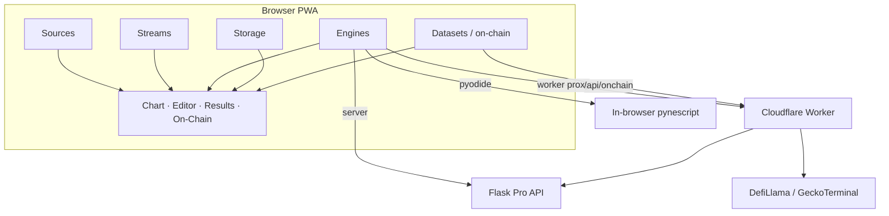

# Copyright (C) 2024-2026 jango_blockchained
#
# This file is part of pynescript.
#
# pynescript is free software: you can redistribute it and/or modify
# it under the terms of the GNU Affero General Public License as published by
# the Free Software Foundation, either version 3 of the License, or
# (at your option) any later version.
#
# pynescript is distributed in the hope that it will be useful,
# but WITHOUT ANY WARRANTY; without even the implied warranty of
# MERCHANTABILITY or FITNESS FOR A PARTICULAR PURPOSE.  See the
# GNU Affero General Public License for more details.
#
# You should have received a copy of the GNU Affero General Public License
# along with pynescript.  If not, see <https://www.gnu.org/licenses/>.
#
# SPDX-License-Identifier: AGPL-3.0-only

---
title: "AXIS Documentation"
description: "Open charting PWA — orthogonal sources, streams, engines, and storage. Own the axes; swap the engine."
---

# AXIS Documentation

**AXIS** is an installable charting PWA (v**2.4.1**) that treats **price**, **time**, and **calculation** as separable axes. Sources load history. Streams advance the present. Engines evaluate Pine Script™ via **PYNE**. Storage keeps your script library. Compose any lawful combination without a proprietary charting host.


_Pine Script™ and TradingView® are trademarks of TradingView, Inc. Cloudflare® is a registered trademark of Cloudflare, Inc. This project is independent and not affiliated with or endorsed by TradingView, Inc. or Cloudflare, Inc._

## Abstract

AXIS is a charting PWA, not a language rewrite. Language fidelity lives in [PYNE](/pyne/docs). The PWA contributes:

1. A **unified plugin registry** (`source | stream | engine | storage | dataset | component`)
2. A **Solid + Vite** product UI (chart, editor, results, manager, Workers Manager, on-chain panel)
3. Optional backends: local Flask, offline Pyodide, Cloudflare® Worker (+ DO/KV/D1/R2 + `/api/onchain` proxy)
4. **AXIS CLI** + optional **Tauri** desktop shell for operators

**Invariant (AXIS ≠ engine):** the shell never embeds a closed interpreter. Evaluation is always an engine plugin.

## Product map

| Track | Role | Start here |
| --- | --- | --- |
| **End User** | Install, compose recipes, research workflows | [End User hub](/axis/docs/enduser) |
| **Architecture** | ADRs, topologies, state namespaces | [Architecture](/axis/docs/architecture) |
| **Plugins** | Contracts and built-in catalogs | [Plugins](/axis/docs/plugins) |
| **UI** | Chart, editor, panels, store | [UI](/axis/docs/ui) |
| **Worker** | CF Pages + Worker data plane | [Worker](/axis/docs/worker) |
| **DevOps** | Build, CLI, VPS, CORS, CI | [DevOps](/axis/docs/devops) · [AXIS CLI](/axis/docs/devops/cli) |
| **Evaluation** | Flask / Pyodide / Worker proxy — not PyneTS, not HOOX execution | [Evaluation map](/axis/docs/architecture/evaluation) |
| **PYNE** (separate) | Grammar & evaluator | [PYNE docs](/pyne/docs) |

## Conceptual model



Formal active set:

```
Active set = { source, stream, engine, storage }
Contract namespace: pynescript.axis.plugins.v1
App state: pynescript.axis.v1
On-chain datasets: kind dataset (+ source geckoterminal-ohlcv for pool candles)
```

## Compose in one glance

| Recipe | Source | Stream | Engine | Storage |
| --- | --- | --- | --- | --- |
| Offline lab | `mock-walk` | `mock-poll` | `pyodide` | `local` |
| Desk research | `binance-rest` | `binance-ws` | `server` → Flask | `local` |
| AXIS at the edge | venue REST | venue WS / DO | `server` → Worker | `cloud` |
| On-chain TVL + CEX | `binance-rest` + DefiLlama dataset | venue WS | any | `local` |
| DEX pool candles | `geckoterminal-ohlcv` | `mock-poll` | any | `local` |
| Repo library | any | any | any | `git` |

Full recipes: [Compose recipes](/axis/docs/enduser/getting-started/compose-recipes).

## Infrastructure names (do not rename lightly)

| Surface | Value |
| --- | --- |
| CF Wrangler / Pages project | `pynescript-axis` (frozen) |
| Health JSON service | `pynescript-axis-worker` |
| Product brand | **AXIS** |

## Demo topologies

- Dev: Vite `:3000` + Flask `:5002` (`bun run axis:install` then `bun run dev`)
- Desktop: `bun run desktop:dev` (Tauri 2)
- Static: `bun run build` + `axis_pwa_server.py` `:8081`
- Worker: `bun run axis dev worker` / wrangler on `:8787`
- Prod: `bun run axis:deploy` → project `pynescript-axis`

See [topologies](/axis/docs/architecture/topologies), [AXIS CLI](/axis/docs/devops/cli), and [local dev](/axis/docs/devops/local-dev).

## Offline & agent exports

Auto-generated like HOOX manuals (`bun run docs:exports`):

| Kind | Path |
| --- | --- |
| Full-corpus LLM pack | [`llm.txt`](/axis/docs/llm.txt) |
| LLM site map ([llmstxt.org](https://llmstxt.org/)) | [`llms.txt`](/axis/docs/llms.txt) |
| Track PDFs (A4) | [`/exports/axis-*-manual.pdf`](/exports/manifest.json) |

## See also

- [Quick start](/axis/docs/enduser/getting-started/quick-start)
- [Plugin contracts](/axis/docs/plugins/contracts)
- [ADRs](/axis/docs/architecture/adrs)
- [PYNE runtime](/pyne/docs/runtime)
