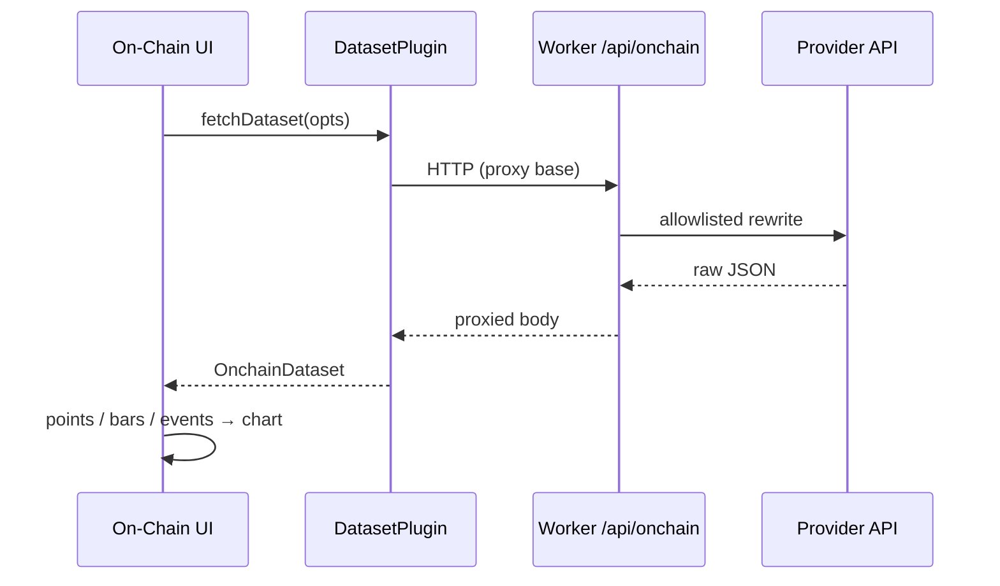

# Copyright (C) 2024-2026 jango_blockchained
#
# This file is part of pynescript.
#
# pynescript is free software: you can redistribute it and/or modify
# it under the terms of the GNU Affero General Public License as published by
# the Free Software Foundation, either version 3 of the License, or
# (at your option) any later version.
#
# pynescript is distributed in the hope that it will be useful,
# but WITHOUT ANY WARRANTY; without even the implied warranty of
# MERCHANTABILITY or FITNESS FOR A PARTICULAR PURPOSE.  See the
# GNU Affero General Public License for more details.
#
# You should have received a copy of the GNU Affero General Public License
# along with pynescript.  If not, see <https://www.gnu.org/licenses/>.
#
# SPDX-License-Identifier: AGPL-3.0-only

---
title: "Datasets"
description: "On-chain / alternate series dataset plugins — fetchDataset contract, DefiLlama TVL, GeckoTerminal DEX OHLCV."
---

# Datasets

## Abstract

A **dataset** plugin loads non-OHLCV (or alternate OHLCV) series for the chart host (protocol TVL, DEX pool candles, funding, events). Kind is `dataset` on the unified registry. Phase 1 surfaces DefiLlama protocol TVL; Phase 2 adds GeckoTerminal pool OHLCV and derived TVL events. UI: [On-Chain panel](/axis/docs/enduser/guides/on-chain). Contract: `src/plugins/types.ts` (`DatasetPlugin`) and `src/onchain/types.ts`.

## Conceptual model



## Interface surface

```ts
interface DatasetPlugin {
  id: string;
  name: string;
  kind: 'dataset';
  fetchDataset(opts: DatasetFetchOpts): Promise<OnchainDataset>;
  searchInstruments?(query: string, config?: Record<string, unknown>): Promise<OnchainInstrument[]>;
  capabilities?: { needsNetwork?: boolean; needsProxy?: boolean; /* … */ };
}
```

### `DatasetFetchOpts`

| Field | Notes |
| --- | --- |
| `instrument` | `chainId`, optional `protocolId` / `address`, `metric`, optional `facet`, `symbol` label |
| `resolution` | e.g. `1d`, `1h` |
| `startTime` / `endTime` | unix seconds (optional window) |
| `limit` | optional max points |
| `signal` | `AbortSignal` |
| `config` | plugin config bag (`baseUrl`, …) |

### `OnchainDataset`

| Field | Notes |
| --- | --- |
| `kind` | `ohlcv` \| `scalar_series` \| `multi_series` \| `events` \| `table` |
| `points` / `series` / `bars` / `events` | payload shape depends on kind |
| `provenance` | `{ provider, queryId?, url? }` — required for UI honesty |
| `finality` | `pending` \| `safe` \| `finalized` \| `unknown` |
| `synthetic` | true when OHLC was synthesized from marks |

## Providers

| id | Name | Network | Notes |
| --- | --- | --- | --- |
| `defillama-tvl` | DefiLlama TVL | yes | Protocol TVL history; browser uses Worker llama proxy by default |
| `geckoterminal` | GeckoTerminal | yes | DEX pool OHLCV + pool search; browser uses Worker gecko proxy by default |

Helpers (not only plugins):

| Module | Role |
| --- | --- |
| `src/onchain/defillama.ts` | Protocol TVL fetch + history parse |
| `src/onchain/geckoterminal.ts` | Pool OHLCV parse/map, search, interval/network maps |
| `src/onchain/events.ts` | `buildTvlSpikeEvents` from scalar TVL points |
| `src/onchain/proxy.ts` | `resolveDefiLlamaBaseUrl` / `resolveGeckoTerminalBaseUrl` |

### Worker proxy (CORS)

Default bases (when plugin `config.baseUrl` is empty):

```text
{store.endpoint}/api/onchain/llama
{store.endpoint}/api/onchain/gecko
```

#### DefiLlama

| Client path | Worker | Upstream |
| --- | --- | --- |
| `/protocols` | `GET /api/onchain/llama/protocols` | `https://api.llama.fi/protocols` |
| `/protocol/:slug` | `GET /api/onchain/llama/protocol/:slug` | `https://api.llama.fi/protocol/:slug` |

#### GeckoTerminal

| Client path | Worker | Upstream |
| --- | --- | --- |
| `/networks/:net/pools/:addr/ohlcv/:tf` | `GET /api/onchain/gecko/networks/.../ohlcv/...` | `https://api.geckoterminal.com/api/v2/networks/.../ohlcv/...` |
| `/search/pools` | `GET /api/onchain/gecko/search/pools` | `https://api.geckoterminal.com/api/v2/search/pools` |

Allowlisted query keys:

- OHLCV: `aggregate`, `limit`, `currency`, `before_timestamp`
- Search: `query`, `network`, `page`, `include`

Address validation on the Worker: EVM `0x[a-fA-F0-9]{40}` or Solana-style base58 `^[1-9A-HJ-NP-Za-km-z]{32,48}$`. Network ids: `^[a-z0-9_]+$`.

Resolver: `src/onchain/proxy.ts`. Handler: `worker/src/onchain.ts`.

Cache keys (IDB dataset cache):  
`provider|chainId|protocol|address|metric|facet|resolution` via `instrumentCacheKey`.

## Related

- [On-Chain data (end user)](/axis/docs/enduser/guides/on-chain)
- [Worker overview](/axis/docs/worker) — `/api/onchain/…` route table
- [Sources](/axis/docs/plugins/sources) — OHLCV (separate plane)
- [Contracts](/axis/docs/plugins/contracts) — shared plugin base
