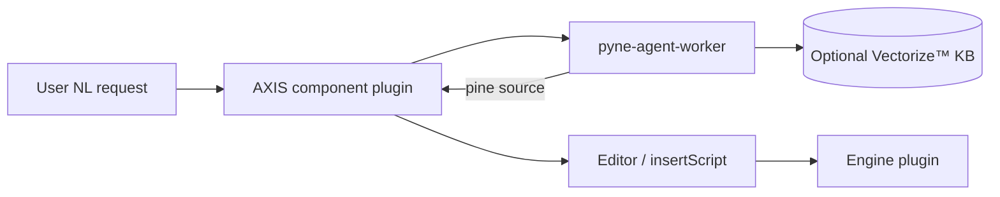

# Copyright (C) 2024-2026 jango_blockchained
#
# This file is part of AXIS.
#
# SPDX-License-Identifier: AGPL-3.0-only

---
title: "PYNE Agent plugin"
description: "Install the pyne-agent-worker AXIS component plugin — natural-language PYNE script chat via Cloudflare® Workers AI™ (standalone or HOOX-enhanced)."
---

# PYNE Agent plugin

## Abstract

**pyne-agent-worker** is a sister Cloudflare® Worker that turns natural language into PYNE-compatible scripts. AXIS consumes it as a **component** plugin (`kind: 'component'`) loaded from URL. It does **not** replace engines — evaluation still goes through your active engine (`server`, `pyodide`, …). The agent only **writes** script source into the editor / chat UI.

| | |
|--|--|
| **Repo** | [hoox-sh/pyne-agent-worker](https://github.com/hoox-sh/pyne-agent-worker) |
| **Plugin module** | `GET /plugin/axis-pine-agent.js` |
| **API** | `POST /v1/chat` |
| **Standalone** | Workers AI™ only — **no** pyne-worker / HOOX mesh required |
| **Optional** | pyne-worker validate→retry when configured |

_Pine Script™ and TradingView® are trademarks of TradingView, Inc. Cloudflare® is a registered trademark of Cloudflare, Inc. Independent project — not affiliated with TradingView, Inc. or Cloudflare, Inc._

## Conceptual model



## Install in AXIS

1. Deploy [pyne-agent-worker](https://github.com/hoox-sh/pyne-agent-worker) (standalone is enough).
2. AXIS → **Manager → Plugins → Install from URL**:

```text
https://pyne-agent-worker.cryptolinx.workers.dev/plugin/axis-pine-agent.js
```

(Or your own deploy: `https://<your-pyne-agent-worker>/plugin/axis-pine-agent.js`.)

3. Configure plugin fields:

| Field | Meaning |
| --- | --- |
| `endpoint` | Worker origin (no trailing slash) |
| `apiKey` | Worker `API_KEY` (optional in open local mode) |
| `pineVersion` | `auto` \| `v5` \| `v6` |
| `style` | `auto` \| `indicator` \| `strategy` \| `library` |

4. Open the agent from the **manager tab** / **topbar** action, or use the floating **PYNE Agent** button if component slots are not mounted yet (phase-2 fallback).

Contract namespace remains `pynescript.axis.plugins.v1`. Export shape: default ES module with `kind: 'component'`, `slots`, `mount`, optional `init`/`dispose`.

See also: [Dynamic loader](/axis/docs/plugins/dynamic-loader), [Plugin examples](/axis/docs/reference/plugin-examples), end-user guide [PYNE Agent](/axis/docs/enduser/guides/pyne-agent).

## Standalone vs HOOX

| Mode | Config | Behavior |
| --- | --- | --- |
| **Standalone** (default) | No `PYNE_SERVICE` / `PYNE_WORKER_URL` on the worker | Chat + optional RAG; `validation.skipped` |
| **HOOX-enhanced** | Optional pyne-worker binding or URL | generate → `POST /run` → fix retries |

AXIS users who only want natural-language script authoring never need to deploy pyne-worker.

## API surface (worker)

| Method | Path | Role |
| --- | --- | --- |
| `GET` | `/health` | `mode: standalone \| hoox` |
| `POST` | `/v1/chat` | NL → `reply` + extracted `pine` |
| `GET` | `/plugin/axis-pine-agent.js` | This plugin module |
| `GET` | `/` | Built-in chat shell (iframe / demo) |

Auth: `X-API-Key` or `Authorization: Bearer` when the worker secret is set.

## Legal / content

- The agent repo **never ships** TradingView® built-in indicator sources.
- Knowledge (docs v5/v6, open corpus ≤ 1000, operator builtin refs) is ingested privately into R2 + Vectorize™.
- Always treat marks: Pine Script™, TradingView®, Cloudflare®.

## Failure modes

| Symptom | Likely cause |
| --- | --- |
| Plugin load fails (`kind: component`) | Older AXIS build rejects component via URL — use floating UI from worker `/` or upgrade AXIS loader |
| 401 on chat | Missing/wrong `apiKey` vs worker `API_KEY` |
| Empty RAG quality | KB not ingested; chat still works with model knowledge only |
| `validation.available: false` | Expected in standalone — not an error |

## See also

- [Manager and settings](/axis/docs/enduser/guides/manager-and-settings)
- [End-user: PYNE Agent](/axis/docs/enduser/guides/pyne-agent)
- [pyne-agent-worker README](https://github.com/hoox-sh/pyne-agent-worker)
- [PYNE docs](https://hoox.sh/pyne/docs)
