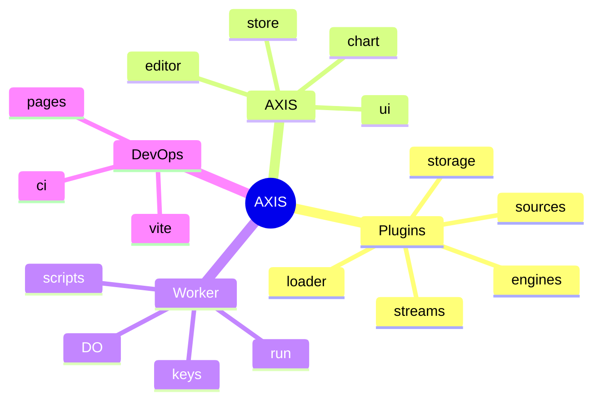

# Copyright (C) 2024-2026 jango_blockchained
#
# This file is part of pynescript.
#
# pynescript is free software: you can redistribute it and/or modify
# it under the terms of the GNU Affero General Public License as published by
# the Free Software Foundation, either version 3 of the License, or
# (at your option) any later version.
#
# pynescript is distributed in the hope that it will be useful,
# but WITHOUT ANY WARRANTY; without even the implied warranty of
# MERCHANTABILITY or FITNESS FOR A PARTICULAR PURPOSE.  See the
# GNU Affero General Public License for more details.
#
# You should have received a copy of the GNU Affero General Public License
# along with pynescript.  If not, see <https://www.gnu.org/licenses/>.
#
# SPDX-License-Identifier: AGPL-3.0-only

---
title: "Feature atlas"
description: "Map of AXIS product surfaces to repository paths: plugins, AXIS, worker, storage, test, legacy."
---

# Feature atlas

## Abstract

This atlas is a **path index** for AXIS. Use it to jump from a product feature to the code that implements it. Prefer Solid product paths over legacy static shell files.

## Conceptual model

## Atlas tables

### Plugin system

| Feature | Primary paths |
| --- | --- |
| Contracts | `src/plugins/types.ts` |
| Registry | `src/plugins/registry.ts` |
| Bootstrap | `src/plugins/bootstrap.ts` |
| Active set | `src/plugins/active.ts` |
| Dynamic install | `src/plugins/loader.ts` (source/stream/engine/dataset/**component**) |
| Barrel | `src/plugins/index.ts` |
| Manager UI | `src/ui/PluginManager.tsx`, `plugin-badges.tsx` |
| Docs (in-tree) | `src/plugins/README.md` |

### Data plugins

| Feature | Primary paths |
| --- | --- |
| Sources | `src/sources/catalog.ts`, `upload-store.ts` |
| Streams | `src/streams/catalog.ts`, `multiplex.ts` |
| Engines | `src/engines/catalog.ts` |
| Load symbol (one-shot) | `src/data/load-symbol.ts`, `parse-bars.ts` |
| Data Source Manager | `src/data/data-source-manager.ts`, `bars-cache.ts`, `bars-gaps.ts`, `ui/DataSourceManagerPanel.tsx` |
| Script run | `src/indicators/runner.ts` |
| Scripts panel | `src/indicators/IndicatorPanel.tsx`, `IndicatorCard.tsx` |
| Chart themes | `src/theme/presets.ts`, `catalog.ts`, `manager.ts`, `ui/ThemePanel.tsx` |

### Storage / library

| Feature | Primary paths |
| --- | --- |
| Catalog | `src/storage/catalog.ts` |
| Local IDB | `src/storage/local.ts`, `idb.ts` |
| Cloud | `src/storage/cloud.ts` |
| Git | `src/storage/git.ts`, `git-github.ts`, `git-gitlab.ts` |
| Service façade | `src/storage/service.ts` |
| Library panel | `src/ui/ScriptLibraryPanel.tsx` |
| v6 starter pack | `examples/script-library-starter.json` |

### UI (UI)

| Feature | Primary paths |
| --- | --- |
| Entry | `src/index.tsx`, `src/app.tsx` |
| Chart host | `src/chart/ChartHost.tsx`, `ChartWorkspace.tsx`, `pane-manager.ts`, `pane-badge.ts`, `series-factory.ts` |
| Price-scale decimals | `src/chart/price-precision.ts` |
| Plot style parity | `src/results/plot-visuals.ts` → pane-manager |
| Multi-chart / recipes | `src/chart/layout.ts`, `layout-recipes.ts`, `chart-registry.ts`, `ui/ChartLayoutMenu.tsx` |
| Bar replay | `src/chart/bar-replay.ts`, `ui/BarReplayControls.tsx` |
| Compare / volume profile | `src/chart/compare-overlay.ts`, `volume-profile.ts` |
| Drawings | `src/chart/drawing-layer.ts`, `drawings/*`, `pyne-drawings.ts`, `DrawingToolbar.tsx` |
| Editor | `src/editor/*` (CM6, diagnostics, ruler, git-sync, inline-debug, symbols) |
| Editor chrome | `ui/EditorGitBar.tsx`, `ui/EditorProblems.tsx` |
| Alerts | `src/alerts/*`, `ui/AlertsPanel.tsx` |
| Command palette | `ui/CommandPalette.tsx`, `command-registry.ts` |
| Docks | `ui/panels/*` (side-by-side left/right) |
| Results | `src/results/*`, `ui/ResultsPanel.tsx`, `StrategyReport.tsx` |
| Workers Manager | `src/ui/WorkersManager.tsx`, `src/workers/*` |
| Store | `src/store/index.ts`, `types.ts` |
| Topbar / settings | `ui/Topbar.tsx`, `TopbarField.tsx`, `SettingsDialog.tsx` |
| Workspace snapshot | `src/storage/workspace-snapshot.ts` |
| Desktop shell bridge | `src/desktop/*`, `src-tauri/` |

### Worker

| Feature | Primary paths |
| --- | --- |
| Router / CORS | `worker/src/index.ts` (`pickOrigin`) |
| Run (auth + rate limit) | `worker/src/runtime.ts`, `pyodide_runtime.ts` |
| Auth / keys | `worker/src/auth.ts`, `keys.ts` |
| Scripts | `worker/src/scripts.ts`, `schemas/scripts.sql` |
| Git OAuth | `worker/src/git-oauth.ts` |
| Session DO | `worker/src/durable-objects/session.ts` |
| Config | `worker/wrangler.toml.example`, `RUNTIME.md`, `README.md` |

### Build / ops

| Feature | Primary paths |
| --- | --- |
| Package scripts | root `package.json` (`dev`, `build`, `test:*`, `axis:*`, `desktop:*`) |
| AXIS CLI | `packages/cli/` (`@hoox-sh/axis-cli`) |
| Static server | `axis_pwa_server.py` |
| Public assets | `public/plugins`, `public/vendor`, `public/pyodide` |
| Makefile | `axis` / `axis-*`, `pages-deploy`, `docker-*` |
| Desktop CI | `.github/workflows/desktop.yml` |
| CI | `.github/workflows/ci.yml` (coverage + e2e smoke) |
| Coverage gate | `scripts/check-coverage.mjs` (scoped core ≥95%) |
| Harden/perf audit | `docs/devops/harden-perf-audit-2026-08-11.md` |

### Examples & tests

| Feature | Primary paths |
| --- | --- |
| Example plugins | `public/plugins/*.js` |
| Pine v6 library starter | `examples/script-library-starter.json` |
| Unit tests | `tests/**` |
| Worker tests | `worker/tests/**` |
| E2E | `e2e/**`, `playwright.config.ts` |
| Testing guide | `TESTING.md` |
| Legacy notes | `LEGACY.md` |

## Namespaces & keys

| Key / namespace | Use |
| --- | --- |
| `pynescript.axis.plugins.v1` | Installed dynamic plugins |
| `pynescript.axis.library.v1` | Local library LS fallback |
| `pynescript.axis.storage` | IDB database name |
| `pynescript.axis.v1` | App state |
| `pynescript.axis.v2` | Older app-state key (write-forward) |
| Contract ns | `pynescript.axis.plugins.v1` (conceptual) |

## Infrastructure constants

| Name | Value |
| --- | --- |
| CF project | `pynescript-axis` |
| Health service | `pynescript-axis-worker` |
| Pyodide version | `0.26.2` (self-hosted path) |

## See also

- [Plugins](/axis/docs/plugins)
- [Worker](/axis/docs/worker)
- [Legacy shell](/axis/docs/reference/legacy-shell)
