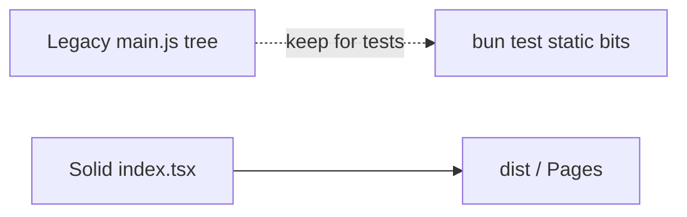

# Copyright (C) 2024-2026 jango_blockchained
#
# This file is part of pynescript.
#
# pynescript is free software: you can redistribute it and/or modify
# it under the terms of the GNU Affero General Public License as published by
# the Free Software Foundation, either version 3 of the License, or
# (at your option) any later version.
#
# pynescript is distributed in the hope that it will be useful,
# but WITHOUT ANY WARRANTY; without even the implied warranty of
# MERCHANTABILITY or FITNESS FOR A PARTICULAR PURPOSE.  See the
# GNU Affero General Public License for more details.
#
# You should have received a copy of the GNU Affero General Public License
# along with pynescript.  If not, see <https://www.gnu.org/licenses/>.
#
# SPDX-License-Identifier: AGPL-3.0-only

---
title: "Legacy shell"
description: "Pre-Solid static shell vs current AXIS product path — what to ignore and what still runs."
---

# Legacy shell

## Abstract

AXIS’s shipping product path is **Solid + Vite**. An older **static shell** remains in the repo for historical scripts and some Bun tests. Do not document or extend the legacy shell as the primary UI.

Source of truth: `LEGACY.md`.

## Conceptual model

## What is legacy

| Path | Role |
| --- | --- |
| `src/main.js` | Old bootstrap (chart.js, legacy-topbar.js, …) |
| `style.css` | TV-blue-era tokens |
| `pyne-editor.js` | Pre-Solid CM6 wiring (renamed from `pine-editor.js`) |
| `server.ts` | Bun static server for old tree |
| `sw.js` | Service worker for the old shell |

There is no `frontend/` directory and no `make run-frontend` target. The product path is `bun run dev`. A static demo of `dist/` is `python axis_pwa_server.py` (default port 8081) after `bun run build`.

## What is current

| Path | Role |
| --- | --- |
| `src/index.tsx`, `app.tsx` | Solid app |
| `src/chart/ChartHost.tsx` | LWC panes |
| `src/ui/*` | Topbar, Settings, Results, Manager, … |
| `public/` + `bun run build` | Production PWA assets |
| `axis_pwa_server.py` | Serve **dist** for demos |

## Migration residue

| Residue | Handling |
| --- | --- |
| `pynescript.axis.plugins.v1` | Plugin install list |
| `pynescript.axis.library.v1` | Library localStorage fallback |
| `pynescript.axis.editor.doc` | Editor document backup |
| CF Pages project `axis` | Pages id; canonical `https://axis.hoox.sh` |
| CF Worker `worker-axis` | Script name; URL `https://worker.axis.hoox.sh` |
| Some docs/Makefile strings | Current brand is AXIS |

App state namespace: `pynescript.axis.v1`.

## Invariants

1. **Do not port new features into `main.js`.**
2. **Prefer Solid store** (`src/store`) over `state.js`.
3. **Plugin registry** is the Solid path (`src/plugins/registry.ts`); dual registries in old JS should be treated as dead ends.
4. **Pages deploy** should use Vite `dist/`, not the repo root static tree.

## Failure modes

| Confusion | Clarification |
| --- | --- |
| “UI doesn’t match docs” | You may be serving the legacy shell |
| Plugin manager missing | Legacy topbar lacks Solid Manager |
| Tests pass, UI wrong | Unit tests may still import legacy helpers |

## See also

- [Feature atlas](/axis/docs/reference/feature-atlas)
- [Build and serve](/axis/docs/devops/build-and-serve)
- [AXIS hub](/axis/docs)
