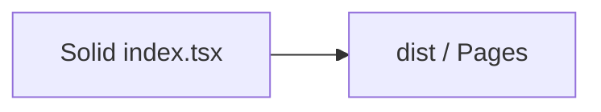

# Copyright (c) 2026 HOOX · AXIS · hoox-sh (jango_blockchained)
#
# This file is part of axis.
#
# axis is free software: you can redistribute it and/or modify
# it under the terms of the GNU Affero General Public License as published by
# the Free Software Foundation, either version 3 of the License, or
# (at your option) any later version.
#
# axis is distributed in the hope that it will be useful,
# but WITHOUT ANY WARRANTY; without even the implied warranty of
# MERCHANTABILITY or FITNESS FOR A PARTICULAR PURPOSE.  See the
# GNU Affero General Public License for more details.
#
# You should have received a copy of the GNU Affero General Public License
# along with axis.  If not, see <https://www.gnu.org/licenses/>.
#
# SPDX-License-Identifier: AGPL-3.0-only

---
title: "Legacy shell"
description: "The pre-Solid static shell was removed in 2.21.0 — what was deleted and what replaced it."
---

# Legacy shell (removed)

## Abstract

AXIS’s product path is **Solid + Vite**. The pre-Solid static shell was **deleted in 2.21.0** (~3,900 lines). Before deletion the import graph was traced from `src/index.tsx`: no legacy file was reachable and none shipped in `dist/`.

Source of truth: `LEGACY.md`.

## Conceptual model

```mermaid
flowchart LR
  CUR[Solid index.tsx] --> SHIP[dist / Pages]
```

## What was removed

| Deleted | Role |
| --- | --- |
| `src/main.js` | Old bootstrap (chart.js, legacy-topbar.js, …) |
| `src/registry.js`, `src/registry.d.ts` | Pre-Solid plugin registry |
| `src/registry-bootstrap.js`, `src/plugin-types.d.ts` | Legacy builtin registration + ambient typings |
| `src/state.js`, `src/state-hash.js` | Pre-Solid store + URL hash hydration |
| `src/{sources,streams,engines}/index.js` | Legacy builtin plugin barrels |
| `src/ui/{manager,legacy-topbar,legacy-watchlist,…}.js` | Legacy DOM UI |
| `pyne-editor.js` | Pre-Solid CM6 wiring |
| `style.css`, `storage.js` | TV-blue tokens / unused |
| `server.ts` | Bun static server for old tree |
| Root `sw.js` | Duplicate of `public/sw.js` |
| `tests/{registry,state,server}.test.ts` | Tests of deleted files only |

There is no `frontend/` directory and no `make run-frontend` target. The product path is `bun run dev`. A static demo of `dist/` is `python axis_pwa_server.py` (default port 8081) after `bun run build`.

## What is current

| Path | Role |
| --- | --- |
| `src/index.tsx`, `app.tsx` | Solid app |
| `src/chart/ChartHost.tsx` | LWC panes |
| `src/plugins/registry.ts` | Plugin registry (singleton `registry`) |
| `src/{sources,streams,engines}/catalog.ts` | Builtin catalogs |
| `src/ui/*` | Topbar, Settings, Results, Manager, … |
| `public/` + `bun run build` | Production PWA assets (`public/sw.js` is the only service worker) |
| `axis_pwa_server.py` | Serve **dist** for demos |

## Migration residue

| Residue | Handling |
| --- | --- |
| `pynescript.axis.plugins.v1` | Plugin install list |
| `pynescript.axis.library.v1` | Library localStorage fallback |
| `pynescript.axis.editor.doc` | Editor document backup |
| CF Pages project `axis` | Pages id; canonical `https://axis.hoox.sh` |
| CF Worker `worker-axis` | Script name; URL `https://worker.axis.hoox.sh` |
| Some docs/Makefile strings | Current brand is AXIS |

App state namespace: `pynescript.axis.v1`.

## Invariants

1. **One plugin registry**: `src/plugins/registry.ts`, singleton `registry`. There is no longer a second one.
2. **One service worker**: `public/sw.js`, served at `/sw.js` and registered by `src/pwa/register-sw.ts`.
3. **One state store**: `src/store` (Solid). The pre-Solid `state.js` is gone.
4. **Pages deploy** uses Vite `dist/`, not the repo root static tree.

## Failure modes

| Confusion | Clarification |
| --- | --- |
| “UI doesn’t match docs” | You may be serving a stale build or cache; `bun run build` then reload |
| Plugin manager missing | A hard reload clears the old shell from cache |
| Service worker looks stale | Only `public/sw.js` is served; unregister any older root `sw.js` |

## See also

- [Feature atlas](/axis/docs/reference/feature-atlas)
- [Build and serve](/axis/docs/devops/build-and-serve)
- [AXIS hub](/axis/docs)
