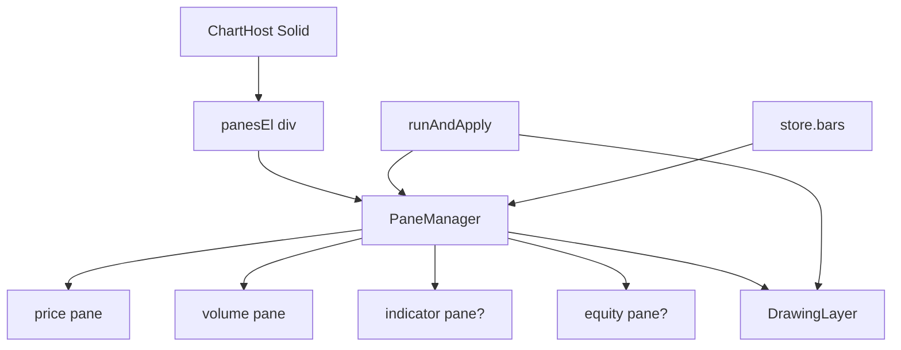

# Copyright (C) 2024-2026 jango_blockchained
#
# This file is part of pynescript.
#
# pynescript is free software: you can redistribute it and/or modify
# it under the terms of the GNU Affero General Public License as published by
# the Free Software Foundation, either version 3 of the License, or
# (at your option) any later version.
#
# pynescript is distributed in the hope that it will be useful,
# but WITHOUT ANY WARRANTY; without even the implied warranty of
# MERCHANTABILITY or FITNESS FOR A PARTICULAR PURPOSE.  See the
# GNU Affero General Public License for more details.
#
# You should have received a copy of the GNU Affero General Public License
# along with pynescript.  If not, see <https://www.gnu.org/licenses/>.
#
# SPDX-License-Identifier: AGPL-3.0-only

---
title: "Charting"
description: "AXIS chart: ChartHost, PaneManager, series factory, drawings, crosshair sync, and trade markers."
---

# Charting

Charting is the spatial surface for OHLCV, overlays, and annotations. Implementation is **imperative** under a Solid shell so lightweight-charts owns its DOM subtree.

## Abstract

| Module | Role |
| --- | --- |
| `ChartHost.tsx` / `ChartWorkspace.tsx` | Solid mount; multi-slot grid; empty-state |
| `pane-manager.ts` | Multi-pane LWC charts, time sync, overlay apply |
| `pane-badge.ts` | Corner name + script action icons |
| `series-factory.ts` | Candle/volume/line series helpers + palette |
| `chart-type.ts` | Price style transforms (HA, hollow, …) |
| `bar-replay.ts` + `BarReplayControls` | History scrub / play |
| `layout.ts` / `layout-recipes.ts` / `chart-registry.ts` | Multi-chart layouts + presets |
| `compare-overlay.ts` | Second-symbol compare series |
| `volume-profile.ts` | OHLCV volume-at-price overlay |
| `drawing-layer.ts` + `drawings/*` | User + script drawings, templates, sync helpers |
| `price-precision.ts` | Price-scale decimals (`auto` or 0–8) from symbol + bars |
| `results/plot-visuals.ts` | Pine `plot.style_*` → LWC series kind (line, stepline, columns, area, …) |
| `crosshair-sync.ts` | Cross-pane crosshair |
| `pyne-drawings.ts` | Engine drawing objects → layer |
| `manager-access.ts` | Process-wide manager/layer getters |

## Conceptual model



## Interface surface

### Panes

`store.panes`: `{ id, type, height, order, visible, label }`.

| type | Typical series |
| --- | --- |
| `price` | Price series (style below) + overlay lines + markers + drawings |
| `volume` | Histogram |
| `indicator` | Non-overlay plots |
| `equity` | Strategy equity curve |

Defaults: price + volume. Indicator/equity created on demand.

### Price chart styles (`store.chartType`)

Topbar **Type** select (persisted). Implementation: `chart/chart-type.ts` + `createPriceSeries`.

| `chartType` | Series | Notes |
| --- | --- | --- |
| `candles` | Candlestick | Japanese candles (default) |
| `hollow` | Candlestick | Hollow body on up bars |
| `bars` | Bar | Classic OHLC bars |
| `heikinashi` | Candlestick | Heikin-Ashi transform of OHLCV |
| `line` | Line | Close only |
| `area` | Area | Close with fill |
| `baseline` | Baseline | Close vs first-bar base |

Series still live under pane key `candle` so markers, hlines, and the drawing layer keep a stable host. Changing type swaps the LWC series and rebinds data without a full history reload.

### Empty / status overlay

When `bars.length === 0`, ChartHost shows contextual title/sub from `store.status` (loading, error, running, or “Load data to begin”).

### Price-scale decimals

Price pane labels use `chart/price-precision.ts`:

| Mode | Behavior |
| --- | --- |
| `auto` (default) | Merge symbol heuristics (e.g. BTC→2, SHIB→8) with recent OHLCV significant digits |
| `0`–`8` | Fixed display decimals + matching `minMove` |

UI control cycles **A → 0 → … → 8 → A** on the price-pane scale chrome. Store field: `priceScaleDecimals` (persisted).

### Plot style parity

Engine plot series honor Pine Script™ `plot.style_*` via `mapPlotStyleToSeriesKind` (`results/plot-visuals.ts` → pane-manager series factory):

| Pine style (examples) | Chart series |
| --- | --- |
| `plot.style_line` / default | Line |
| `plot.style_stepline` | Stepline (LWC WithSteps) |
| `plot.style_stepline_diamond` | Stepline + vertex point markers |
| `plot.style_histogram` | Histogram (base 0) |
| `plot.style_columns` | Columns → LWC Histogram (base 0; no column-width/gap API) |
| `plot.style_area` / `areabr` | Area |
| `plot.style_circles` | Circular point markers + faint hairline |
| `plot.style_cross` | Larger point markers, connector hidden |
| `plot.style_linebr` / `steplinebr` | Broken line / stepline variants (whitespace gaps) |

**LWC limits:** Histogram series has no bar-width or gap option, so `columns` and `histogram` share the same bar geometry (both zero-based). Point markers are always circular — `cross` is approximated by discrete markers without a connector; `stepline_diamond` uses stepline + vertex markers. Sparse `plotshape` styles map diamond/cross to square markers (optional `+` / `✕` glyphs when text is omitted).

`fill(plot1, plot2, color=…)` renders as SVG bands between the two series when both resolve on the same pane.

### Multi-chart layouts

- Modes: **1 / 2H / 2V / 4** (`store.chartLayout`)  
- Per-slot symbol/interval via registry; active slot drives topbar + Run  
- **Named layouts** save/load (optional chrome snapshot)  
- **Recipes** in Layouts menu: Scalp 1m+5m, Swing HTF, Quad, BTC majors (`layout-recipes.ts`)

### Bar Replay

Topbar **Replay** → session over loaded OHLCV (`bar-replay.ts`):

- Enters with **full history visible** (cursor on last bar)  
- Scrub / step / play; **Play at end restarts from bar 0**  
- Mutually exclusive with Live  

### Compare & volume profile

- **Compare** control: second symbol as % or absolute overlay (`compare-overlay.ts`)  
- **Volume profile** toggle in Layers → OHLCV approximation histogram (`volume-profile.ts`)

### Pane badges

Each pane’s top-left chip (`pane-badge.ts`): label + script actions when scripts are applied:

| Icon | Action |
| --- | --- |
| Settings | Script inputs modal |
| Eye | Show / hide series |
| Refresh | Re-run script |
| Trash | Remove from chart |

Volume/equity without scripts: name + hide.

### Drawings toolbar

See [Drawings](/axis/docs/enduser/guides/drawings). Tools include cursor, hline, vline, trend, ray, extend, rect, ellipse, arrow, fib, measure, text. Templates and duplicate helpers live under Layers / drawings modules.

### Crosshair & time

`syncTimeScales` / `syncCrosshair` keep multi-pane navigation coherent. `scrollToTime` / `jumpToDebugPin` used from Results and debug pins.

## Internals

### Solid vs imperative boundary

```text
// ChartHost — Solid owns outer shell
// PaneManager only mutates panesEl — never put Solid children inside panesEl
```

On cleanup: destroy drawing layer, dispose manager, clear accessors.

### Data path

`setDataToChart(bars)` applies OHLCV; `createEffect` on `store.bars` re-applies if bars change outside load helper.

### Run apply (chart side)

From `runAndApply` (indicators):

- `syncOverlayLines` — update existing overlay series in place (avoids destroy→blank→add flash on live re-runs)
- Markers from normalized events (set in place)
- Script drawings atomic replace via DrawingLayer (`setScriptDrawings` without empty frame); `linefill` quads and `force_overlay` geometry route with other script drawings; `barcolor` tints candles via plot-visuals (not the SVG layer)
- Equity series when strategy report warrants (silent live runs skip hide thrash)

### History vs live bars

- Full loads: `loadBars` → `chartDataGen++` → `setDataToChart` + fitContent  
- Live: `multiplex` → `appendBar` + `manager.appendBar` only (no fitContent, no full setData)
- **Performance (2.0.x):** live tick path is O(1) append + conflation under load; heavy history paint is batched; load requests use **AbortController** so symbol switches cancel in-flight venue fetches
- Overlay re-runs prefer in-place series updates (`syncOverlayLines`) to avoid destroy→blank flash

### series-factory

Centralizes series construction options, plot-style mapping, and color palette so Results plot summary and chart stay chromatically related.

## Invariants

1. Solid reconciliation must not rewrite pane roots.  
2. Script drawings ephemeral per run; user drawings store-backed.  
3. Overlay routing: engine `meta.overlay` + script type; **oscillator-scale** series forced to sub-pane when they would vanish on price (see [Indicators](/axis/docs/ui/indicators)).  
4. Shared non-overlay sub-pane id is stable: **`indicator`**.  
5. Manager may be null before mount—runner no-ops chart apply safely.

## Failure modes

| Symptom | Cause |
| --- | --- |
| Blank panes after hot reload | Manager disposed; full remount |
| Overlays stack forever | Old path skipped removeOverlays |
| Fib/tools ignore clicks | No bars / time scale; wrong tool |
| Markers at t=0 | Event times not bar-aligned |

## Worked example (dev)

```ts
import { getManager } from './chart/manager-access';
getManager()?.scrollToTime(barTime);
```

## See also

- [Indicators](/axis/docs/ui/indicators)
- [Results and strategy](/axis/docs/ui/results-and-strategy)
- [End-user drawings](/axis/docs/enduser/guides/drawings)
