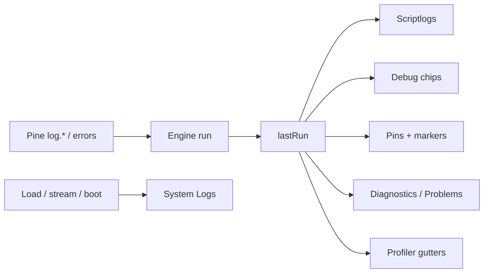

# Copyright (C) 2024-2026 jango_blockchained
#
# This file is part of pynescript.
#
# pynescript is free software: you can redistribute it and/or modify
# it under the terms of the GNU Affero General Public License as published by
# the Free Software Foundation, either version 3 of the License, or
# (at your option) any later version.
#
# pynescript is distributed in the hope that it will be useful,
# but WITHOUT ANY WARRANTY; without even the implied warranty of
# MERCHANTABILITY or FITNESS FOR A PARTICULAR PURPOSE.  See the
# GNU Affero General Public License for more details.
#
# You should have received a copy of the GNU Affero General Public License
# along with pynescript.  If not, see <https://www.gnu.org/licenses/>.
#
# SPDX-License-Identifier: AGPL-3.0-only

---
title: "Debugging"
description: "Scriptlogs, Profiler, Debug chips, chart Pins, diagnostics, and System Logs."
---

# Debugging

AXIS separates **script-authored diagnostics** (Pine `log.*`, engine errors, line timing) from **shell telemetry** (load, stream, engine connection).

Writing-time and last-run info share four surfaces — hover, the param checklist, pre-eval, and debug chips — so each answer stays on its own chrome.

## Abstract

| Surface | Source of truth | Open / toggle |
| --- | --- | --- |
| **Hover** | Builtin / identifier docs (local corpus or LSP) | Rest cursor on a symbol |
| **Param checklist** | Call signature + remaining named args | Type inside `plot(` / `ta.sma(` / … |
| **Pre-eval / Problems** | Parse/lint ∪ last-run engine errors | Underlines + Problems (`pre-eval` vs `run`) |
| **Scriptlogs** | `store.lastRun` → `normalizePyneLogs` | Editor header **Scriptlogs** |
| **Profiler** | `profilerEnabled` + `profile.lines` | Editor header **Profiler** |
| **Debug chips** | `inlineDebugEnabled` + last-run logs with **line** | Editor header **Debug** |
| **Pins** | `debugPinsEnabled` + logs with **bar_index / time** | Editor header **Pins** · **Alt+P** |
| **System Logs** | `store.logs` ring buffer | Status bar / logs strip |

| Module | Role |
| --- | --- |
| `ui/ScriptLogsPanel.tsx` | Floatable last-run `log.*` list |
| `results/pyne-logs.ts` | Normalize / filter / TSV |
| `results/profiler.ts` | Line % profile |
| `results/inline-debug.ts` | Annotations + pinable helpers |
| `results/debug-pins.ts` | Bar pins, markers, `countDebugPins` |
| `editor/inline-debug.ts` | CM chips, pin gutter, line flash |
| `editor/diagnostics.ts` | Error underlines / gutter / jump |
| `ui/EditorProblems.tsx` | Problems list UI |
| `chart/manager-access.ts` | `applyDebugPinsToChart`, `jumpToDebugPin` |

## Conceptual model

**Invariant:** Scriptlogs / Debug / Pins never write into `store.logs`.

---

## Four information surfaces

| Surface | When | Answers |
| --- | --- | --- |
| **Hover** | Idle on a symbol | What is this builtin / identifier? |
| **Param checklist** | Inside a call | Which arguments remain? |
| **Pre-eval** | While typing / Save | What is wrong *before* Run? |
| **Debug chips** | After Run, **Debug** on | What did this **source line** log or error? |

Hover and the param checklist never invent TradingView® host APIs — they read PYNE builtins / local docs. Pre-eval marks the buffer; Debug chips still read **last run** only.

---

## Debug vs Pins

| | **Debug** | **Pins** |
| --- | --- | --- |
| **Question** | What happened on this **source line**? | Which **bar** was that on the chart? |
| **Requires** | Line ref (`line 12:`, structured `line`, …) | `bar_index` and/or `time` / `bar_time` |
| **UI** | End-of-line chips + optional level gutter | Chart circle markers + 📍 editor gutter |
| **Click** | Pin-able chips jump if bar info present | Chip / 📍 / Scriptlogs → chart jump + line flash |
| **Store** | `inlineDebugEnabled` | `debugPinsEnabled` |

### Workflow

1. Add `log.info` / `log.warning` / `log.error` (or rely on engine errors) with **line** and ideally **bar_index**.  
2. **Run**.  
3. Toggle **Debug** to see chips; **Pins** to mark bars (count shows on the Pins button).  
4. Click a pin-able chip or 📍 → `jumpToDebugPin` (crosshair + scroll); source line flashes (`cm-debug-pin-flash`).

Both can be on at once. Pins without Debug still show 📍 gutter and chart markers.

---

## Scriptlogs

Panel for **script** logging from the last run.

| Pine call | Panel level |
| --- | --- |
| `log.info` | info |
| `log.warning` | warning |
| `log.error` | error |

Open: Editor → **Scriptlogs** (`axis-btn-scriptlogs`). Pin-able rows jump to the chart when bar time/index is known.

---

## Editor Profiler

Toggle **Profiler** (`axis-btn-profiler`):

- Persists `profilerEnabled`  
- May send `profiler: true` to the engine  
- Header shows last-run ms  
- Gutter shows line `%` when `profile.lines` is present  

---

## Diagnostics & Problems

Independent of Debug chips: structural **error reporting** from pre-eval and the run payload.

- Pre-eval (`preeval*`) marks parse / lint issues as you type; last-run adds engine `error`, `meta.errors`, `diagnostics`, error-level logs  
- CodeMirror underlines + severity gutter (larger hit target than line numbers)  
- Stats strip badge (`axis-editor-diag-count`) and **Problems** list (`axis-editor-problems`)  
- Each row shows origin **`pre-eval`** or **`run`** when the diagnostic has a source  
- Click → jump to line/range  
- Empty / in-flight pre-eval stays **No problems** (no checking flicker)  

---

## Scriptlogs vs System Logs

| | **Scriptlogs** | **System Logs** |
| --- | --- | --- |
| **Source** | Script `log.*` on last run | AXIS shell events |
| **Store** | `lastRun` | `store.logs` |
| **UI** | Floatable Scriptlogs | Strip above status bar |
| **Control** | Editor header | Status bar |

---

## Persistence & test ids

| Key | Role |
| --- | --- |
| `panelChrome.scriptlogs` / `editor` | Panel chrome |
| `profilerEnabled` | Profiler |
| `inlineDebugEnabled` | Debug chips |
| `debugPinsEnabled` | Chart + pin gutter |

| testid | Role |
| --- | --- |
| `axis-btn-scriptlogs` | Open Scriptlogs |
| `axis-btn-profiler` | Profiler |
| `axis-btn-inline-debug` | Debug |
| `axis-btn-debug-pins` | Pins |
| `axis-debug-pin-count` | Pin count |
| `axis-editor-diag-count` | Diagnostics badge |
| `axis-editor-problems` | Problems panel |

Unit coverage: `tests/pyne-logs.test.ts`, `tests/profiler.test.ts`, `tests/inline-debug.test.ts`, `tests/debug-pins.test.ts`, `tests/editor-diagnostics.test.ts`.

## See also

- [Editor](/axis/docs/ui/editor)  
- [Charting](/axis/docs/ui/charting) — markers and jump  
- [UI shell](/axis/docs/ui/ui-shell)  
