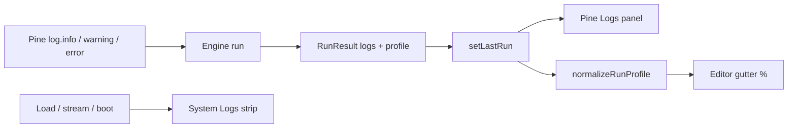

# Copyright (C) 2024-2026 jango_blockchained
#
# This file is part of pynescript.
#
# pynescript is free software: you can redistribute it and/or modify
# it under the terms of the GNU Affero General Public License as published by
# the Free Software Foundation, either version 3 of the License, or
# (at your option) any later version.
#
# pynescript is distributed in the hope that it will be useful,
# but WITHOUT ANY WARRANTY; without even the implied warranty of
# MERCHANTABILITY or FITNESS FOR A PARTICULAR PURPOSE.  See the
# GNU Affero General Public License for more details.
#
# You should have received a copy of the GNU Affero General Public License
# along with pynescript.  If not, see <https://www.gnu.org/licenses/>.
#
# SPDX-License-Identifier: AGPL-3.0-only

---
title: "Debugging"
description: "AXIS Pine Logs panel and Editor Profiler: script log.* output, line % gutters, and how they differ from System Logs."
---

# Debugging

AXIS separates **script-authored diagnostics** (Pine `log.*` + optional engine line timing) from **shell telemetry** (load, stream, engine connection). This page covers Pine Logs, Editor Profiler mode, and the System Logs strip.

## Abstract

| Surface | Source of truth | Open / toggle |
| --- | --- | --- |
| **Pine Logs** | `store.lastRun` → `normalizePineLogs` | Topbar **Pine Logs** (`togglePineLogsPanel`) |
| **Profiler** | `store.profilerEnabled` + `meta.profile` / `profile.lines` | Topbar **Profiler** (`toggleProfilerEnabled`) |
| **System Logs** | `store.logs` ring buffer | Status bar / logs strip (`logsPanel`) |

| Module | Role |
| --- | --- |
| `ui/PineLogsPanel.tsx` | Floatable panel for last-run `log.*` lines |
| `results/pine-logs.ts` | Normalize / filter / TSV export |
| `results/profiler.ts` | Normalize engine profile → per-line % |
| `editor/profiler-gutter.ts` | CodeMirror gutter chips (`N%`) |
| `ui/SystemLogs.tsx` | Shell event strip (not Pine) |

## Conceptual model



**Invariant:** Pine Logs never write into `store.logs`. System Logs never display script `log.*` messages unless some other path explicitly `appendLog`s them.

---

## Pine Logs

TradingView-style panel for **script** logging from the last successful (or failed) run payload.

### Pine API → panel

| Pine call | Panel level |
| --- | --- |
| `log.info(...)` | `info` |
| `log.warning(...)` | `warning` |
| `log.error(...)` | `error` |

Engines may also emit aliases (`warn`, `err`, severities, tuples). Normalization maps those to the three levels above (`results/pine-logs.ts`).

### How to open

1. Topbar → **Pine Logs** (`data-testid="axis-btn-pine-logs"`).
2. Panel id `pinelogs` (bottom dock by default; floatable via chrome).
3. Store helpers: `togglePineLogsPanel()` / `setPineLogsPanelOpen(open)`.

The panel reads **`store.lastRun` only** — re-run the script after editing `log.*` calls.

### What you see

- Level filter chips: All / Info / Warning / Error  
- Optional bar index when the engine attached one  
- Copy filtered rows to clipboard  
- Empty states: no run yet vs run with no logs  

### Payload shapes accepted

`normalizePineLogs` pulls arrays from, in order of discovery:

- Top-level `logs` / `pine_logs` / `pineLogs` / `messages`
- `meta.logs` (and nested `result` / `data`)

Each item may be:

- `{ level, message, barIndex?, time? }` (plus common aliases: `msg`, `severity`, `bar_index`, …)
- Tuple `[level, message, barIndex?, time?]`
- Plain string (optional `level: message` prefix)

The runner lifts `meta.logs` onto top-level `logs` when present (`normalizeRunExtras` in `indicators/runner.ts`) so Results and Pine Logs share one shape.

### Example script

```pine
//@version=6
indicator("Log demo")
log.info("close={0}", close)
if close > open
    log.warning("green bar")
if na(close)
    log.error("missing close")
plot(close)
```

---

## Editor Profiler

Profiler **mode** is a persisted UI preference (`store.profilerEnabled`). When enabled:

1. Topbar **Profiler** button is accented; Editor chrome shows a **Profiler · Nms** chip using `store.lastRunMs` (always available after a timed run).
2. Engines **may** attach per-line timing under `profile` or `meta.profile` (especially `profile.lines`).
3. When line data exists, `normalizeRunProfile` builds `% of total` stats; the CodeMirror **profiler gutter** can show compact `N%` markers (hot accent for top lines).

When the engine **does not** provide `profile.lines`, you still get total run latency (`lastRunMs` / `meta.ms`) — line % is simply empty.

### How to enable

1. Topbar → **Profiler** (`data-testid="axis-btn-profiler"`).
2. Helpers: `toggleProfilerEnabled()` / `setProfilerEnabled(on)` — both call `persist()`.
3. Hydrate restores `profilerEnabled` from `pynescript.axis.v1`.

### Profile payload (engine)

Loose shapes accepted by `normalizeRunProfile`:

```json
{
  "meta": {
    "ms": 42.5,
    "profile": {
      "totalMs": 40,
      "lines": [
        { "line": 12, "ms": 8, "execs": 500 },
        { "line": 30, "ms": 32, "executions": 500 }
      ]
    }
  }
}
```

Also tolerated: top-level `profile`, snake_case `total_ms` / `line_stats`, line maps keyed by line number, tuples `[line, ms, execs]`. Returns `null` when no usable line rows exist.

| Field | Meaning |
| --- | --- |
| `line` | 1-based source line |
| `ms` | Cumulative time on that line |
| `execs` / `executions` | Execution count |
| `pct` | Share of total (0–100); computed if missing |

### Gutter module

`editor/profiler-gutter.ts` exposes `profilerGutterExtension`, `setProfilerData`, and re-exports normalizers. Include the extension always; push `null` via the effect to clear markers when Profiler is off or the run has no line profile.

---

## Difference vs System Logs

| | **Pine Logs** | **System Logs** |
| --- | --- | --- |
| **Audience** | Script author | Operator / integrators |
| **Content** | `log.info` / `log.warning` / `log.error` from the **last run** | Boot, Load, Live, engine transport, storage, status messages |
| **Store** | Derived from `lastRun` (not a separate array) | `store.logs` ring buffer (max 500) |
| **Persistence** | None (`lastRun` not hydrated) | None (forced empty on hydrate) |
| **UI** | Floatable **Pine Logs** panel | Collapsible strip above the status bar |
| **Open control** | Topbar **Pine Logs** | Status bar log toggle / strip header |
| **API** | Engine run payload | `appendLog(level, message, source)` |

Use **Pine Logs** when debugging script logic. Use **System Logs** when diagnosing AXIS connectivity, plugin install, or chart load.

---

## Store & types

| Path | Notes |
| --- | --- |
| `store.profilerEnabled` | boolean, **persisted** |
| `panelChrome.pinelogs` | open/dock/geometry for Pine Logs |
| `plugins/types.ts` `RunResult.logs` / `RunResult.profile` | Contract fields (also under `meta`) |
| `store.lastRunMs` | Always updated from `meta.ms` via `setLastRun` |

## Test hooks

| Selector | Control |
| --- | --- |
| `axis-btn-pine-logs` | Topbar open Pine Logs |
| `axis-pine-logs` | Panel shell |
| `axis-pine-logs-filter-*` | Level filters |
| `axis-btn-profiler` | Toggle profiler mode |
| `axis-editor-profiler-chip` | Editor header chip when enabled |

Unit coverage: `tests/pine-logs.test.ts`, `tests/profiler.test.ts`.

## Invariants

1. Pine Logs ≠ System Logs (separate stores and UI).  
2. Profiler mode may be on without line data — total ms still shown.  
3. Line % only appears when the engine supplies a profile with lines.  
4. AXIS does not invent Pine log text; engines must export it on the run result.

## See also

- [Editor](/axis/docs/ui/editor) — CM6 surface, popout, Run  
- [UI shell](/axis/docs/ui/ui-shell) — System Logs strip, Topbar  
- [Indicators](/axis/docs/ui/indicators) — `runAndApply` / `setLastRun`  
- [Results and strategy](/axis/docs/ui/results-and-strategy) — last-run Results drawer  
- [Store](/axis/docs/ui/store) — persistence rules  
