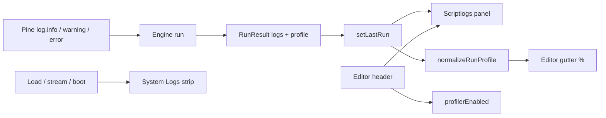

# Copyright (C) 2024-2026 jango_blockchained
#
# This file is part of pynescript.
#
# pynescript is free software: you can redistribute it and/or modify
# it under the terms of the GNU Affero General Public License as published by
# the Free Software Foundation, either version 3 of the License, or
# (at your option) any later version.
#
# pynescript is distributed in the hope that it will be useful,
# but WITHOUT ANY WARRANTY; without even the implied warranty of
# MERCHANTABILITY or FITNESS FOR A PARTICULAR PURPOSE.  See the
# GNU Affero General Public License for more details.
#
# You should have received a copy of the GNU Affero General Public License
# along with pynescript.  If not, see <https://www.gnu.org/licenses/>.
#
# SPDX-License-Identifier: AGPL-3.0-only

---
title: "Debugging"
description: "AXIS Scriptlogs panel and Editor Profiler: script log.* output, line % gutters, and how they differ from System Logs."
---

# Debugging

AXIS separates **script-authored diagnostics** (Pine `log.*` + optional engine line timing) from **shell telemetry** (load, stream, engine connection). This page covers **Scriptlogs**, Editor **Profiler** mode, and the System Logs strip.

## Abstract

| Surface | Source of truth | Open / toggle |
| --- | --- | --- |
| **Scriptlogs** | `store.lastRun` → `normalizePineLogs` | Editor header **Scriptlogs** (`toggleScriptLogsPanel`) |
| **Profiler** | `store.profilerEnabled` + `meta.profile` / `profile.lines` | Editor header **Profiler** (`toggleProfilerEnabled`) |
| **System Logs** | `store.logs` ring buffer | Status bar / logs strip (`logsPanel`) |

| Module | Role |
| --- | --- |
| `ui/ScriptLogsPanel.tsx` | Floatable panel for last-run `log.*` lines |
| `results/pine-logs.ts` | Normalize / filter / TSV export |
| `results/profiler.ts` | Normalize engine profile → per-line % |
| `editor/profiler-gutter.ts` | CodeMirror gutter chips (`N%`) |
| `editor/EditorPane.tsx` | FloatableShell + Scriptlogs / Profiler header tools |
| `ui/SystemLogs.tsx` | Shell event strip (not script logs) |

## Conceptual model

**Invariant:** Scriptlogs never write into `store.logs`. System Logs never display script `log.*` messages unless some other path explicitly `appendLog`s them.

---

## Scriptlogs

Panel for **script** logging from the last successful (or failed) run payload.

### Pine API → panel

| Pine call | Panel level |
| --- | --- |
| `log.info(...)` | `info` |
| `log.warning(...)` | `warning` |
| `log.error(...)` | `error` |

Engines may also emit aliases (`warn`, `err`, severities, tuples). Normalization maps those to the three levels above (`results/pine-logs.ts`).

### How to open

1. Open the **Editor** panel (topbar).
2. Editor header → **Scriptlogs** (`data-testid="axis-btn-scriptlogs"`).
3. Panel id `scriptlogs` (bottom dock by default; floatable via chrome).
4. Store helpers: `toggleScriptLogsPanel()` / `setScriptLogsPanelOpen(open)`.

The panel reads **`store.lastRun` only** — re-run the script after editing `log.*` calls.

### What you see

- Level filter chips: All / Info / Warning / Error  
- Optional bar index when the engine attached one  
- Copy filtered rows to clipboard  
- Empty states: no run yet vs run with no logs  

### Payload shapes accepted

`normalizePineLogs` pulls arrays from, in order of discovery:

- Top-level `logs` / `pine_logs` / `pineLogs` / `messages`
- `meta.logs` (and nested `result` / `data`)

Each item may be:

- `{ level, message, barIndex?, time? }` (plus common aliases: `msg`, `severity`, `bar_index`, …)
- Tuple `[level, message, …]`

The runner lifts `meta.logs` onto top-level `logs` when present (`normalizeRunExtras` in `indicators/runner.ts`) so Results and Scriptlogs share one shape.

---

## Editor Profiler

Toggle on the **editor header** (`data-testid="axis-btn-profiler"`). When enabled:

- Persisted as `store.profilerEnabled`
- Runs may send `config.profiler: true` so engines can collect timing
- Editor chip shows last run ms when known
- CodeMirror gutter shows line `%` when `profile.lines` is non-empty

Phase-only profiles (`total_ms`, `phases.parse_ms` / `eval_ms`, empty `lines`) still drive the header chip; gutters stay empty until the engine emits line stats.

---

## Editor panel management

The editor uses the same **FloatableShell** chrome as other panels:

- Hamburger menu: dock left / right / bottom / float / new window  
- Drag title to float; drop on edge zones to dock  
- Close control dual-writes `editor.open` + `panelChrome.editor`  
- **New window** opens the live Pine editor popout (`?view=editor`), not a stub companion page  

---

## Scriptlogs vs System Logs

| | **Scriptlogs** | **System Logs** |
| --- | --- | --- |
| **Source** | Script `log.*` on last run | AXIS shell events |
| **Store** | `lastRun.logs` | `store.logs` |
| **UI** | Floatable **Scriptlogs** panel | Collapsible strip above the status bar |
| **Open control** | Editor header **Scriptlogs** | Status bar log toggle / strip header |

Use **Scriptlogs** when debugging script logic. Use **System Logs** when diagnosing AXIS connectivity, plugin install, or chart load.

---

## Persistence & test ids

| Key | Role |
| --- | --- |
| `panelChrome.scriptlogs` | open/dock/geometry for Scriptlogs |
| `panelChrome.editor` | editor dock/geometry (FloatableShell) |
| `profilerEnabled` | Profiler mode on/off |

| testid | Role |
| --- | --- |
| `axis-btn-scriptlogs` | Editor header open Scriptlogs |
| `axis-btn-profiler` | Editor header Profiler toggle |
| `axis-editor-tools` | Header tool group |
| `axis-scriptlogs` | Panel shell |
| `axis-scriptlogs-filter-*` | Level filters |

Unit coverage: `tests/pine-logs.test.ts`, `tests/profiler.test.ts`.

### Invariants

1. Scriptlogs ≠ System Logs (separate stores and UI).  
2. Scriptlogs + Profiler controls live on the **editor**, not the topbar.  
3. Editor shares FloatableShell panel management with other chrome panels.  
