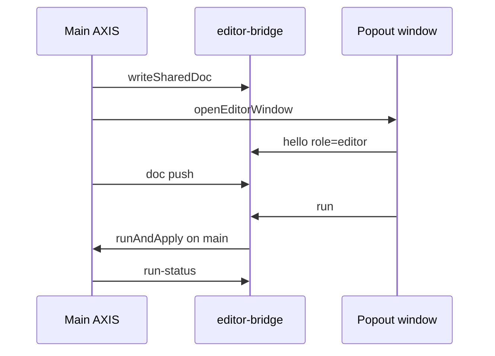

# Copyright (C) 2024-2026 jango_blockchained
#
# This file is part of pynescript.
#
# pynescript is free software: you can redistribute it and/or modify
# it under the terms of the GNU Affero General Public License as published by
# the Free Software Foundation, either version 3 of the License, or
# (at your option) any later version.
#
# pynescript is distributed in the hope that it will be useful,
# but WITHOUT ANY WARRANTY; without even the implied warranty of
# MERCHANTABILITY or FITNESS FOR A PARTICULAR PURPOSE.  See the
# GNU Affero General Public License for more details.
#
# You should have received a copy of the GNU Affero General Public License
# along with pynescript.  If not, see <https://www.gnu.org/licenses/>.
#
# SPDX-License-Identifier: AGPL-3.0-only

---
title: "Editor"
description: "AXIS Pine editor: CodeMirror 6, diagnostics, 80-col ruler, git sync, stats, docked vs popout, editor bridge."
---

# Editor

The editor is the **source axis of intent**: Pine text the operator authorizes the engine to run. Completion and hover can use local builtins metadata and optional remote LSP; **evaluation** is always an engine plugin.

## Abstract

| Module | Role |
| --- | --- |
| `EditorPane.tsx` | Docked/standalone chrome, header tools, detach |
| `tabbed-editor.tsx` | Multi-tab docs, stats strip, Problems, git bar |
| `PineEditor.tsx` | CM6 mount (extensions + view APIs) |
| `pine-language.ts` | StreamLanguage / highlighting |
| `pine-lsp.ts` + `data/pine-builtins.json` | Offline completion/hover corpus |
| `column-ruler.ts` | 80-character guide line |
| `diagnostics.ts` | Underlines, gutter, jump-to from last run |
| `inline-debug.ts` | EOL chips, pin gutter, line flash |
| `git-sync.ts` + `ui/EditorGitBar.tsx` | Pull / push / storage status |
| `ui/EditorProblems.tsx` | Collapsible problems list |
| `editor-bridge.ts` | Cross-window doc + run messages |
| `cm-void.ts` | Void-theme CM styling |

## Conceptual model

**Why run on main?** Chart, bars, and pane manager live in the main window. Popout is a pure editing surface.

## Interface surface

### Docked mode

- Right dock by default (`panelChrome.editor`); may sit **side-by-side** with other right panels (e.g. Indicators left of Editor)
- FloatableShell: dock left/right/bottom, float, new window
- Detach → popup or tab (`openEditorWindow`)

### Popout mode

- Main shows “Editor detached” chip + **Reattach**
- Shared doc key + bridge messages: `hello`, `doc`, `run`, `run-status`, `reattach`, `popout-opened`, `popout-closed`

### Run entry points

- Editor / topbar **Run** → `runAndApply(getDoc())`
- Popout Run → bridge → main executes
- Command palette: save library, git push/pull, jump to line, toggles

### Header tools (`axis-editor-tools`)

Icon-only (labels in tooltips / `aria-label`). **Open in new tab** is in the left hamburger menu with dock options.

| Control | Effect |
| --- | --- |
| **Run** | Run script against loaded bars |
| **Scriptlogs** | Open last-run `log.*` panel |
| **Profiler** | `profilerEnabled` + optional line % gutter; re-run when enabling |
| **Debug** | Inline end-of-line log/error chips (`inlineDebugEnabled`) |
| **Pins** | Chart markers + 📍 gutter (`debugPinsEnabled`); **Alt+P** |
| **Ruler** | 80-column guide (`editorRulerEnabled`) |
| **Hamburger → Open in new tab** | Editor in a full browser tab (vs **New window** popup) |

Details: [Debugging](/axis/docs/ui/debugging).

### Stats strip

Bottom of tabbed editor (`data-testid="axis-editor-stats"`):

| Field | Meaning |
| --- | --- |
| **Pos L:C** | Cursor line:column (1-based) |
| **Ln** | Total lines in document |
| **Words / Chars** | Document stats |
| **Diagnostics badge** | Error/warning count from last run — click jumps to first |
| **Problems** | Expand/collapse problems list |
| **wrap** | Soft wrap toggle (`editorWrapEnabled`, default on) |

### Diagnostics & Problems

**Pre-eval (as you type)** — `schedulePreeval` / `POST /lsp/diagnostics` (when engine=server) plus local structural checks mark wrong code *before* Run. Severity **error** disables Run (topbar, editor, Mod-Enter, command palette). Warnings do not block.

**After a run**, `diagnosticsFromLastRun(lastRun, doc)` still builds ranges from engine `error`, `meta.errors` / `diagnostics`, and error logs with line refs (`line 12:`, `L12:`, …). Live pre-eval takes precedence when it has findings for the current buffer.

- CodeMirror: wavy underlines, severity gutter, hover tooltips  
- **Problems** panel: clickable rows → `scrollToLine` / `jumpToDiagnostic`  
- Unit tests: `tests/editor-diagnostics.test.ts`, `tests/editor-problems.test.ts`, `tests/preevaluate.test.ts`

### 80-column ruler

`columnRulerExtension` paints a dashed guide at character column **80** (measured via CM coords). Toggle **Ruler** or command palette “Toggle Editor Ruler”.

### Git sync bar

Tab toolbar **Pull / Push / status** (`EditorGitBar`):

- Uses active **storage** plugin (`local` \| `cloud` \| `git`)  
- Push → `writeScript` (git commits when storage is git)  
- Pull → optional plugin `sync('pull')` + list/reload bound library id  
- Config stays in Settings / Script Library (no second credentials UI)

### Completion corpus

`src/editor/data/pine-builtins.json` is synced from PYNE (`scripts/sync-pine-builtins.sh`). Offline completion/hover fall back to this catalog; optional remote LSP when the Pro API is available.

### Library load

`loadLibraryDoc(doc, name)` on `editorRef` injects storage reads into the active tab.

## Internals

### editorRef pattern

App holds `{ getDoc, setDoc?, loadLibraryDoc?, scrollToLine?, jumpToDiagnostic?, getCursor? }` populated by CM mount—avoids full-doc store writes every keystroke (doc also mirrored to `EDITOR_DOC_KEY`).

### Persistence

| Key / field | Role |
| --- | --- |
| `store.editor` + `panelChrome.editor` | Dock geometry, open, mode |
| `pynescript.axis.editor.doc` | Draft text |
| `profilerEnabled` / `inlineDebugEnabled` / `debugPinsEnabled` / `editorRulerEnabled` / `editorWrapEnabled` | Editor tools |

## Invariants

1. Empty doc Run is a no-op at topbar/editor handlers.  
2. Popout does not own PaneManager.  
3. Reattach restores shared doc into docked CM.  
4. AXIS ≠ engine: editor never fully evaluates Pine itself; pre-eval is parse/lint only.  
5. Debug/Pins still read **last run**; static diagnostics also come from pre-eval.

## Failure modes

| Symptom | Mitigation |
| --- | --- |
| Two editors diverge | Prefer bridge doc events; reattach |
| Detached but no window | Popup blocked; allow popups; reattach |
| Lost text on crash | editor.doc localStorage; library Save / git push |
| Blank CM (no lines) | Dock column height chain; editor must fill strip |
| No chips/pins | Enable Debug/Pins; logs need line and/or bar_index |

## See also

- [Debugging](/axis/docs/ui/debugging) — Debug vs Pins, Scriptlogs, Profiler  
- [UI shell](/axis/docs/ui/ui-shell) — Topbar, docks, command palette  
- [Indicators](/axis/docs/ui/indicators)  
- [Script library](/axis/docs/enduser/guides/script-library)  
