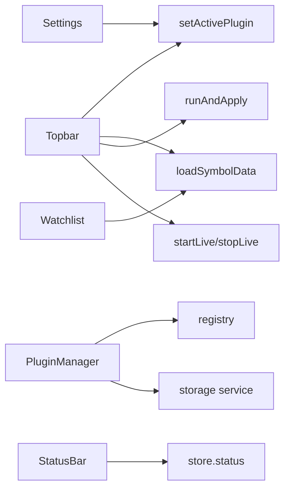

# Copyright (C) 2024-2026 jango_blockchained
#
# This file is part of pynescript.
#
# pynescript is free software: you can redistribute it and/or modify
# it under the terms of the GNU Affero General Public License as published by
# the Free Software Foundation, either version 3 of the License, or
# (at your option) any later version.
#
# pynescript is distributed in the hope that it will be useful,
# but WITHOUT ANY WARRANTY; without even the implied warranty of
# MERCHANTABILITY or FITNESS FOR A PARTICULAR PURPOSE.  See the
# GNU Affero General Public License for more details.
#
# You should have received a copy of the GNU Affero General Public License
# along with pynescript.  If not, see <https://www.gnu.org/licenses/>.
#
# SPDX-License-Identifier: AGPL-3.0-only

---
title: "UI shell"
description: "AXIS chrome: topbar, watchlist, status bar, settings, plugin manager, logs, and layout chrome around the chart."
---

# UI shell

The shell is the non-canvas chrome: navigation of axes, market selection, modals, and status. It binds human gestures to store + plugins without owning calculation.

## Abstract

| Component | Path | Role |
| --- | --- | --- |
| Topbar | `ui/Topbar.tsx` | Axes pickers, Load/Run/Live, theme, modals |
| Watchlist | `ui/Watchlist.tsx` | Symbols, quotes, click-to-load |
| StatusBar | `ui/StatusBar.tsx` | Status, engine/storage badges, trade snippet |
| SettingsDialog | `ui/SettingsDialog.tsx` | Endpoint, engine, storage, intervals |
| PluginManager | `ui/PluginManager.tsx` | Catalog / install / library |
| SystemLogs | `ui/SystemLogs.tsx` | Ring buffer of `store.logs` |
| ResultsPanel | `ui/ResultsPanel.tsx` | Bottom drawer (see results doc) |
| Icons | `ui/icons.tsx` | Lucide wrappers |
| ResizeHandle | `ui/ResizeHandle.tsx` | Panel widths/heights |

## Conceptual model

## Topbar responsibilities

Grouped left→right (`axis-tb-group`, `data-tb-group`):

| Group | Contents |
| --- | --- |
| **brand** | Logo + AXIS |
| **market** | Symbol, Interval, Type (`TopbarField`), Compare |
| **data** | Source (+ CSV upload), Load, Reload (icon-only) |
| **compute** | Engine, Stream, **Run**, Live, Replay |
| **layout** | Multi-chart layouts + recipes |
| **panels** | List, Editor, Library, **Data** (Source Manager), **Scripts**, Layers, Alerts, Data window, Inputs, Results |
| **system** | Plugins, Settings, Theme (`margin-left: auto`) |

| Control | Effect |
| --- | --- |
| Symbol / interval | Store + Load (Enter / blur reload) |
| Source / Stream / Engine | `setActivePlugin` + side effects |
| Chart type | `setChartType` (candles, HA, …) |
| Compare | Second-symbol overlay |
| Load / Reload | One-shot historical fetch → chart |
| **Data** panel | [Data Source Manager](/axis/docs/enduser/guides/data-source-manager) — background deep history |
| **Scripts** panel | Applied indicators/strategies list |
| Run | Editor doc → `runAndApply`; **accent only while `status === 'running'`** |
| Live | multiplex start/stop (stops Replay) |

### Chart themes

Settings / command palette expose **ten** curated presets (void dark/light, classic, mono, obsidian, graphite, pacific, dusk, porcelain, parchment). High-end soft surfaces — not neon high-contrast. See `src/theme/presets.ts`.
| Replay | Bar replay over loaded bars |
| Panel toggles | `isPanelOpen` / dual-write chrome |
| Settings / Plugins | Modal open |
| Detach editor | Bridge + popout |

Integrated labels: `ui/TopbarField.tsx` (`.axis-tb-field*`).  
`catalogTick` forces memo re-list when plugins install/remove.

### Command palette

**Ctrl/Cmd+K** — `CommandPalette` + `command-registry.ts`: panels, theme, layouts, Run, symbol focus, editor toggles (ruler, debug, pins, profiler), jump to line, git push/pull, save library.

### Alerts panel

Dockable **Alerts** (`src/alerts/*` + `AlertsPanel.tsx`): local-first price alerts, webhook optional, list/create/toggle. Continuous server-side arming is not required for session use.

### Workspace snapshots

`storage/workspace-snapshot.ts` + optional chrome menus capture layout/plugin prefs for restore (distinct from OHLCV — bars still re-fetch on Load).

### Panel docks (side-by-side)

Left/right docks with **2+ open panels** lay out **horizontally** (row), not stacked under each other:

- Example: **Indicators** left of **Editor** on the right strip  
- Column width = **sum** of panel widths (capped)  
- Each panel keeps its own width (resize handle on chart-facing edge)  
- Bottom dock still stacks vertically  

See `ui/panels/dock-layout.ts`, `FloatableShell.tsx`.

## Watchlist

- Default universe includes majors (`BTCUSDT`, …)
- `refreshSec` clamped 5–120
- Source-aware labels (e.g. CSV mode)
- Click sets symbol and loads through active source

## Status bar

Single row:

- **Left — Connection HUD** (`ConnectionHud`, `data-testid="axis-connection-hud"`)
  - LIVE badge (off / connecting / live / err)
  - Tick pulse (fixed-width price + age; ping does not resize layout)
  - Engine chip (id · interpret/compile · latency)
  - Plane chips SRC / STR / ENG / STO with transport badges **WS / REST / LOCAL / BROKER**
  - Source↔stream pairing warning when mismatched
- **Right** — `status` / `statusMessage`, strategy snippet, log toggle, bar/ind/pane counts

Telemetry is ephemeral (`store.telemetry`); HUD compact mode and live prefs persist via settings.

### Live settings (Settings dialog)

| Setting | Default | Effect |
| --- | --- | --- |
| Auto-start live after Load | off | `live.preferAfterLoad` → multiplex after successful Load |
| Indicator re-run | every-tick | or `bar-close` only |
| Compact connection HUD | off | hide plane chips |

## Logs

### System Logs strip

- `appendLog(level, message, source)`
- Cap `MAX_LOGS` (500)
- Not persisted
- Boot messages, pyodide ready, live errors

### Scriptlogs & Profiler

Script `log.*` output and editor line-timing live on a separate path — see [Debugging](/axis/docs/ui/debugging). Controls sit on the **editor header** (not the topbar) and do not write into `store.logs`.

## Theming

`store.theme` → `document.documentElement data-theme` (`dark` \| `light`). Void dark is default product aesthetic.

## Accessibility / test hooks

E2E selectors use `data-testid` on critical controls (`axis-btn-load`, `axis-manager`, …) per `TESTING.md`.

## Invariants

1. Shell never calls Python.  
2. Plugin lists always come from registry facades (`listSources`, …).  
3. Modal settings persist only on Save (not on every keystroke of endpoint field until save).  
4. Live off leaves historical bars intact.

## Failure modes

| Symptom | Shell-side check |
| --- | --- |
| Pickers empty | Builtins not registered at boot |
| Live ignores click | Stream `none` or multiplex error in logs |
| Settings probe fails | Network / CORS—not topbar bug |

## See also

- [Manager and settings](/axis/docs/enduser/guides/manager-and-settings)
- [Store](/axis/docs/ui/store)
- [Architecture overview](/axis/docs/architecture/overview)
