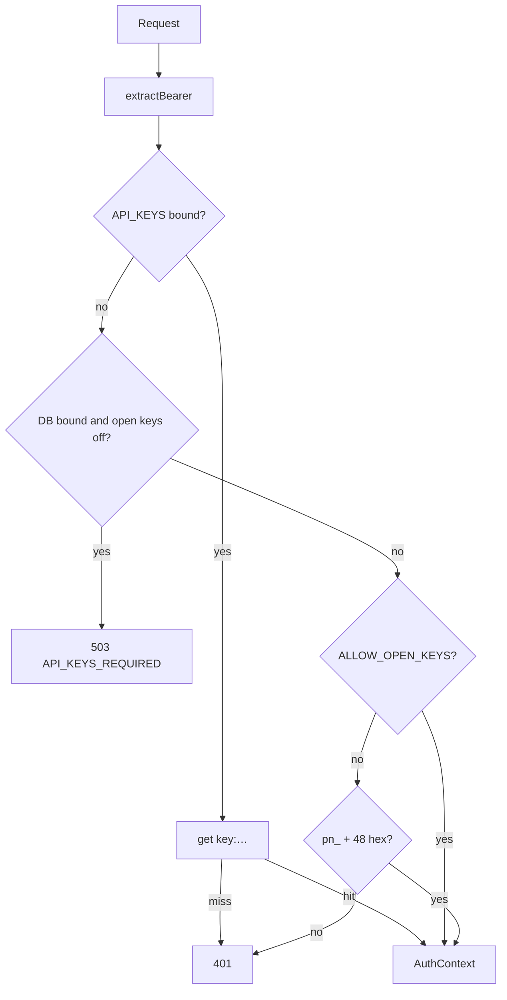

# Copyright (C) 2024-2026 jango_blockchained
#
# This file is part of pynescript.
#
# pynescript is free software: you can redistribute it and/or modify
# it under the terms of the GNU Affero General Public License as published by
# the Free Software Foundation, either version 3 of the License, or
# (at your option) any later version.
#
# pynescript is distributed in the hope that it will be useful,
# but WITHOUT ANY WARRANTY; without even the implied warranty of
# MERCHANTABILITY or FITNESS FOR A PARTICULAR PURPOSE.  See the
# GNU Affero General Public License for more details.
#
# You should have received a copy of the GNU Affero General Public License
# along with pynescript.  If not, see <https://www.gnu.org/licenses/>.
#
# SPDX-License-Identifier: AGPL-3.0-only

---
title: "Worker auth"
description: "API keys (pn_…), fail-closed D1 without KV, admin token, Bearer, ALLOW_OPEN_KEYS, and /api/run gating."
---

# Worker auth

## Abstract

AXIS Worker auth is **API-key based**, not session cookies. Keys are created by admins (`X-Admin-Token`), validated via KV when bound, and used as `Authorization: Bearer` on the script library and (when gated) on `/api/run`.

Core helpers: `worker/src/auth.ts`. Key CRUD: `worker/src/keys.ts`.

## Conceptual model



## Interface surface

### AuthContext

```ts
{ key: string; userId: string; tier: string }
```

`userId` is a truncated SHA-256 of the key (stable partition id).

### extractBearer

1. `Authorization: Bearer <token>`
2. Else query `?key=`

### requireApiKey

Returns either `{ ok: true, ctx }` or `{ ok: false, status, code, message }`.

| Code | HTTP | When |
| --- | --- | --- |
| `NO_KEY` | 401 | Empty Bearer / `?key=` |
| `INVALID_KEY` | 401 | Unknown in KV / malformed shape |
| `API_KEYS_REQUIRED` | 503 | **Fail-closed:** D1 (`DB`) bound without `API_KEYS` KV and `ALLOW_OPEN_KEYS` off |

### Fail-closed with durable storage (2.0.1+)

When D1 is active but `API_KEYS` KV is **not** bound, inventable shape-only keys would partition real script data by attacker-chosen tokens with no mint/revoke path. In that configuration:

1. Only explicit `ALLOW_OPEN_KEYS=1` accepts any non-empty Bearer (local demos).
2. Otherwise respond **503** `API_KEYS_REQUIRED` — bind `API_KEYS` and mint via `/api/keys`.

### `/api/run` auth gate

From `worker/src/runtime.ts`:

| Condition | Auth on `POST /api/run` |
| --- | --- |
| `API_KEYS` bound | **Required** |
| `REQUIRE_RUN_AUTH=1` (or `true` / `yes`) | **Required** |
| Neither | Optional (Bearer still meters when present) |

Always rate-limited (30/min) regardless of auth — see [Runtime](/axis/docs/worker/runtime).

### Admin keys API (`/api/keys`)

| Action | Auth | Behavior |
| --- | --- | --- |
| create (`POST` or `?action=create`) | `X-Admin-Token` === `env.ADMIN_TOKEN` | Mint `pn_` + 48 hex, store `key:{key}` in KV (1y TTL) with tier |
| validate (`GET` or `?action=validate`) | Bearer or `?key=` | Tier + created_at if known |

Tiers: `free` \| `hobby` \| `pro` \| `team` \| `enterprise`.

Without `ADMIN_TOKEN` set, **create always fails** (`isAdmin` false).

Without KV on validate: accepts well-formed `pn_[a-f0-9]{48}` as hobby (dev).

### ALLOW_OPEN_KEYS

`wrangler.toml` defaults local demos to `"1"`:

> accept any non-empty Bearer key for `/api/scripts`

**Never leave open in production.** Prefer bound `API_KEYS` + real admin-minted keys.

## Internals

| Path | Role |
| --- | --- |
| `worker/src/auth.ts` | Bearer, hash, requireApiKey (fail-closed) |
| `worker/src/keys.ts` | Admin create / validate |
| `worker/src/runtime.ts` | Run gate + rate limit + usage meter |
| `worker/src/scripts.ts` | requireApiKey on library CRUD |
| `worker/src/git-oauth.ts` | Env `GITHUB_OAUTH_CLIENT_ID` / `GITLAB_OAUTH_CLIENT_ID` wins over body `clientId` |

### Key format

```ts
'pn_' + 24 random bytes as hex  // 48 hex chars
```

## Invariants & edge cases

1. **Admin token is a shared secret** — rotate via wrangler secrets in production, not committed vars.
2. **KV record shape** — JSON `{ key, tier, createdAt }` under `key:${apiKey}`.
3. **No OAuth / cookies** — PWA stores the key in plugin config (`storage:cloud`).
4. **Stream DO unauthenticated** — public market data only.

## Worked examples

### Create a key (admin)

```bash
curl -sS -X POST 'http://127.0.0.1:8787/api/keys?action=create' \
  -H "X-Admin-Token: $ADMIN_TOKEN" \
  -H 'content-type: application/json' \
  -d '{"tier":"hobby"}'
```

### Validate

```bash
curl -sS 'http://127.0.0.1:8787/api/keys?action=validate' \
  -H "Authorization: Bearer pn_…"
```

## Failure modes

| Symptom | Cause |
| --- | --- |
| 403 create | Wrong/missing admin token |
| 401 scripts | Open keys off + no KV + bad shape |
| 503 `API_KEYS_REQUIRED` | D1 without `API_KEYS` KV and open keys off — bind KV + mint keys |
| 401 on `/api/run` | `API_KEYS` or `REQUIRE_RUN_AUTH` set; missing Bearer |
| OAuth start uses attacker client | Env client id not set — set `GITHUB_OAUTH_CLIENT_ID` (env always wins over body) |
| Cross-user leakage tests fail | Partition hash regression |

## See also

- [Data plane](/axis/docs/worker/data-plane)
- [Bindings](/axis/docs/worker/bindings)
- [Runtime](/axis/docs/worker/runtime)
- [Security tests](/axis/docs/reference/testing)
- [AXIS CLI](/axis/docs/devops/cli) — `axis secret put` · `axis setup oauth`
