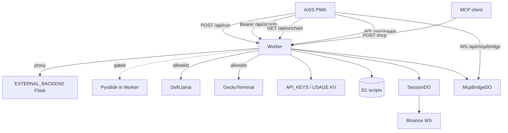

# Copyright (C) 2024-2026 jango_blockchained
#
# This file is part of pynescript.
#
# pynescript is free software: you can redistribute it and/or modify
# it under the terms of the GNU Affero General Public License as published by
# the Free Software Foundation, either version 3 of the License, or
# (at your option) any later version.
#
# pynescript is distributed in the hope that it will be useful,
# but WITHOUT ANY WARRANTY; without even the implied warranty of
# MERCHANTABILITY or FITNESS FOR A PARTICULAR PURPOSE.  See the
# GNU Affero General Public License for more details.
#
# You should have received a copy of the GNU Affero General Public License
# along with pynescript.  If not, see <https://www.gnu.org/licenses/>.
#
# SPDX-License-Identifier: AGPL-3.0-only

---
title: "Worker"
description: "Cloudflare Worker for AXIS: /api/run proxy, keys, scripts, usage, and Durable Object stream relay."
---

# Worker

## Abstract

The AXIS Cloudflare® Worker (`worker/`) is the **edge data plane** for the PWA: JSON APIs, optional script library (D1), API keys (KV), usage meters, on-chain proxy, and a WebSocket session relay (Durable Objects). It is **not** a full Pine Script™ interpreter in production today.

**Honest runtime fact:** `POST /api/run` **proxies to `EXTERNAL_BACKEND`** (typically Flask) unless `PYODIDE_IN_WORKER=enabled` and the in-worker path succeeds. That path is implemented and **off by default** (`disabled` in `worker/wrangler.toml.example`). It is not a planned feature. See [Runtime](/axis/docs/worker/runtime) and `worker/RUNTIME.md`.

**Security (2.0.1+):** gated `/api/run` (auth when `API_KEYS` / `REQUIRE_RUN_AUTH`), rate limits + body caps, fail-closed Worker auth when D1 is bound without `API_KEYS` KV, product-scoped CORS (not open `*.pages.dev`), OAuth env client ids over body `clientId`. See [Auth](/axis/docs/worker/auth) and [CORS](/axis/docs/devops/cors-and-origins).

**Operator path:** [AXIS CLI](/axis/docs/devops/cli) — `axis setup` · `axis deploy worker` · `axis health`.

## Conceptual model



## Infrastructure names (frozen)

| Surface | Value |
| --- | --- |
| Wrangler Worker script | **`worker-axis`** — canonical `https://worker.axis.hoox.sh` |
| Pages project | **`axis`** — canonical `https://axis.hoox.sh` |
| npm package | `axis-worker` |
| Health JSON `service` | `worker-axis` |
| Product brand | **AXIS** |

Pages `--project-name` is `axis`; custom domain is `axis.hoox.sh`. Worker URL is `https://worker.axis.hoox.sh`.

## Interface surface

| Path | Method | Role |
| --- | --- | --- |
| `/`, `/health` | GET | Health + feature flags (`scripts`, `d1`, `keys`, `onchain`) |
| `/api/run` | POST | Run script (proxy / gated Pyodide) |
| `/api/keys` | GET/POST | Validate / create keys (`X-Admin-Token` for create) |
| `/api/usage` | GET | Usage stub / KV-backed counters |
| `/api/scripts`… | CRUD | Script library (Bearer) |
| `/api/onchain/…` | GET | Public on-chain proxy (DefiLlama + GeckoTerminal allowlist; see below) |
| `/api/stream` | WS | Session DO relay |
| `/mcp` | POST | [MCP server](/axis/docs/worker/mcp) (Bearer) — Worker APIs + live-app control |
| `/api/mcp/bridge` | WS | PWA MCP control plane |

### On-chain proxy routes (`worker/src/onchain.ts`)

Allowlisted **GET** only (public, no API key). Other `/api/onchain/*` paths return 404.

| Worker path | Upstream | Cache TTL |
| --- | --- | --- |
| `/api/onchain/health` | local (providers + cache size) | — |
| `/api/onchain/llama/protocols` | `https://api.llama.fi/protocols` | ~10 min |
| `/api/onchain/llama/protocol/:slug` | `https://api.llama.fi/protocol/:slug` | ~2 min |
| `/api/onchain/gecko/networks/:network/pools/:address/ohlcv/:timeframe` | `https://api.geckoterminal.com/api/v2/networks/.../ohlcv/...` | ~60 s |
| `/api/onchain/gecko/search/pools` | `https://api.geckoterminal.com/api/v2/search/pools` | ~120 s |

Gecko validation: `network` `^[a-z0-9_]+$`; `address` EVM `0x`+40 hex **or** Solana-style base58 32–48; `timeframe` `day` \| `hour` \| `minute`.  
OHLCV query pass-through: `aggregate`, `limit`, `currency`, `before_timestamp`. Search: `query`, `network`, `page`, `include`.

Responses may include `X-Axis-Onchain-Cache: HIT|MISS`. Product guide: [On-Chain data](/axis/docs/enduser/guides/on-chain).

Entry: `worker/src/index.ts`.

## Local entrypoints

```bash
cd worker
npm install   # or bun install
npm run dev   # wrangler dev → http://127.0.0.1:8787
```

Makefile: `make worker-dev`, `make worker-deploy`.

## Implementation status

| Feature | Status |
| --- | --- |
| `/api/run` → `EXTERNAL_BACKEND` | **Works today** |
| Admin `/api/keys` | Works (KV or shape-check) |
| Usage KV increment on run | Works when `USAGE` bound |
| `SessionDO` + `/api/stream` | Implemented; binding often commented until provisioned |
| `POST /mcp` + `McpBridgeDO` | **Works today** when `MCP_BRIDGE` is bound |
| `/api/scripts` + D1 schema | Implemented; memory fallback without D1 |
| Pyodide scaffold | `pyodide_runtime.ts` + flag; **wheel pipeline incomplete** |
| Response cache for `/api/run` | Deferred |

## Page map

| Page | Topic |
| --- | --- |
| [Runtime](/axis/docs/worker/runtime) | `/api/run`, proxy, Pyodide plan |
| [Durable Objects](/axis/docs/worker/durable-objects) | Stream fan-out |
| [Data plane](/axis/docs/worker/data-plane) | Scripts, D1, drafts |
| [Auth](/axis/docs/worker/auth) | Bearer keys, admin token |
| [Bindings](/axis/docs/worker/bindings) | wrangler.toml, vars, provision |
| [MCP server](/axis/docs/worker/mcp) | `POST /mcp`, tools, PWA bridge |

## See also

- [Cloudflare deploy](/axis/docs/devops/cloudflare)
- [Engines](/axis/docs/plugins/engines)
- Worker README: `worker/README.md`
