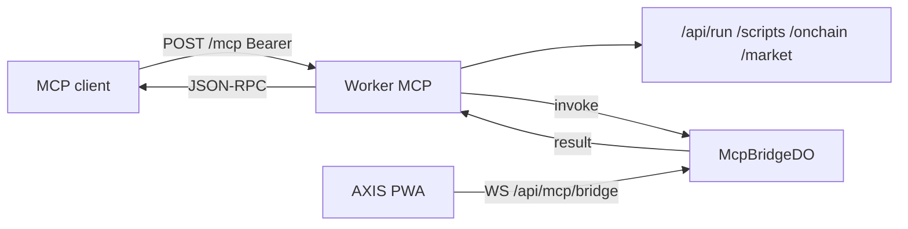

# Copyright (C) 2024-2026 jango_blockchained
#
# This file is part of pynescript.
#
# pynescript is free software: you can redistribute it and/or modify
# it under the terms of the GNU Affero General Public License as published by
# the Free Software Foundation, either version 3 of the License, or
# (at your option) any later version.
#
# pynescript is distributed in the hope that it will be useful,
# but WITHOUT ANY WARRANTY; without even the implied warranty of
# MERCHANTABILITY or FITNESS FOR A PARTICULAR PURPOSE.  See the
# GNU Affero General Public License for more details.
#
# You should have received a copy of the GNU Affero General Public License
# along with pynescript.  If not, see <https://www.gnu.org/licenses/>.
#
# SPDX-License-Identifier: AGPL-3.0-only

---
title: "MCP server"
description: "Remote MCP for AXIS — Streamable HTTP /mcp, Bearer keys, Worker tools, live-app capabilities, McpBridgeDO."
---

# MCP server

## Abstract

AXIS exposes a **Model Context Protocol** server on the Cloudflare Worker so agents can **request and respond** across the data plane and a connected PWA.

| Plane | Live tab? | Tools |
| --- | --- | --- |
| **Worker** | No | `axis_health`, `axis_request`, `axis_run`, `axis_scripts_*`, `axis_keys_*`, `axis_usage`, `axis_onchain`, `axis_market` |
| **App** | Yes | `app_invoke`, `app_get`, `app_set`, `app_capabilities`, `app_session_status` |

Transport: **Streamable HTTP JSON-RPC 2.0** on `POST /mcp` (JSON body in / JSON body out). Protocol versions accepted: `2025-03-26`, `2025-06-18`, `2024-11-05`.

Auth: same **Bearer API key** as `/api/scripts` (`pn_…`). `GET /mcp` is public discovery. Production fail-closes when D1 is bound without `API_KEYS` KV. Rate limit: 60 MCP calls / minute / key.

End-user connect steps: [MCP (agents)](/axis/docs/enduser/guides/mcp).

## Conceptual model



## Endpoints

Canonical host: `https://worker.axis.hoox.sh`.

| Path | Method | Auth | Role |
| --- | --- | --- | --- |
| `/mcp` | POST | Bearer | JSON-RPC: `initialize`, `tools/*`, `resources/*`, `prompts/*`, `ping` |
| `/mcp` | GET | public | Discovery JSON (server name, tool names) |
| `/mcp` | DELETE | — | No-op 204 (stateless) |
| `/.well-known/oauth-protected-resource` | GET | public | Bearer resource metadata |
| `/api/mcp/bridge` | WS | Bearer or `?key=` | PWA control plane → `McpBridgeDO` |
| `/api/mcp/bridge` | GET | Bearer | No `Upgrade` header → DO `/status`: `{ status, connected }` tab count (the app status bar polls this) |

Health JSON includes `features.mcp: true` and `features.mcpBridge` when the DO is bound.

## Bindings

`MCP_BRIDGE` Durable Object (`class_name = "McpBridgeDO"`, migration tag `v1` `new_sqlite_classes`). Declared in `worker/wrangler.toml.example`. App-plane tools return `NO_MCP_BRIDGE` until this is deployed. Cloudflare® no longer creates KV-backed DO namespaces (`new_classes`).

Session name is the API-key partition (`userId` = first 32 hex chars of SHA-256 of the key). Optional suffix `userId:label` is allowed; foreign session ids are ignored.

## Worker tools

| Tool | Role |
| --- | --- |
| `axis_health` | Same payload as `GET /health` |
| `axis_request` | Allowlisted Worker HTTP; returns `{ ok, status, body }` |
| `axis_run` | `POST /api/run` — `script` required; optional `data`, `ticker`, `timeframe`, `inputs` |
| `axis_scripts_list` | Cloud library metadata |
| `axis_scripts_get` | `{ id }` full script |
| `axis_scripts_put` | Create/upsert `{ name, content, id?, description?, path?, revision? }` |
| `axis_scripts_delete` | `{ id }` |
| `axis_keys_validate` | Current Bearer or `{ key }` |
| `axis_keys_create` | `{ adminToken, tier? }` — same as `X-Admin-Token` |
| `axis_usage` | Usage stub / KV counters |
| `axis_onchain` | `{ path, query? }` suffix after `/api/onchain` |
| `axis_market` | `{ path, query? }` suffix after `/api/market` |
| `app_session_status` | Connected PWA count for this key |

`axis_request` arguments: `method` (`GET` default), `path` (required, starts with `/`), optional `query`, `body`, `headers` (`Authorization` is injected from the MCP session).

### `axis_request` allowlist

Allowed: `GET /` `/health`; `POST /api/run`; `GET|POST /api/keys`; `GET /api/usage`; scripts CRUD (`/api/scripts`, `/_draft`, `/:id`, versions); `GET /api/onchain…`; `GET /api/market…`.

Blocked: `/mcp` recursion, `/api/stream`, `/api/git/oauth`, path traversal, unknown methods.

Resource `axis://allowlist` returns the live table.

## App tools

| Tool | Role |
| --- | --- |
| `app_capabilities` | Capability catalog from the connected tab |
| `app_invoke` | `{ capability, payload? }` — wait for JSON result (default 20s) |
| `app_get` | Sanitized snapshot; optional dotted `path` |
| `app_set` | Allowlisted dotted `path` + `value` |

No tab → `SESSION_OFFLINE`. Timeouts → `TIMEOUT`. Snapshots redact keys matching `apiKey|secret|passphrase|token|password|authorization|cookie` and summarize OHLCV unless `includeBars: true`.

### Capability ids (`app_invoke`)

| Id | Payload | Mutates |
| --- | --- | --- |
| `app.snapshot` | `{ includeBars? }` | no |
| `app.get` | `{ path?, includeBars? }` | no |
| `app.set` | `{ path, value }` | yes |
| `app.command` | `{ id }` palette command | yes |
| `app.shortcut` | `{ id }` shortcut id | yes |
| `app.event` | `{ name, detail? }` — `name` must start with `axis-` | yes |
| `chart.get` | — | no |
| `chart.set` | `{ symbol?, interval?, exchange?, source?, chartType? }` | yes |
| `chart.load` | `{ symbol?, interval?, source? }` | yes |
| `chart.reload` | — | yes |
| `chart.live` | `{ active? }` | yes |
| `chart.layout` | `{ op: get\|grid\|save\|load\|delete, mode?, name?, id? }` | yes |
| `chart.theme` | `{ presetId? }` | yes |
| `chart.type` | `{ type }` | yes |
| `chart.screenshot` | `{ scope?: price\|panes\|workspace, scale?: 1\|2 }` | no |
| `chart.zoom` | `{ op: in\|out\|reset\|pan, delta?, bars? }` | yes |
| `editor.get` | — | no |
| `editor.set` | `{ doc, open? }` | yes |
| `editor.run` | `{ doc? }` | yes |
| `editor.diagnostics` | — | no |
| `indicators.list` | — | no |
| `indicators.add` | `{ name, code, paneId? }` | yes |
| `indicators.remove` | `{ id }` | yes |
| `indicators.update` | `{ id, name?, visible?, code?, inputValues? }` | yes |
| `indicators.run` | re-run visible | yes |
| `alerts.list` | — | no |
| `alerts.create` | `{ name, kind, symbol?, params?, interval?, webhookUrl?, enabled? }` | yes |
| `alerts.update` | `{ id, patch }` | yes |
| `alerts.remove` | `{ id }` | yes |
| `watchlist.get` | — | no |
| `watchlist.add` / `remove` | `{ symbol }` | yes |
| `watchlist.lists` | `{ op: create\|rename\|delete\|select, id?, name?, symbols? }` | yes |
| `library.list` | `{ prefix? }` | no |
| `library.read` | `{ id }` | no |
| `library.write` | `{ name, content, id?, description? }` | yes |
| `library.remove` | `{ id }` | yes |
| `results.get` | last run + strategy UI | no |
| `logs.get` | `{ limit?, source?, level? }` | no |
| `logs.append` | `{ message, level?, source? }` | yes |
| `logs.clear` | — | yes |
| `panels.get` | — | no |
| `panels.set` | `{ id, open?, dock?, chartOnly? }` | yes |
| `plugins.list` | — | no |
| `plugins.activate` | `{ kind: source\|stream\|engine\|storage, id }` | yes |
| `theme.get` / `theme.set` | `{ theme?, presetId?, uiScale?, toggle? }` | set mutates |
| `workspace.export` | `{ includeBars? }` | no |
| `workspace.import` | `{ json }` or snapshot object | yes |
| `drawings.list` | — | no |
| `drawings.add` | `{ kind, points: [{time, price}…], style?, meta?, symbol?, id? }` — kind arity validated, symbol defaults to active | yes |
| `drawings.update` | `{ id, points?, style?, meta?, visible? }` — kind immutable | yes |
| `drawings.remove` | `{ id }` | yes |
| `drawings.clear` | `{ symbol? }` | yes |
| `drawings.tool` | `{ tool }` | yes |
| `settings.get` | `{ key? }` — sanitized settings, secrets never exposed | no |
| `settings.set` | allowlisted patch (`endpoint`, `engine`, `interval`, `historyBars`, `refreshSec`, `live.*`, `uiScale`, `autoload`, label/strategy/telemetry prefs); interval/history changes reload | yes |
| `status.get` | status bar + telemetry | no |

`app_set` paths: `symbol`, `interval`, `source`, `engine`, `exchange`, `theme`, `chartType`, `uiScale`, `live.active`, `live.preferAfterLoad`, `editor.doc`, `editor.open`, `watchlist.open`.

## Resources and prompts

| URI | Contents |
| --- | --- |
| `axis://health` | Health JSON |
| `axis://capabilities` | Tool names + planes |
| `axis://allowlist` | `axis_request` paths |
| `axis://session` | Bridge status for this key |

Prompts (seed the agent; they still call tools):

| Name | Args |
| --- | --- |
| `run_script` | `script` (required), `symbol?`, `interval?` |
| `debug_last_run` | — |
| `analyze_strategy` | — |
| `load_symbol` | `symbol`, `interval?` |
| `audit_workspace` | — |

## Client config

```bash
axis mcp config --key pn_…
axis mcp --key pn_…                 # stdio proxy
```

```json
{
  "mcpServers": {
    "axis": {
      "url": "https://worker.axis.hoox.sh/mcp",
      "headers": { "Authorization": "Bearer pn_…" }
    }
  }
}
```

Local wrangler: `http://127.0.0.1:8787/mcp` with `ALLOW_OPEN_KEYS=1` still requires a non-empty Bearer.

## Errors

| Code | Where | Meaning |
| --- | --- | --- |
| `NO_KEY` / `INVALID_KEY` | HTTP 401 | Missing or unknown Bearer |
| `API_KEYS_REQUIRED` | HTTP 503 | D1 without KV |
| `RATE` | HTTP 429 | 60/min/key |
| `MCP_ALLOWLIST` | tool | Path not allowed |
| `NO_MCP_BRIDGE` | tool | DO unbound |
| `SESSION_OFFLINE` | app tool | No PWA socket |
| `TIMEOUT` | app tool | Tab did not reply in 20s |
| `UNKNOWN_CAPABILITY` / `PATH_DENIED` | app | Bad id or set path |
| `-32601` | JSON-RPC | Unknown method |

## Implementation

| Path | Role |
| --- | --- |
| `worker/src/mcp/handler.ts` | Streamable HTTP JSON-RPC |
| `worker/src/mcp/catalog.ts` | Tools / resources / prompts |
| `worker/src/mcp/allowlist.ts` | `axis_request` gate |
| `worker/src/mcp/proxy.ts` | In-isolate dispatch to existing handlers |
| `worker/src/mcp/bridge.ts` | `McpBridgeDO` |
| `src/mcp/` | PWA host, snapshot, dispatch, WS client |
| `packages/cli/src/commands/mcp.ts` | `axis mcp` |

In-page: `window.__AXIS_MCP__.invoke('chart.get')`. Tests: `worker/tests/mcp-handler.test.ts`, `tests/mcp-dispatch.test.ts`, `packages/cli/tests/mcp.test.ts`.

This is a **stateless** MCP handler (no deprecated `McpAgent` session DO). App state lives in the PWA + `McpBridgeDO`, not in an MCP session id.

## See also

- [MCP (agents)](/axis/docs/enduser/guides/mcp)
- [Auth](/axis/docs/worker/auth)
- [Durable Objects](/axis/docs/worker/durable-objects)
- [Bindings](/axis/docs/worker/bindings)
- [AXIS CLI](/axis/docs/devops/cli)
