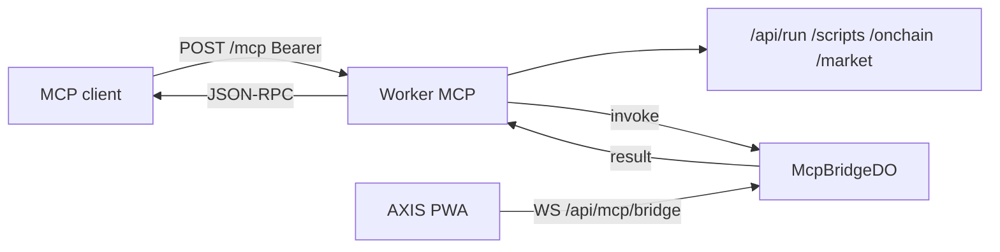

# Copyright (C) 2024-2026 jango_blockchained
#
# This file is part of pynescript.
#
# pynescript is free software: you can redistribute it and/or modify
# it under the terms of the GNU Affero General Public License as published by
# the Free Software Foundation, either version 3 of the License, or
# (at your option) any later version.
#
# pynescript is distributed in the hope that it will be useful,
# but WITHOUT ANY WARRANTY; without even the implied warranty of
# MERCHANTABILITY or FITNESS FOR A PARTICULAR PURPOSE.  See the
# GNU Affero General Public License for more details.
#
# You should have received a copy of the GNU Affero General Public License
# along with pynescript.  If not, see <https://www.gnu.org/licenses/>.
#
# SPDX-License-Identifier: AGPL-3.0-only

---
title: "MCP server"
description: "Remote MCP for AXIS — Worker APIs plus live-app request/response control (chart, editor, scripts, alerts, plugins)."
---

# MCP server

## Abstract

AXIS exposes a **Model Context Protocol** server on the Cloudflare Worker so agents (Claude, Cursor, Grok, Inspector) can **read and write** nearly every product surface.

Two planes:

| Plane | Needs a live tab? | Tools |
| --- | --- | --- |
| **Worker** | No | `axis_health`, `axis_request`, `axis_run`, scripts, keys, usage, onchain, market |
| **App** | Yes — PWA connected to the MCP bridge | `app_invoke`, `app_get`, `app_set`, `app_capabilities`, `app_session_status` |

Auth is the same **Bearer API key** as `/api/scripts` (`pn_…`). Production fail-closes when D1 is bound without `API_KEYS` KV.

## Conceptual model



## Endpoints

| Path | Method | Role |
| --- | --- | --- |
| `/mcp` | POST | Streamable HTTP JSON-RPC 2.0 (tools, resources, prompts) |
| `/mcp` | GET | Public discovery document (tool names, no auth) |
| `/.well-known/oauth-protected-resource` | GET | Bearer resource metadata |
| `/api/mcp/bridge` | WS | PWA control plane (Bearer or `?key=`) |

Worker URL: `https://worker.axis.hoox.sh/mcp`.

## Connect a client

Mint a key (`axis keys create`) and paste it into Settings → Data (cloud storage) so the PWA can attach. Enable **Connect this tab to MCP** (Settings → General).

### Remote HTTP (Inspector, Cursor, Claude with URL support)

```json
{
  "mcpServers": {
    "axis": {
      "url": "https://worker.axis.hoox.sh/mcp",
      "headers": { "Authorization": "Bearer pn_…" }
    }
  }
}
```

Print the snippet: `axis mcp config --key pn_…`

### Stdio proxy

```bash
axis mcp --key pn_…
# or
axis mcp config --stdio --key pn_…
```

The CLI forwards newline-delimited JSON-RPC from stdin to `POST /mcp`.

## Worker tools

`axis_request` is the generic **request/response** tool: any allowlisted Worker path (`GET /health`, `POST /api/run`, scripts CRUD, onchain, market). It is **not** an open proxy — stream, OAuth, and `/mcp` recursion are blocked.

Convenience wrappers: `axis_run`, `axis_scripts_*`, `axis_keys_*`, `axis_onchain`, `axis_market`, `axis_usage`, `axis_health`.

## App capabilities

`app_invoke` with a capability id. Catalog: `app_capabilities` (or `axis://capabilities`).

| Domain | Examples |
| --- | --- |
| Chart | `chart.load`, `chart.live`, `chart.layout`, `chart.theme`, `chart.screenshot`, `chart.zoom` |
| Editor | `editor.get` / `set` / `run` / `diagnostics` |
| Scripts | `indicators.list` / `add` / `remove` / `run` |
| Alerts | `alerts.list` / `create` / `update` / `remove` |
| Library | `library.list` / `read` / `write` / `remove` |
| Watchlist | `watchlist.get` / `add` / `remove` / `lists` |
| Chrome | `panels.set`, `theme.set`, `drawings.tool`, `workspace.export` |
| Palette | `app.command`, `app.shortcut` |

`app_get` / `app_set` use dotted paths (`symbol`, `interval`, `editor.doc`). Secret fields are redacted in snapshots.

If no tab is connected, app tools return `SESSION_OFFLINE`. Bind `MCP_BRIDGE` (see `wrangler.toml`) and keep the PWA open.

## Resources and prompts

Resources: `axis://health`, `axis://capabilities`, `axis://allowlist`, `axis://session`.

Prompts: `run_script`, `debug_last_run`, `analyze_strategy`, `load_symbol`, `audit_workspace`.

## Implementation

| Path | Role |
| --- | --- |
| `worker/src/mcp/` | JSON-RPC handler, catalog, allowlist, bridge DO |
| `src/mcp/` | PWA host, dispatch, snapshot, WS client |
| `packages/cli/src/commands/mcp.ts` | `axis mcp` |

In-page API for tests: `window.__AXIS_MCP__.invoke('chart.get')`.

## See also

- [Auth](/axis/docs/worker/auth)
- [Durable Objects](/axis/docs/worker/durable-objects)
- [AXIS CLI](/axis/docs/devops/cli)
