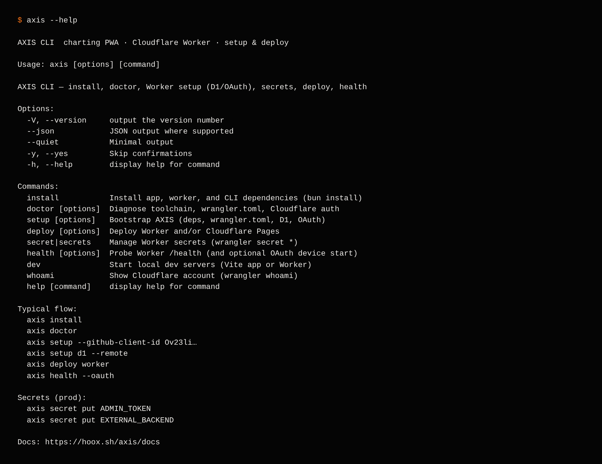
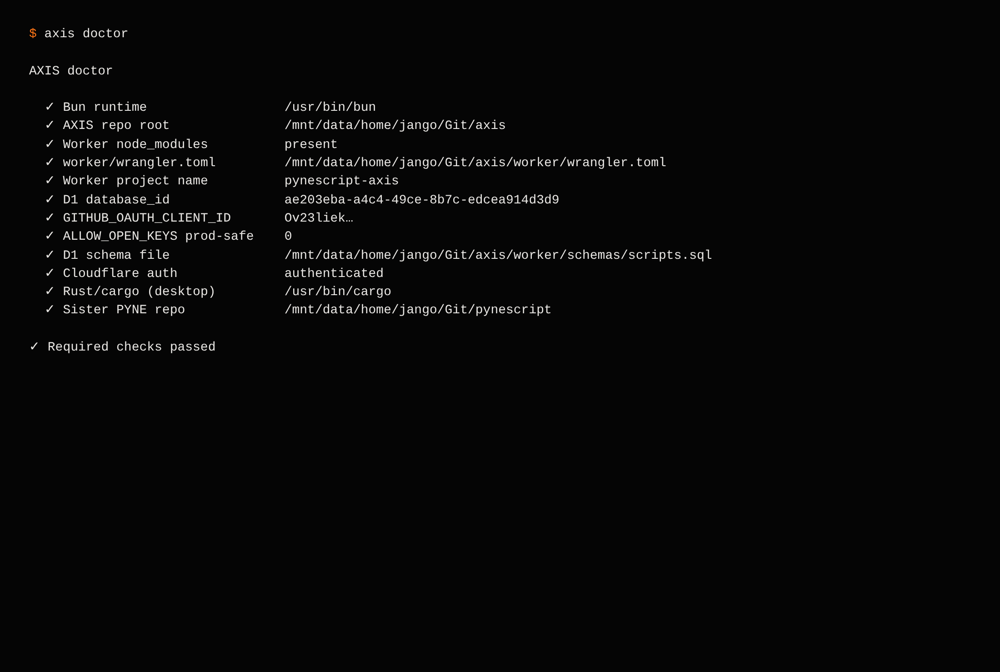

# @hoox-sh/axis-cli

**AXIS CLI** — install flows, doctor, Worker setup (D1 / KV / keys), secrets, deploy, and health probes for the [AXIS](https://hoox.sh/axis) charting PWA.

Requires **Node ≥ 20** to run the published binary, and **Bun ≥ 1.2** for `axis install` / `axis dev` / `axis deploy pages` (those shell out to Bun).

<p align="center">
  
</p>

## Install

```bash
# npm (global)
npm install -g @hoox-sh/axis-cli
axis --help

# standalone binary (single file, no Node/Bun required)
# download axis-cli-<cli-version>-bun-<target> from the release assets:
#   bun-linux-x64 | bun-linux-arm64 | bun-linux-x64-musl | bun-linux-arm64-musl
#   bun-darwin-x64 | bun-darwin-arm64 | bun-windows-x64.exe
# Release tag = app VERSION (v2.6.5). Filename uses CLI package version (0.3.1).
curl -LO "https://github.com/hoox-sh/axis/releases/download/v2.6.5/axis-cli-0.3.1-bun-linux-x64"
chmod +x axis-cli-0.3.1-bun-linux-x64 && ./axis-cli-0.3.1-bun-linux-x64 --version

# from the AXIS monorepo
bun install
cd packages/cli && bun install && bun run build && cd ../..
bun packages/cli/bin/axis.js --help
```

Build the binaries yourself: `cd packages/cli && bun run build:binaries` (bun
`--compile` cross-builds every target; native output is smoke-tested).

CLI-first — install once, call `axis` anywhere:

```bash
axis --help
axis doctor
```

Repo aliases (no global install): `bun run axis --help` · `bun run axis:doctor` — see root `package.json` scripts.

Global flags: `--json`, `--quiet`, `-y/--yes`. `--json` is machine-only (no banners mixed into stdout).

## Commands

| Command | Purpose |
|---------|---------|
| `axis install` | `bun install` for app, `worker/`, and CLI |
| `axis doctor` | Toolchain + optional Cloudflare auth. Missing `worker/wrangler.toml` warns until `axis setup` (expected on a fresh clone). |
| `axis doctor --remote` | Also probe deployed Worker `/health` |
| `axis setup` | Full bootstrap (install → toml → local D1) |
| `axis setup --prod` | Production bootstrap: remote D1 schema + `API_KEYS` KV |
| `axis setup worker` | Ensure `worker/wrangler.toml` (copy from example) |
| `axis setup d1 [--local] [--remote] [--create]` | Apply `schemas/scripts.sql` (scripts + versions) |
| `axis setup kv [--usage]` | Create and bind `API_KEYS` KV (required when D1 is on) |
| `axis setup oauth --github-client-id Ov23li…` | Set OAuth client id in `[vars]` |
| `axis setup oauth --github-client-id … --secret` | Or as Worker secret |
| `axis keys create [--tier hobby]` | Mint a `pn_…` key (`ADMIN_TOKEN` required) |
| `axis keys validate --key pn_…` | Validate a key against `/api/keys` |
| `axis secret put ADMIN_TOKEN` | `wrangler secret put` |
| `axis secret list` / `axis secret delete <name>` | List / delete secrets |
| `axis deploy` / `axis deploy worker` | Deploy Worker `pynescript-axis` |
| `axis deploy pages` | Vite build + Pages project |
| `axis deploy all` | Worker then Pages |
| `axis health [--oauth] [--scripts] [--url …]` | Probe `/health` (+ OAuth start and/or `/api/scripts`) |
| `axis whoami` | Cloudflare account |
| `axis dev` / `axis dev worker` / `axis dev desktop` | Local servers |

<p align="center">
  
</p>

## Typical production flow

```bash
axis install
axis doctor
axis setup --prod --github-client-id Ov23liekgk16zDDiHBz1
axis secret put ADMIN_TOKEN
axis secret put EXTERNAL_BACKEND   # public HTTPS PYNE/Flask base
axis deploy all                    # applies D1 schema, then Worker + Pages
axis keys create                   # mint pn_… → Settings → Script storage
axis health --scripts --oauth
```

`axis setup --prod` is `--remote-d1` plus `API_KEYS` KV create/bind. `axis deploy` / `deploy all` apply the remote D1 schema first (`--skip-schema` to skip). `axis setup d1 --remote` is remote-only; pass both `--local --remote` to apply both.

Env overrides:

| Variable | Role |
|----------|------|
| `AXIS_ROOT` | Force monorepo root |
| `AXIS_WORKER_URL` | Default health/deploy probe URL |
| `AXIS_ADMIN_TOKEN` | Admin token for `axis keys create` |
| `AXIS_API_KEY` | Default key for `axis keys validate` / `health --scripts --key` |
| `CLOUDFLARE_API_TOKEN` | Wrangler auth (non-interactive) |
| `AXIS_CLI_SRC=1` | Force bin to load `src/` over `dist/` (Bun only) |

## License

AGPL-3.0-only · jango_blockchained
